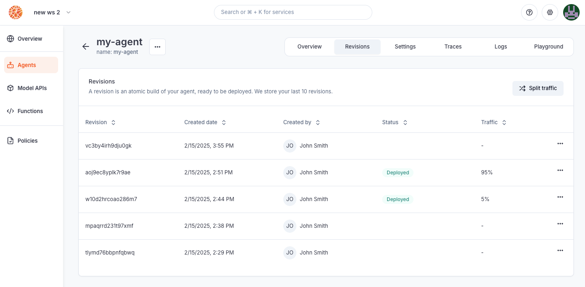
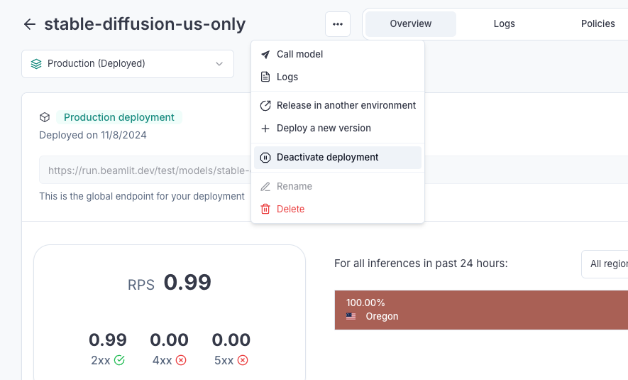

---

title: 'Deploy agents'

description: 'Ship your custom AI agents on Blaxel in a few clicks.'

---

Blaxel provides a serverless infrastructure to instantly deploy AI agents. You receive a global inference endpoint for each deployment, and your workloads are served optimally to dramatically accelerate cold-start and latency.

The main way to deploy an agent on Blaxel is by **using Blaxel CLI.** This method is detailed down below on the page. Alternatively you can [**connect a GitHub repository**](Github-integration): any push to the *main* branch will automatically update the deployment on Blaxel — or deploy from a variety of **pre-built templates** on the Blaxel Console.

## Deploy an agent with Blaxel CLI

This section assumes you have developed an agent locally, as explained [in this documentation](Develop-an-agent), and are ready to deploy it. 

The Blaxel SDK allows you to connect to and orchestrate other resources (such as model APIs, tool servers, multi-agents) during development, and ensures telemetry, secure connections to third-party systems or private networks, smart global placement of workflows, and much more when agents are deployed.

This packaging makes Blaxel **fully agnostic of the framework** used to develop your agent and doesn’t prevent you from deploying your software on another platform.

<Info>Read [this guide first](Develop-an-agent) on how to use the Blaxel SDK to develop a custom agent to deploy.</Info>

### Serve locally

You can serve the agent locally in order to make the `main.py` / `main.ts` main function available on a local endpoint. 

Run the following command to serve the agent:

```bash
bl serve
```

Calling the provided endpoint will execute the agent locally while sandboxing the core agent logic, function calls and model API calls exactly as it would be when deployed on Blaxel. Add the flag `--hotreload`  to get live changes.

```bash
bl serve --hotreload
```

### Deploy on production

You can deploy the agent in order to make the `main.py` / `main.ts` main function **callable on a global endpoint**. When deploying to Blaxel, you get a dedicated endpoint that enforces your [deployment policies](../Model-Governance/Policies).

Run the following command to build and deploy a local agent on Blaxel:

```bash
bl deploy
```

<Note>When making a deployment using Blaxel CLI (`bl deploy`), the new traffic routing depends on the `--traffic` option. Without this option specified, Blaxel will automatically deploy the new revision with full traffic (100%) if the previous deployment was the latest revision. Otherwise, it will create the revision without deploying it (0% traffic).</Note>

### Customize an agent deployment

You can set custom parameters for an agent deployment (e.g. specify the agent name, etc.) in the `blaxel.toml` file at the root of your directory.

This file is used to configure the deployment of the agent on Blaxel. It's not mandatory, but it allows you to customize the deployment.

```toml
name = "my-agent"
workspace = "my-workspace"
type = "agent"

agents = []
functions = ["blaxel-search"]
models = ["gpt-4o-mini"]

[env]
DEFAULT_CITY = "San Francisco"
```

- `name`, `workspace`, and `type` fields are optional and serve as default values. Any bl command run in the folder will use these defaults rather than prompting you for input.
- `agents`, `functions`, and `models` fields are also optional. They specify which resources to deploy with the agent. These resources are preloaded during build, eliminating runtime dependencies on the Blaxel control plane and dramatically improving performance.
- `[env]` section defines environment variables that the agent can access via the SDK. Note that these are NOT [secrets](Variables-and-secrets).

### Deploy from GitHub

You can connect a GitHub repository to Blaxel to automatically deploy updates whenever changes are pushed to the *main* branch.

<Card title="Deploy from GitHub" icon="github" href="/Agents/Github-integration">
Learn how to synchronize your GitHub repository to automatically deploy updates.
</Card>

## Overview of deployment life-cycle

### Deploying an agent

Deploying an agent will create the associated agent deployment. At this time: 

- it is [reachable](Query-agents) through a specific endpoint
- it does not consume resources [until it is actively being invoked and processing inferences](Query-agents)
- its status can be monitored either on the console or using the CLI/APIs

### Choosing the infrastructure generation

Blaxel offers two [infrastructure generations](../Infrastructure/Generations). When deploying a workload, you can select between *Mk 2 infrastructure*—which provides stable, globally distributed container-based workloads—and *Mk 3* (in Alpha), which delivers ultra-fast cold starts. Choose the generation that best fits your specific requirements.

### Managing revisions

As you iterate on software development, you will need to update the version of an agent that is currently deployed and used by your consumers. Every time you build a new version of your agent, this creates a **revision**. Blaxel stores the 10 latest revisions for each object. 



Revisions are atomic builds of your deployment that can be either deployed (accessible via the inference endpoint) or not. This system enables you to:

- **rollback a deployment** to its exact state from an earlier date
- create a revision without immediate deployment to **prepare for a future release**
- implement progressive rollout strategies, such as **canary deployments**

Important: Revisions are not the same as versions. You cannot use revisions to return to a previous configuration and branch off from it. For version control, use your preferred system (such as GitHub) alongside Blaxel.

Deployment revisions are updated following a **blue-green** paradigm. The Global Inference Network will wait for the new revision to be completely up and ready before routing requests to the new deployment. You can also set up a **canary deployment** to split traffic between two revisions (maximum of two).


<Note>When making a deployment using Blaxel CLI (`bl deploy`), the new traffic routing depends on the `--traffic` option. Without this option specified, Blaxel will automatically deploy the new revision with full traffic (100%) if the previous deployment was the latest revision. Otherwise, it will create the revision without deploying it (0% traffic).</Note>

### Executions and inference requests

**Executions** (a.k.a inference executions) are ephemeral invocations of agent deployments by a [consumer](Query-agents). Because Blaxel is serverless, an agent deployment is only materialized onto one of the execution locations when it actively receives and processes requests. Workload placement and request routing is fully managed by the Global Agentics Network, as defined by your [environment policies](../Model-Governance/Policies).

Read more about [querying agents in this documentation](Query-agents).

### Deactivating an agent deployment

Any agent deployment can be deactivated at any time. When deactivated, it will **no longer be reachable** through the inference endpoint and will stop consuming resources. 

Agents can be deactivated and activated at any time from the Blaxel console, or via [API](https://docs.blaxel.ai/api-reference/agents/update-agent-by-name) or [CLI](https://docs.blaxel.ai/cli-reference/bl_apply).



## Agent deployment reference

The `bl deploy` command generates a YAML configuration manifest automatically and deploys it to Blaxel's hosting infrastructure. You can also create custom manifest files in the `.blaxel` folder and deploy them using the following command:

```
bl apply -f ./my-agent-deployment.yaml
```

Read our [reference for agent deployments](https://docs.blaxel.ai/api-reference/agents/get-agent-by-name).

<Card title="Query agents" icon="bolt" href="/Agents/Query-agents">
Learn how to run consumers’ inference requests on your agent. 
</Card>