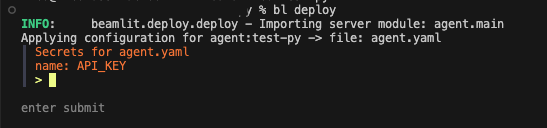

---

title: 'Develop agents in Python'

description: 'Use the Blaxel SDK to develop and run a custom agent in Python.'

---

You can **bring agents developed in Python in any framework** (LangChain, CrewAI, or any custom framework) and deploy them on Blaxel by integrating a few lines of the Blaxel SDK and leveraging our other developer tools ([Blaxel CLI](../cli-reference), GitHub action, etc.).

<Tip>Check out [this Getting Started](../Get-started) tutorial in order to develop and deploy your first Hello World AI agent globally in less than 5 minutes.</Tip>

## Blaxel agent file structure

### Overview

To deploy a custom AI agent on Blaxel, you need the following file in your repository:

- **agent.py (or src/agent.py)**: This file must contain an *async* `main` function that runs your agent. The `agent.main` function serves as the default entry point during serving and deployment.
    - You can specify a different module to serve using the flag `bl serve --module your-function-path.your-function-name`
    - The function accepts these arguments, which Blaxel passes when a request is made to your deployed agent:
        - *request*: The [FastAPI](https://fastapi.tiangolo.com/) Request that triggers the agent's execution.
        - *agent*: (Optional) The core agent algorithm. By default, it uses a [LangChain ReAct agent](https://api.python.langchain.com/en/latest/agents/langchain.agents.react.agent.create_react_agent.html).
        - *model*: (Optional) The [LLM chat API](../Models/Overview) that powers the agent. By default, it uses the model API specified during agent creation, **passed in LangChain format [*ChatModel*](https://python.langchain.com/docs/integrations/chat/)**
        - *functions*: (Optional) The [functions](../Functions/Overview) available for tool calling. By default, it uses the functions from the `src/functions` folder, **passed in LangChain format [*BaseTool*](https://api.python.langchain.com/en/latest/tools/langchain_core.tools.BaseTool.html).**

**Mark your agent's main function with the `@agent` decorator to serve it with Blaxel. You can override the default argument values that Blaxel passes upon requesting the agent by using the decorator parameters** (see below).

Some folders are optional but designed to handle specific parts of the agent code on Blaxel:

- **src/functions**: all files listed in this folder will be interpreted as custom tools that will all be made available to the agent automatically when serving or deploying the agent. The tool’s Python function itself is identified with the `@function` decorator.

### Quickstart

<Warning>It is required to [have *uv* installed](https://docs.astral.sh/uv/getting-started/installation/) to use the following command.</Warning>

You can quickly initialize a new project from scratch by using CLI command  `bl create-agent-app`. This will create a pre-scaffolded local repo where your entire code can be added. By default, this command creates a boilerplate agent that has:

- A [LangChain ReAct agent](https://api.python.langchain.com/en/latest/agents/langchain.agents.react.agent.create_react_agent.html) as the core agent logic. This agent can be overridden by passing a custom agent as the `override-agent` parameter to the @agent decorator in */src/agent.py*

- A hello-world tool (a function) that returns a placeholder text string. This function can be customized by changing the code in the `helloworld` function in */src/functions/helloworld.py*, and additional functions can be created in the */src/functions* folder.

## The @agent decorator

The `@agent` decorator identifies the main function that handles your core agent logic such as how to handle queries and responses, tool calls and such.

```python
@agent()
async def main(request, agent):
	# Your main agent logic
	...
```

Inside the decorator, you can pass several parameters:

- **`agent`**: this can be either the Blaxel SDK’s `Agent` object or equivalent dict, and allows to specify all the parameters for the deployment of your agent on Blaxel. Examples include:
    - `metadata.name`: the name of the agent on Blaxel
    - `spec.description`: the description of the agent on Blaxel
    - `spec.model`: the name of a model API deployed in your Blaxel workspace, to use as core chat model for the agent
- **`override_agent`**: You can override the default [LangChain ReAct agent](https://api.python.langchain.com/en/latest/agents/langchain.agents.react.agent.create_react_agent.html) by passing any custom agent instance. When the deployed agent receives a request, Blaxel will pass this as the `agent` argument to the agent's `main()` function.
- **`override_model`**: You can query an LLM provider directly instead of routing through Blaxel by passing a [ChatModel object from LangChain](https://python.langchain.com/docs/integrations/chat/). When the deployed agent receives a request, Blaxel will pass this as the *llm* to the default LangChain ReAct agent. This is used as a more granular alternative to `override_agent`.
- **`remote_functions`**: You can pass on additional Blaxel [functions](../Functions/Overview) that are already deployed so your agent can access them too, in addition to the functions from `src/functions/`. This parameter takes in an array of *string* representing the names of the functions on Blaxel. This is used as a more granular alternative to `override_agent`.

### Managing secrets

You can add secrets to your code using `$secrets.KEY_NAME`. When you run the `bl deploy` command, Blaxel will attempt to retrieve the secret values and export them:

- if the key exists in your environment variables, Blaxel will use that value
- if not, you'll be prompted to enter the secret value in the terminal

```python
### For example, to export in Blaxel's environment variables for an agent:

@agent(
    agent={
        "metadata": {
            "name": "test-py",
        },
        "spec": {
            "runtime": {
                "envs": [
                    {
                        "name": "OPENAI_API_KEY",
                        "value": "$secrets.OPENAI_API_KEY"
                    }
                ]
            },
        },
    },
)
async def main(request: Request, agent):
...
```



### Example

Here's an example that demonstrates overriding the default *agent* object.

```python
from fastapi import Request
from langchain_openai import ChatOpenAI
from langgraph.checkpoint.memory import MemorySaver
from langgraph.prebuilt import create_react_agent

from blaxel.agents import agent
from customfunctions.helloworld import helloworld

chat = ChatOpenAI()
memory = MemorySaver()
custom_agent = create_react_agent(chat, tools=[helloworld], checkpointer=memory)

@agent(override_agent=custom_agent)
async def main(request: Request, agent):
	# Your main agent logic
	...
```

When developing custom agents, you may also need to retrieve instantiated model APIs and functions in your code. The following section shows you how to.

## Retrieve existing functions and model APIs

### Get model APIs

You can use model APIs deployed on Blaxel by calling `get_chat_model()`. This function returns a model API **in LangChain format [*ChatModel*](https://python.langchain.com/docs/integrations/chat/)**

```python
from blaxel.agents.chat import get_chat_model

model = get_chat_model("model-name-on-Blaxel")

custom_agent = create_react_agent(model, tools=[])
```

### Get functions

You can use [functions](../Functions/Overview) defined both in your code and deployed on Blaxel by calling `get_functions()`. This function returns a list of tools **in LangChain format [*BaseTool*](https://api.python.langchain.com/en/latest/tools/langchain_core.tools.BaseTool.html).**

```python
from blaxel.agents import agent, get_default_thread
from langgraph.checkpoint.memory import MemorySaver
from langgraph.prebuilt import create_react_agent
from blaxel.functions import get_functions

from langchain_openai import ChatOpenAI

async def get_custom_agent():
    memory = MemorySaver()
    chat = ChatOpenAI()
    
    functions = await get_functions(warning=False)
    
    custom_agent = create_react_agent(chat, tools=functions, checkpointer=memory)
    return custom_agent
```

By default, this returns the list of functions **defined in the local folder** `src/functions/`. You can pass several parameters:

- **`remote_functions`**: to retrieve additional Blaxel [functions](../Functions/Overview) that are already deployed so your agent can access them too, in addition to the functions from `src/functions/`. This parameter takes in an array of *string* representing the names of the functions on Blaxel

### Manage threads for sessions

To simulate multi-turn conversations, agent consumers can generate a thread ID and include it in the agent request using either the `X-Blaxel-Thread-Id` or `Thread-Id` header. You can access this thread by calling `get_default_thread()` in your agent code.

```python
from blaxel.agents import agent, get_default_thread
from langgraph.prebuilt import create_react_agent
from langgraph.checkpoint.memory import MemorySaver

thread_id = get_default_thread(request) or str(uuid.uuid4())

agent_config = {"configurable": {"thread_id": thread_id}}
```

<Note>See an example of [how to use the Blaxel SDK to develop and deploy a custom LangChain agent](../Examples/Deploy-a-LangChain-agent) in 5 minutes.</Note>

<Card title="Deploy an agent" icon="server" href="/Agents/Deploy-an-agent">
Learn how to deploy your custom AI agents on Blaxel as a serverless endpoint. 
</Card>