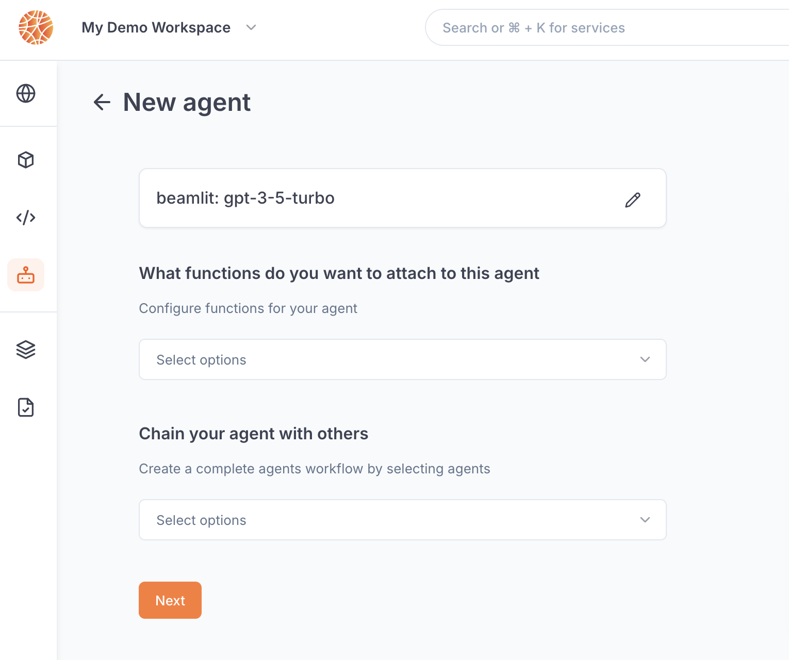

---

title: 'Agents'

sidebarTitle: "Overview"

description: 'The simplest way to run AI agents.'

---

Agents are AI-powered systems that are able to interact with their consumers, reason, and autonomously take action on the external world via APIs to read or write data. 

## Beamlit concepts

There are three types of workloads that you can deploy on Beamlit:

- **Functions**: These are pieces of custom code that can be executed with specific arguments through an API endpoint. They represent the tools that an agent can use to interact with the environment.
    - *When you deploy a function on Beamlit, you get a global endpoint to run the function in a sandboxed environment. It can retrieve integration connections in order to access private systems (such as a database).*
- **Model APIs**: These are the APIs to ML models that make inferences as part of the chained AI workflow. They typically represent action models: LLMs that can interact with humans in natural language and decide to use a tool at their disposal, generating the payload to use as the tool input (*function calling*)
    - *When you deploy a model API on Beamlit, you get a global endpoint to call the model provider from a unified interface that handles credentials management for you via saved integration connections.*
- **Agents**: These are files of custom code which represents an agent’s logic, dictating which functions and models it can use, as well as which agents it is allowed to transfer a request to.
    - *When you deploy an agent on Beamlit, you get a global endpoint to run the agent in a secure sandboxed environment. Agent-type workloads handle all communication with their functions, model APIs, and other linked agents — making sure all requests are authenticated against the end-user’s identity and access rights. Agents also provide complete lineage and audit tracking of consumer requests across all workloads.*

This is a high-level representation, as ultimately an entire AI agent is simply just software, but Beamlit helps you design your agent in a future-proof way by breaking it down into a function, model API and agent logic. 

Beamlit provides all the **developer tools** needed to build and run your agents throughout their lifecycle. When pushed to Beamlit, agents, models, and functions become available as single **global endpoints**. Beamlit lets you set the model APIs and tools an agent uses during development, but also **executes those API and tool calls** during agent runtime. You can manage your model lifecycle across stages using Beamlit environments such as development and production, in order to iterate on prompts and code, and ship and rollback as needed. 

## Run your agent on Beamlit

To run your agent on Beamlit, you must package it by **using the Beamlit SDK**. This packaging is agnostic of the framework you used to develop your agent and doesn’t prevent you from deploying your software elsewhere. The Beamlit SDK allows Beamlit to identify core resources in your code, so they can be adequately created when launching a deployment on Beamlit.

<Card title="Develop & deploy an agent on Beamlit" icon="robot" href="/Agents/Develop-an-agent">
Read our guide for deploying any custom AI agent on Beamlit.
</Card>

Read the reference below to learn about how deploying agents work on Beamlit.

## Deployment life-cycle

### How agent deployment works

Beamlit agent deployment works using two conceptual entities: **agents** and **deployments**.

- **Agents** are the base logical entity labeling an AI agent throughout it’s life-cycle. An agent can be instantiated into multiple deployments over different environments. This effectively allows to run multiple versions of the agent at the same time, each on a different environment.
- **Deployments** (a.k.a agent deployments) are the instantiation of one agent version over one specific [environment](../Model-Governance/Environments). For example, you can have a *deployment* XYZ of *agent* ABC on the *production environment*.
- **Executions** (a.k.a inference executions) are ephemeral invocations of agent deployments by a [consumer](Query-agents%2015447e47b1ea802f88bbd4bb180bf101). Because Beamlit is serverless, an agent deployment is only materialized onto one of the execution locations when it actively receives and processes requests. Workload placement and request routing is fully managed by the Global Inference Network, as defined by your [environment policies](../Model-Governance/Environments).

An agent can be uploaded into Beamlit from a variety of origins. At this moment, it can be either: **just** **created** (an *agent deployment* exists but it is deactivated), or **created and deployed** (as an *agent deployment*). At any time, you can deactivate an agent deployment, and update it with a new version.

### Deploying an agent

Deploying an agent will create the associated agent deployment. At this time: 

- it is [reachable](Query-agents) through a specific endpoint
- it does not consume resources [until it is actively being invoked and processing inferences](Query-agents)
- its deployment/inference policies are governed by the associated [environment](../Model-Governance/Environments)
- its status can be monitored either on the console or using the CLI/APIs

Deploy an agent by running the following [CLI](https://docs.beamlit.com/cli-reference/beamlit_apply) command:

```
bl apply -f ./my-agent-deployment.yaml
```

Read our [reference for agent deployments](https://docs.beamlit.com/api-reference/agents/get-agent-by-name).

### Updating an agent version

As you iterate on software development, you will need to update the version of an agent that is currently deployed and used by your consumers.

One way to manage this is through multiple [environments](../Model-Governance/Environments), and releasing the agent version that is on one environment (e.g. development) to another environment (e.g. production). Another more straightforward way is to directly update an agent deployment on an environment.

Agent deployments are updated following a **blue-green** paradigm. The Global Inference Network will wait for the new version to be completely up and ready before routing inference requests to the new deployment.

When using the Beamlit console, you can update all agent configurations except policies by selecting ***Deploy a new version***.


To update the policies of an agent deployment using the Beamlit console, go the the ***Policies*** page and edit them here.


Agent deployments can also be updated via the Beamlit [APIs](https://docs.beamlit.com/api-reference/agents/update-agent-by-name) or [CLI](https://docs.beamlit.com/cli-reference/beamlit_apply).

### Releasing to another environment

Because you have several environments, you can manage deployment of an agent version from one environment to the other. On Beamlit, this is called ***releasing*** a agent deployment. 

When releasing, you need to choose an *origin* environment and a *destination* environment. Upon releasing:

1. the agent deployment on the *destination* environment (if it exists) will be overwritten (i.e. updated) with the agent deployment from the *origin* environment. 
    - You can choose whether to also release the policies set at the level of the origin agent deployment on the destination deployment. This will overwrite all deployment-level policies in the destination environment with the ones from the origin deployment.
    - ⚠️ Warning: if the [environment-level policies](../Model-Governance/Environments) are different between the origin and destination, the behavior of the deployment may be different between the two environments.
2. the agent deployment on the *origin* environment will remain unchanged, and will still be reachable after release

Read more on our [reference on agent releases](https://docs.beamlit.com/api-reference/agents/create-release-for-a-agent-from-an-environment).

### Deactivating an agent deployment

Any agent deployment can be deactivated at any time. When deactivated, it will **no longer be reachable** through the inference endpoint and will stop consuming resources. 

Agents can be deactivated and activated at any time from the Beamlit console, or via [API](https://docs.beamlit.com/api-reference/agents/update-agent-by-name) or [CLI](https://docs.beamlit.com/cli-reference/beamlit_apply).


## Agent deployment reference

### Model

You must choose one action model, which will be the reasoning and talking core of the agent. The model must be a [model API](../Models/Overview) referenced on Beamlit.

Read about [the API parameters in the reference](https://docs.beamlit.com/api-reference/agents/create-agent-by-name).

### Functions

Select one or multiple [functions](../Functions/Overview) to equip your agent with the ability to run custom code. This is optional, in which case your agent will only be able to talk.

### Chaining and multi-agents

Multi-agent systems allow to better specialize each agent, with their specific set of tools and instructions. 

You can chain other agents to an agent on Beamlit. When processing a consumer query, the agent will be able to handover the request to another agent that is chained to it if the action model considers it the best way to address the query.



### Environment

You must choose an [environment](../Model-Governance/Environments%2013847e47b1ea81ac9677d81f847741bd) when deploying an agent on Beamlit. Environments allow you to pre-attach [policies](../Model-Governance/Policies) to an agent deployment (for example: to make it so the agent only runs in certain countries, or on a certain hardware). 

### Policies

Additional [policies](../Model-Governance/Policies%2013847e47b1ea817daa5bcd58129a9bdb) can be optionally attached to an agent deployment directly. If there already are policies set in the environment, policies of the **same policy type** (e.g. location-based, flavor-based, etc.) will collide. In this case, the result will be [as described here](../Model-Governance/Policies).

### Resources

Select the memory size to allocate to the execution of the agent.

<Card title="Develop & deploy an agent on Beamlit" icon="robot" href="/Agents/Develop-an-agent">
Read our guide for deploying any custom AI agent on Beamlit.
</Card>