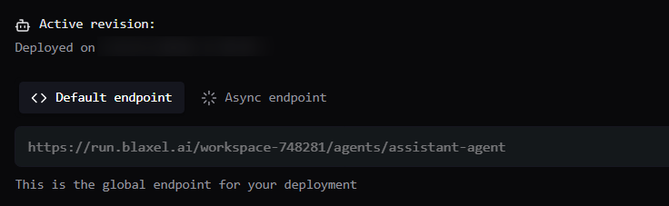

Every Blaxel sandbox exposes a Model Context Protocol (MCP) server that allows agents to operate the sandbox using tool calls. This includes [tools for process management, filesystem operations, and code generation](./MCP).

This guide demonstrates by creating a sandbox-aware agent using the [Claude Agent SDK](https://platform.claude.com/docs/en/agent-sdk/overview), but you could also use other frameworks like LangChain, Vercel AI SDK, Mastra, or your own custom code.

## Assumptions

This example assumes that you have the following:

- An Anthropic API key, required by Claude Agent SDK. If not, [sign up for an Anthropic account](https://platform.claude.com/) and obtain an API key.
- A Blaxel account and API key. If not, [sign up for a Blaxel account](https://blaxel.ai) and [obtain an API key](/Security/Access-tokens#api-keys).
- The Blaxel CLI. If not, [download and install the Blaxel CLI]((../cli-reference/introduction))

## 1. Install required dependencies

Create a directory for the project:

```shell
mkdir sandbox-agent && cd sandbox-agent
```

Agents deployed on Blaxel must expose an HTTP endpoint for requests.

In your project directory, install the [Claude Agent SDK](https://platform.claude.com/docs/en/agent-sdk/overview) for the agent loop, the Blaxel TypeScript SDK / Python SDK for sandbox operations, and [Express](https://expressjs.com/) (TypeScript) / [FastAPI](https://fastapi.tiangolo.com/) (Python) to handle HTTP requests and responses:

<CodeGroup>
```shell TypeScript (npm)
npm init # if new project
npm install @anthropic-ai/claude-agent-sdk express @blaxel/core
```

```shell TypeScript (pnpm)
pnpm init # if new project
pnpm install @anthropic-ai/claude-agent-sdk express @blaxel/core
```

```shell TypeScript (yarn)
yarn init # if new project
yarn add @anthropic-ai/claude-agent-sdk express @blaxel/core
```

```shell TypeScript (bun)
bun init -m --yes # if new project
bun install @anthropic-ai/claude-agent-sdk express @blaxel/core
```

```shell Python (pip)
python3 -m venv .venv && source .venv/bin/activate # if new project
pip install claude-agent-sdk "fastapi[standard]" blaxel
```

</CodeGroup>

## 2. Configure the environment

Add your API keys to a `.env` file in the project directory:

```shell
echo "ANTHROPIC_API_KEY=your_anthropic_key_here" > .env
echo "BL_API_KEY=your_blaxel_key_here" >> .env
```

## 3. Build the agent

In your project directory, create a file named `index.ts` (TypeScript) or `main.py` (Python) with the following code:

<CodeGroup>

```typescript TypeScript
import { query } from "@anthropic-ai/claude-agent-sdk";
import express from "express";
import { SandboxInstance } from "@blaxel/core";

const host = process.env.HOST || "0.0.0.0";
const port = parseInt(process.env.PORT || "8000");

const app = express();

app.use(express.json());

app.post("/query", async (req, res) => {
  const { prompt } = req.body;

  if (!prompt) {
    return res.status(400).json({ error: "prompt is required" });
  }

  if (!process.env.BL_API_KEY) {
    return res.status(400).json({ error: "BL_API_KEY env var is required" });
  }

  try {

    const sandbox = await SandboxInstance.createIfNotExists({
      name: "my-sandbox",
      image: "blaxel/base-image:latest",
      memory: 4096,
    });

    let response = "";

    for await (const message of query({
      prompt: prompt,
      options: {
        systemPrompt: "You are connected to a sandbox environment with tools. Use the tools to accomplish the task.",
        mcpServers: {
          "sandbox": {
            type: "http",
            url: `${sandbox.metadata?.url}/mcp`,
            headers: {
              Authorization: `Bearer ${process.env.BL_API_KEY}`,
            },
          },
        },
        tools: [],
        permissionMode: "bypassPermissions",
        allowDangerouslySkipPermissions: true,
      }
    })) {
      if (message.type === "assistant" && message.message?.content) {
        for (const block of message.message.content) {
          if ("text" in block) {
            console.log(block.text);
          } else if ("name" in block) {
            console.log(`Tool: ${block.name}`);
          }
        }
      } else if (message.type === "result") {
        console.log(`Done: ${message.result}`); // Final result
        response = message.result
      }
    }

    return res.json({ response });
  } catch (error) {
    return res.status(500).json({ error: error instanceof Error ? error.message : "Unknown error" });
  }
});

app.listen(port, host, () => {
  console.log(`Server listening on ${host}:${port}`);
});
```

```python Python
import os
from fastapi import FastAPI, HTTPException, Request
from claude_agent_sdk import query, ClaudeAgentOptions, AssistantMessage, ResultMessage
from blaxel.core import SandboxInstance
import uvicorn

host = os.getenv("HOST", "0.0.0.0")
port = int(os.getenv("PORT", "8000"))

app = FastAPI()

@app.post("/query")
async def query_endpoint(request: Request):

    body = await request.json()
    prompt = body.get("prompt")

    if not prompt:
        raise HTTPException(status_code=400, detail="prompt is required")

    api_key = os.getenv("BL_API_KEY")

    if not api_key:
        raise HTTPException(status_code=400, detail="BL_API_KEY env var is required")

    try:
        sandbox = await SandboxInstance.create_if_not_exists({
            "name": "my-sandbox",
            "image": "blaxel/my-sandbox:latest",
            "memory": 4096,
        })

        response = ""

        async for message in query(
            prompt=prompt,
            options=ClaudeAgentOptions(
                system_prompt="You are connected to a sandbox environment with tools. Use the tools to accomplish the task.",
                mcp_servers={
                    "sandbox": {
                        "type": "http",
                        "url": f"{sandbox.metadata.url}/mcp",
                        "headers": {
                            "Authorization": f"Bearer {api_key}"
                        }
                    }
                },
                tools=[],
                permission_mode="bypassPermissions",
            )
        ):
            if isinstance(message, AssistantMessage):
                for block in message.content:
                    if hasattr(block, "text"):
                        print(block.text)
                    elif hasattr(block, "name"):
                        print(f"Tool: {block.name}")
            elif isinstance(message, ResultMessage):
                print(f"Done: {message.subtype}")
                response = message.result

        return {"response": response}
    except Exception as error:
        raise HTTPException(
            status_code=500,
            detail=str(error) if error else "Unknown error"
        )


if __name__ == "__main__":
    print(f"Server listening on {host}:{port}")
    uvicorn.run(app, host=host, port=port)
```

</CodeGroup>

This creates a Blaxel sandbox named `my-sandbox` and an agent using the Claude Agent SDK.

- The sandbox exposes a streamable HTTP MCP server at the sandbox's base URL: `https://<SANDBOX_BASE_URL>/mcp`.
- The agent exposes an HTTP endpoint at `/query` to accept user requests.
- The agent's HTTP service is bound to the host and port provided by Blaxel. Blaxel automatically injects these values as `HOST` and `PORT` variables into the runtime environment.
- The agent configuration includes the sandbox MCP server URL and uses the Blaxel API key as credential to gain access to it (the `Authorization` header).

In TypeScript, entrypoints are managed in the `scripts` section of the `package.json` file. Update your `package.json` to ensure that `start` and `dev` scripts are defined in the `scripts` section (TypeScript only).

<CodeGroup>

```json TypeScript (npm/pnpm/yarn)
{
  "scripts": {
    "start": "tsx index.ts",
    "dev": "tsx --watch index.ts",
    "build": "tsc"
  },
  // ...
}
```

```json TypeScript (bun)
{
  "scripts": {
    "start": "bun run index.ts",
    "dev": "bun --watch index.ts"
  },
  // ...
}
```

</CodeGroup>


## 4. Test the agent locally

Log in to Blaxel:

```bash
bl login
```

Test the agent by making the endpoint available locally:

```shell
bl serve --hotreload
```

This starts the agent locally while sandboxing the core agent logic, function calls and model API calls exactly as they would be when deployed on Blaxel. The `--hotreload` flag monitors and reloads the agent if the source code changes.

Note the host port on which the agent is running.

In another terminal, send the agent a request (update the endpoint URL below with the correct port number for your agent):

```shell
curl -X POST http://0.0.0.0:1338/query  \
 -H "Content-Type: application/json" \
 -d '{"prompt": "what tools are available to you?"}'
```

You should see output similar to the following (abbreviated for clarity):

```shell
{"response":"I have access to the following tools:\n\n## Code Analysis & Navigation\n- **codegenCodebaseSearch** - Semantic search to find relevant code snippets\n- **codegenFileSearch** ..."}
```

Give the agent a more complex task that requires it to use the sandbox tools over MCP:

```shell
curl -X POST http://0.0.0.0:1338/query  \
 -H "Content-Type: application/json" \
 -d '{"prompt": "install a complete Python development environment in the sandbox. Create a hello world program in Python and save the code file to the sandbox filesystem. Once done, respond with the location of your saved code file and a summary of the tools you used."}'
```

If the agent is successful, it will return output similar to the following (abbreviated for clarity):

```json
{"response":"## ✅ Installation Complete!\n\n### 📍 Code File Location:\n**`/blaxel/hello_world.py`**\n\nThe hello world program has been successfully created and tested. ... ### 🛠️ Tools Used:\n\n1. **mcp__sandbox__fsGetWorkingDirectory** - Determined the working directory (/blaxel)\n2. **mcp__sandbox__processExecute** - Used multiple times to:\n   - Check for existing Python installation\n ..."}
```

Connect to the sandbox and validate the agent's output:

```shell
bl connect sandbox my-sandbox
cat /blaxel/hello_world.py
```

## 5. Deploy the agent on Blaxel

Deploying the agent on Blaxel is as simple as running the following command:

```shell
bl deploy
```

The Blaxel CLI will prompt for, or auto-detect, details of your project and begin the deployment. Once the deployment process is complete, log in to the [Blaxel Console](https://app.blaxel.ai/) to find the global endpoint for your agent service. Typically, this will be of the form `https://run.blaxel.ai/WORKSPACE/agents/AGENT`.



## Resources

Want the complete guide on developing and deploying agents on Blaxel? Check out the following resources:

<Card title="Give compute to your agent with the TypeScript SDK " icon="square-js" href="/Agents/Develop-an-agent-ts">
Complete guide for using the TypeScript SDK to develop an agent using Blaxel services.
</Card>

<Card title="Give compute to your agent with the Python SDK " icon="python" href="/Agents/Develop-an-agent-py">
Complete guide for using the Python SDK to develop an agent using Blaxel services.
</Card>

<Card title="Deploy your agent code to Blaxel" icon="server" href="/Agents/Deploy-an-agent">
Complete guide for deploying AI agents on Blaxel.
</Card>

<Card title="Manage environment variables" icon="lock" href="/Agents/Variables-and-secrets">
Complete guide for managing variables and secrets when deploying on Blaxel.
</Card>
