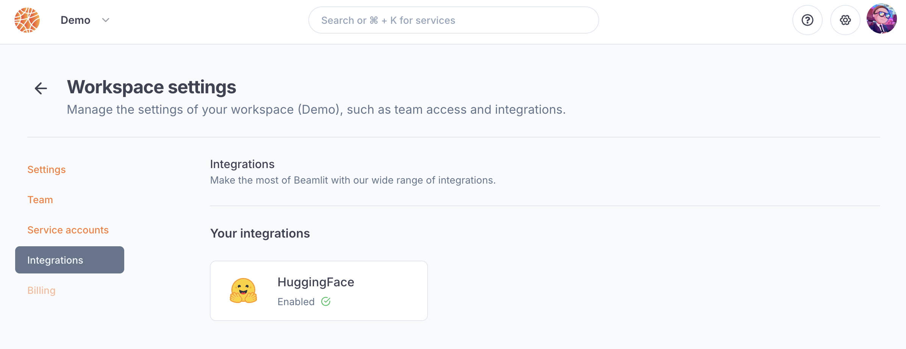
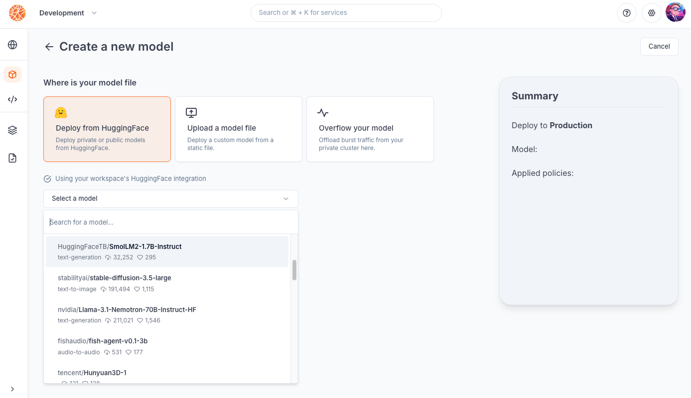
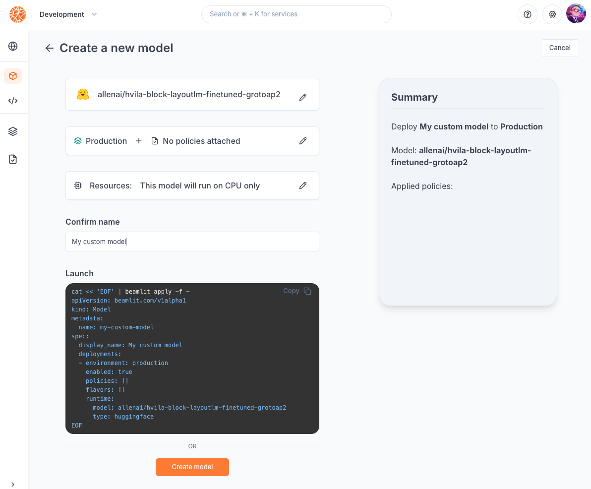

---

title: 'Deploy a custom model from HuggingFace'

description: 'Learn how to deploy a model you saved on a private HuggingFace repository.'

---

This tutorial demonstrates how to use the Beamlit console to deploy a custom model that is stored on HuggingFace.

## Prerequisites

- A Beamlit workspace
- A custom model that has been saved on a HuggingFace repository
- A [HuggingFace](https://huggingface.co/) account
- A HuggingFace access token that has access to the aforementioned model. Read about how to generate an access token on [this HuggingFace guide](https://huggingface.co/docs/hub/security-tokens).

## Guide

### Setup the workspace integration with HuggingFace

To setup an integration with HuggingFace, you must use a [user access token](https://huggingface.co/docs/hub/security-tokens) generated on the HuggingFace console.

Go in **Workspace Settings > Integrations**, and look for *HuggingFace*.



Paste your user access token from HuggingFace. If there is already a token there, you can also replace it. All model deployments will start using the new token to connect to HuggingFace.

### Deploy the model

In **Global Inference Network > Models > Create a new model**, after having selected **Deploy from HuggingFace,** validate that the workspace configuration is correctly set and is being used for the model creation.



Then, choose a HuggingFace model to deploy using the search tool. You can search for both the organization name or model name. 

<Info>You can select any model that the integration’s access token has access to.</Info>

Then, move on to the next step. Keep the [environment](../Model-Governance/Environments.mdx) set to *production* without any additional policy. 

Give a name, then deploy the model.



You can also run the following CLI command to deploy your model to the *production* environment: 

```
cat << 'EOF' | beamlit apply -f -
apiVersion: beamlit.com/v1alpha1
kind: Model
metadata:
  name: my-custom-model
spec:
  display_name: My custom model
  deployments:
  - environment: production
    enabled: true
    policies: []
    flavors: []
    runtime:
      model: your-huggingface-organization/your-huggingface-model
      type: huggingface
EOF
```

That’s it! Your model is deployed and ready to be called using the inference endpoint.

### Call the model

Use your model deployment’s [inference endpoint](../Models/Query-a-model.mdx) to make an inference request. 

For a model called `My custom model` in workspace `My workspace`, the base URL should look like the following:

`run.beamlit.com/my-workspace/models/my-custom-model`

Call it via an HTTP **POST** request, authenticating yourself with a [bearer token](../Security/Access-tokens.mdx):

```
curl 'https://run.beamlit.com/YOUR-WORKSPACE/models/YOUR-MODEL?environment=YOUR-ENVIRONMENT' \
  -H 'accept: application/json, text/plain, */*' \
  -H 'x-beamlit-authorization: Bearer YOUR-TOKEN' \
  -H 'x-beamlit-workspace: YOUR-WORKSPACE' \
  --data-raw $'{"inputs":"Enter your input here."}'
```

If your HuggingFace model implements any other endpoint, they will be served on the URL above. For example:

`run.beamlit.com/my-workspace/models/my-custom-model/v1/chat/completions`

For further reference, read our documentation about [model deployments](../Models/Model-deployment.mdx).