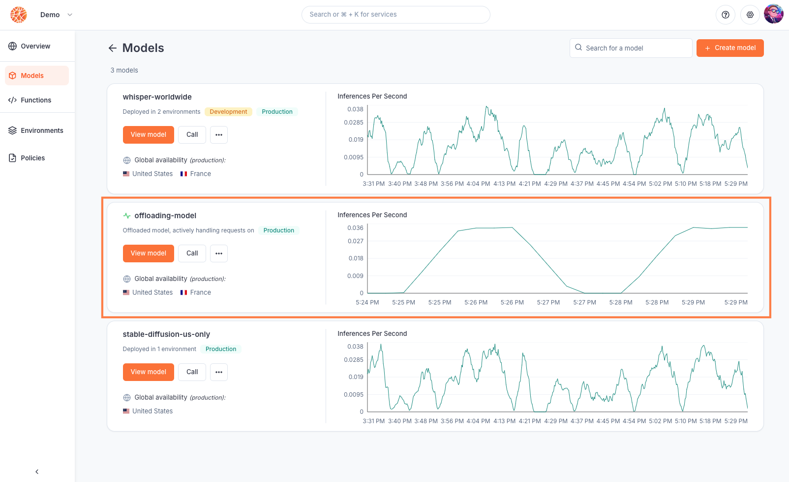

---

title: 'Offload burst inferences from a self hosted model'

description: 'Learn how to create a hybrid replica of a model deployed on your own Kubernetes cluster.'

---

This tutorial demonstrates how you can create a hybrid deployment of a model deployed on your own private Kubernetes cluster with Beamlit, in order to make your app more resilient in case of burst traffic or hardware failure for example.

## Prerequisites

1. A Beamlit workspace
2. A running **Kubernetes cluster** where you have deployed a ML model (as a Deployment, StatefulSet, ReplicaSet, or DaemonSet). 

1. **Helm**. Version 3.8.0 or later is recommended in order to use [OCI-based registries](https://helm.sh/docs/topics/registries/). Check out the [Installation Guide.](https://helm.sh/docs/intro/install/)
1. A **Prometheus server** that will contain metrics used to trigger offloading. Make sure you have its address as you will need it later.

## Guide

On a conceptual level, model offloading works by defining a [model deployment](../Models/Model-deployment) on Beamlit that references a Kubernetes Deployment on your own cluster. The is done **via the open-source [Beamlit controller](https://github.com/beamlit/beamlit-controller).** You can interact with the controller using Kubernetes *Custom Resources (CR)*, in order to:

- create the corresponding resources on Beamlit
- monitor metrics on Prometheus
- route traffic based on trigger conditions, via a Beamlit gateway installed alongside the controller

### Create a service account

[Service accounts](../Security/Service-accounts%2013847e47b1ea8152aac9f45438e91d84) act as virtual users in your [Beamlit workspace](../Security/Workspace-access-control), representing external systems that need to control Beamlit resources. The Beamlit controller authenticates using a service account in your workspace.

Open the Beamlit console. In **Workspace Settings > Service Accounts**, create a new service account. Make sure to retrieve its *client ID* and *client secret*.


<Info>Read further documentation about [service accounts here](https://docs.beamlit.com/Security/Service-accounts).</Info>

### Install the Beamlit controller

The next step is to install the [open-source controller](https://github.com/beamlit/beamlit-controller) in your cluster. This tutorial will install the controller in a `beamlit` namespace, which is a recommended best practice.

**Run the following commands** to add the repository from Helm and install the package. Make sure to **edit** the variables `CLIENT_ID` and `CLIENT_SECRET` with the values previously retrieved, and `config.metricInformer.prometheus.address` with the address for your Prometheus server:

```bash
   # Download chart and install Beamlit controller
export CLIENT_ID="FILL HERE"
export CLIENT_SECRET="FILL HERE"
export API_KEY=`echo -n $CLIENT_ID:$CLIENT_SECRET | base64`
helm install beamlit-controller oci://ghcr.io/beamlit/beamlit-controller-chart \
    --set beamlitApiToken=$API_KEY \
    --set config.defaultRemoteBackend.authConfig.oauthConfig.clientId=$CLIENT_ID \
    --set config.defaultRemoteBackend.authConfig.oauthConfig.clientSecret=$CLIENT_SECRET \
    --set config.metricInformer.type=prometheus \
    --set config.metricInformer.prometheus.address="my-local-prom:9090" \
    --namespace beamlit \
		--create-namespace
```

You can verify that the controller was successfully installed by running:

```bash
kubectl get pods --namespace beamlit
```

### Make your model overflow

On Beamlit, a Kubernetes Deployment is mapped to a **ModelDeployment**. These are fully serverless and consume resources only when they are actively processing requests. Offloaded models activate only when a metric reaches a threshold. At all other times, requests go to your Deployment, while the model on Beamlit remains idle.

**Create** a *ModelDeployment* [custom resource](https://beamlit.github.io/beamlit-controller/crds/crds-docs.html#modeldeployment) in a file `my-deployment.yaml` to be remotely applied by the controller. Use the template YAML below and replace with your specific values:

```yaml
apiVersion: deployment.beamlit.com/v1alpha1
kind: ModelDeployment
metadata:
  name: my-model
spec:
  model: my-model
  environment: production # Can also be development
  modelSourceRef:
    apiVersion: apps/v1 
    kind: Deployment 
    name: my-model 
    namespace: default
  serviceRef:
    name: my-model
    namespace: default
    targetPort: 8080 # Port where your model listens on
  offloadingConfig:
    behavior:
      percentage: 50
    metrics:
      - type: External
			  external:
			    metric:
			      name: "vllm:num_requests_running" # Metric name in Prometheus, or PromQL query 
			      target:
				      type: Value
				      value: 20
```

With this resource, the Beamlit controller will monitor a Prometheus server for the value of the offloading metric. If you want to use Kubernetes’ metrics-server instead, follow [our guide here](../Models/Cloud-Burst-Network/Cluster-configurations/Set-up-overflow-metric).

Create the model deployment by **running the following command** in your cluster:

```
kubectl apply -f my-deployment.yaml
```

A model deployment is now created on Beamlit. It remains in **standby mode** until the activation metric reaches the threshold. When it does, the model will become active and requests will start being routed to Beamlit, making sure all your consumers are served. 

### Monitor offloaded requests

You can verify when requests are being routed to Beamlit by accessing the Beamlit console and navigating to the **Models** page. There, when there is an active offloading state, you'll see the model marked as actively handling offloaded requests, along with real-time metrics.



For further reference, read our documentation about [model offloading](../Models/Cloud-Burst-Network/Model-overflow).