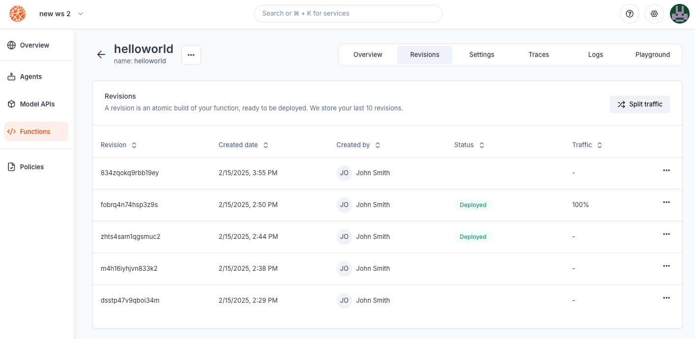

---

title: 'Deploy custom MCP servers'

description: 'Host your custom MCP Servers on Blaxel as serverless autoscalable endpoints.'

---

Blaxel provides a serverless infrastructure to instantly deploy MCP servers. You receive a global inference endpoint for each deployment, and your workloads are served optimally to dramatically accelerate cold-start and latency. The main way to deploy an MCP server on Blaxel is by **using Blaxel CLI.**

## Deploy an MCP server with Blaxel CLI

This section assumes you have developed the MCP server locally, as explained [in this documentation](Create-MCP-server), and are ready to deploy it.

### Serve locally

Blaxel offers you a way to serve locally either:

<AccordionGroup>

<Accordion title="The server and MCP Inspector to test it (recommended)" icon="flask">

You can test it by running the following command which launches **both** the MCP server and a web application to query it ([MCP Inspector](https://github.com/modelcontextprotocol/inspector), managed by MCP) locally.

<CodeGroup>

```shell TypeScript

pnpm inspect

```

```shell Python

BL_DEBUG=true uv run mcp dev src/server.py

```

</CodeGroup>

The web application is accessible at: [http://127.0.0.1:6274](http://127.0.0.1:6274/). Alternatively, you can just simply [serve the server](Deploy-a-function) locally by running `bl serve --hotreload`.

</Accordion>

<Accordion title="Just the server" icon="server">

You can serve the MCP server locally in order to make the entrypoint function (by default: `server.ts` / `server.py`) available on a local endpoint.

Run the following command to serve the MCP server:

```bash
bl serve
```

You can then create an MCP Client to communicate with your server. When testing locally, communication happens over stdio, but when deployed on Blaxel, your server will use streamable HTTP instead.

Add the flag `--hotreload`  to get live changes.

```bash
bl serve --hotreload
```

</Accordion>

</AccordionGroup>

### Deploy on production

You can deploy the MCP server in order to make the entrypoint function (by default: `server.ts` / `server.py`) **available on a global hosted endpoint**. When deploying to Blaxel, you get a dedicated endpoint that enforces your [deployment policies](../Model-Governance/Policies).

Run the following command to build and deploy the MCP server on Blaxel:

```bash
bl deploy
```

You can now [connect to the MCP server](Invoke-functions) either from an agent on Blaxel (using the Blaxel SDK), or from an external client that supports HTTP.

<Accordion title="Example of tool calling via Blaxel SDK" icon="bolt">

<CodeGroup>

```typescript In TypeScript

// Import tool adapter (in whichever framework format):
import { blTools } from "@blaxel/langchain";
// or
import { blTools } from "@blaxel/llamaindex";
// or
import { blTools } from "@blaxel/mastra";
// or
import { blTools } from "@blaxel/vercel";

// or

// …

const tools = blTools(['blaxel-search'])
```

```python In Python

# Import tool adapter (in whichever framework format):

from blaxel.pydantic import bl_tools
# or
from blaxel.langgraph import bl_tools
# or
from blaxel.crewai import bl_tools
# or
from blaxel.googleadk import bl_tools
# or
from blaxel.openai import bl_tools

#or

# …

tools = await bl_tools(['blaxel-search'])
```

</CodeGroup>

</Accordion>

<Card title="Connect to an MCP server" icon="bolt" href="/Functions/Invoke-functions">
Learn how to run tool calls through your MCP server.
</Card>

### Customize an MCP server deployment

You can set custom parameters for an MCP server deployment (e.g. specify the server name, etc.) in the `blaxel.toml` file at the root of your directory.

For more information on MCP deployment settings, refer to the reference section down at the bottom of this guide.

### Deploy with a Dockerfile

While Blaxel uses predefined, optimized container images to build and deploy your code, you can also deploy your workload using your own [Dockerfile](https://docs.docker.com/reference/dockerfile/).

<Card title="Deploy using Dockerfile" icon="folder-tree" href="/Agents/Deploy-dockerfile">
Deploy resources using a custom Dockerfile.
</Card>

### Deploy multiple resources at once

Using a custom Dockerfile allows for [deploying multiple agents & MCPs from the same repository](../Agents/Deploy-multiple) with shared dependencies.

<Card title="Deploy multiple resources with shared files" icon="folder-tree" href="/Agents/Deploy-multiple">
Deploy multiple agents & MCP servers with shared context from a single repository.
</Card>

## Reference for deployment life-cycle

### Maximum runtime

- Deployed MCP servers have a runtime limit after which executions time out. The maximum timeout is 15 minutes.

### Manage revisions

As you iterate on your software development, you will need to update the version of a function that is currently deployed and used by your consumers. Every time you build a new version of your function, this creates a **revision**. Blaxel stores the last 5 revisions for each object.



Revisions are atomic builds of your deployment that can be either deployed (accessible via the inference endpoint) or not. This system enables you to:

- **rollback a deployment** to its exact state from an earlier date
- create a revision without immediate deployment to **prepare for a future release**
- implement progressive rollout strategies, such as **canary deployments**

Important: Revisions are not the same as versions. You cannot use revisions to return to a previous configuration and branch off from it. For version control, use your preferred system (such as GitHub) alongside Blaxel.

Deployment revisions are updated following a **blue-green** paradigm. The Global Inference Network will wait for the new revision to be completely up and ready before routing requests to the new deployment. You can also set up a **canary deployment** to split traffic between two revisions (maximum of two).


<Note>When making a deployment using Blaxel CLI (`bl deploy`), the new traffic routing depends on the `--traffic` option. Without this option specified, Blaxel will automatically deploy the new revision with full traffic (100%) if the previous deployment was the latest revision. Otherwise, it will create the revision without deploying it (0% traffic).</Note>

### Code mode

Blaxel supports ["code mode"](Code-mode) natively, enabling a more efficient way to execute tool calls over MCP.

## Deployment reference

The MCP server deployment can be configured via the ***blaxel.toml*** file in your MCP server directory. This file is not mandatory; if the file is not found or a required option is not set, you will be prompted for the information during deployment.

```toml
name = "my-mcp-server"
workspace = "my-workspace"
type = "function"

[env]
DEFAULT_CITY = "San Francisco"

[[triggers]]
  id = "trigger-my-mcp"
  type = "http"
[triggers.configuration]
  path = "functions/my-mcp" # This will create this endpoint on the following base URL: https://run.blaxel.ai/{YOUR-WORKSPACE}/
  authenticationType = "public"
```

- `name`, `workspace`, and `type` fields are optional and serve as default values. Any bl command run in the folder will use these defaults rather than prompting you for input.
- `[env]` section defines environment variables that the MCP server can access via the SDK. Note that these are NOT [secrets](../Agents/Variables-and-secrets).
- `[[triggers]]`  and `[triggers.configuration]` sections defines ways to send requests to the MCP servers. You can also make them either private (default) or public (`authenticationType = "public"`).

<AccordionGroup>
<Accordion title="Define entrypoints in Python" icon="python">

Additionally, when developing in Python, you can define an `[entrypoint]` section to specify how Blaxel is going to start your server.

```toml
...

[entrypoint]
prod = ".venv/bin/python3 src/server.py"
dev = "npx nodemon --exec uv run python src/server.py"

...
```

- `prod`:  this is the command that will be used to serve your MCP server

```bash
.venv/bin/python3 src/server.py
```

- `dev`: same as prod in dev mode, it will be used with the command `--hotreload`. Example:

```bash
npx nodemon --exec uv run python src/server.py
```

This `entrypoint` section is optional. If not specified, Blaxel will automatically detect in the MCP server’s content and configure your server’s startup settings.

</Accordion>

<Accordion title="Define entrypoints in TypeScript" icon="js">

In TypeScript, entrypoints are managed in the `scripts` in the `package.json` file at the root of the directory.

- `scripts.start` : start the server locally through the TypeScript command, to avoid having to build the project when developing.
- `scripts.build` : build the project. It is done automatically when deploying.
- `scripts.prod` : start the server remotely on Blaxel from the dist folder, the project needs to be have been built before.
- `scripts.dev` : same as start, but with hotreload. It's useful when developing locally, each file change is reflected immediately.

The remaining fields in *package.json* follow standard JavaScript/TypeScript project conventions. Feel free to add any dependencies you need, but keep in mind that devDependencies are only used during the build process and are removed afterwards.
</Accordion>
</AccordionGroup>

### Deployment manifests (advanced usage)

When `bl deploy` runs, it generates a YAML configuration manifest automatically and deploys it to Blaxel's hosting infrastructure. You can also create custom manifest files in the `.blaxel` folder and deploy them using the following command:

```
bl apply -f ./my-deployment.yaml
```

Read our [reference for MCP server deployments](https://docs.blaxel.ai/api-reference/functions/get-function-by-name).

<Card title="Query MCP servers" icon="bolt" href="/Functions/Invoke-functions">
Learn how to run tool calls on your MCP server.
</Card>

<Card title="Use Claude Agent SDK with MCP code mode on Blaxel" icon="thumbs-up" href="/Tutorials/Claude-Agent-SDK-Code-Mode">
Build an agent that connects to a Blaxel MCP server running in code mode using Claude Agent SDK.
</Card>
