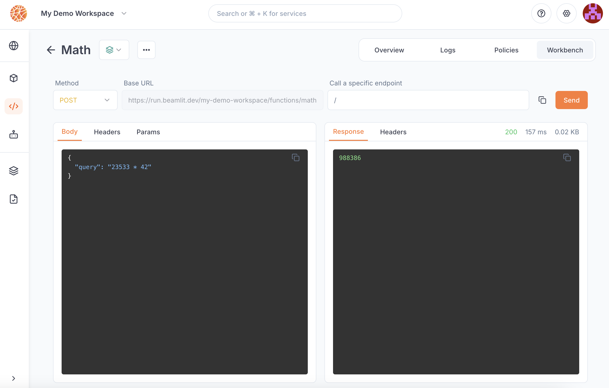

---

title: 'Query MCP servers'

description: 'Make invocation requests on your MCP servers.'

---

Blaxel uses **streamable HTTP** as its MCP transport mechanism. MCP servers deployed on Blaxel are only hosted server-side and cannot be installed locally.

<Warning>
Blaxel has replaced its WebSockets implementation for MCP transport with streamable HTTP (as of November 2025). Blaxel will continue to temporarily support WebSockets for a transition period, but users should update their deployments to the streamable HTTP transport as soon as possible to avoid errors.
</Warning>

## MCP server endpoint

When you deploy an MCP server on Blaxel, an **HTTP endpoint** is generated on Global Agentics Network to connect to the server.

The server endpoint looks like this:

```http Connect to an MCP server

https://run.blaxel.ai/{YOUR-WORKSPACE}/functions/{YOUR-SERVER-NAME}/mcp

```

### Endpoint authentication

By default, MCP servers deployed on Blaxel aren’t public. It is necessary to authenticate all connections, via a [bearer token](../Security/Access-tokens).

The evaluation of authentication/authorization for messages is managed by the Global Agentics Network based on the [access given in your workspace](../Security/Workspace-access-control).

You can make an MCP server **public**, meaning it will bypass Blaxel authentication and you will have to implement your own authentication inside the server. This can be done through the `blaxel.toml` configuration file.

<Accordion title="blaxel.toml reference">

The MCP server deployment can be configured via the ***blaxel.toml*** file in your MCP server directory.

This file is used to configure the deployment of the MCP server on Blaxel. The only mandatory parameter is the `type` so Blaxel knows which kind of entity to deploy. Others are not mandatory but allow you to customize the deployment.

```toml
name = "my-mcp-server"
workspace = "my-workspace"
type = "function"

[env]
DEFAULT_CITY = "San Francisco"

[[triggers]]
  id = "trigger-my-mcp"
  type = "http"
[triggers.configuration]
  path = "functions/my-mcp" # This will create this endpoint on the following base URL: https://run.blaxel.ai/{YOUR-WORKSPACE}/
  authenticationType = "public"
```

- `name`, `workspace`, and `type` fields are optional and serve as default values. Any bl command run in the folder will use these defaults rather than prompting you for input.
- `[env]` section defines environment variables that the MCP server can access via the SDK. Note that these are NOT [secrets](../Agents/Variables-and-secrets).
- `[[triggers]]`  and `[triggers.configuration]` sections defines ways to send requests to the MCP servers. You can also make them either private (default) or public (`authenticationType = "public"`).

</Accordion>

### Timeout limit

MCP server runtime has a hard limit of 15 minutes.

## Call the MCP server

You can connect to your MCP server and send requests in several ways (code samples below):

- **use the Blaxel SDK to retrieve tools**: best when developing an agent, particularly when running on Blaxel
- **connect from your code directly**: suitable for custom implementations requiring server connection to list and call tools
- **connect from the Blaxel Console's Playground**: best for testing and validating server functionality

### Use Blaxel SDK to retrieve tools

The following code example demonstrates how to use the Blaxel SDK to retrieve and pass an MCP server’s tools when building an agent.

<CodeGroup>

```typescript In TypeScript

// Import tool adapter (in whichever framework format):
import { blTools } from "@blaxel/langchain";
// or
import { blTools } from "@blaxel/llamaindex";
// or
import { blTools } from "@blaxel/mastra";
// or
import { blTools } from "@blaxel/vercel";

// or

// …

const tools = blTools(['blaxel-search'])
```

```python In Python

# Import tool adapter (in whichever framework format):

from blaxel.pydantic import bl_tools
# or
from blaxel.langgraph import bl_tools
# or
from blaxel.crewai import bl_tools
# or
from blaxel.googleadk import bl_tools
# or
from blaxel.openai import bl_tools

#or

# …

tools = await bl_tools(['blaxel-search'])
```

</CodeGroup>

### Directly connect from your code

Below are snippets of code to connect to an MCP server that is deployed on Blaxel. You will need the following information:

- `BL_API_KEY`: an [API key](../Security/Access-tokens) to connect to your Blaxel workspace
- `BL_WORKSPACE`: the slug ID for your workspace
- `MCP_SERVER_NAME`: the slug name for your MCP server

<CodeGroup>

```typescript In TypeScript
import { settings } from "@blaxel/core";
import { Client } from "@modelcontextprotocol/sdk/client/index.js";
import { StreamableHTTPClientTransport } from "@modelcontextprotocol/sdk/client/streamableHttp.js";
import dotenv from 'dotenv';

console.log('Connected using Streamable HTTP transport');
// Load environment variables from .env file
dotenv.config();


// Initialize client
const client = new Client({
  name: 'streamable-http-client',
  version: '2.0.0'
});

// Initialize transport
const baseUrl = `${settings.runUrl}/${settings.workspace}/functions/blaxel-search/mcp`
const transport = new StreamableHTTPClientTransport(new URL(baseUrl), { requestInit: { headers: settings.headers } });

// Connect client to transport
await client.connect(transport);

// List tools
const response = await client.listTools();
console.log(`Tools retrieved, number of tools: ${response.tools.length}`);
```

```python In Python
import asyncio

from mcp.client.session import ClientSession
from mcp.client.streamable_http import streamablehttp_client

from blaxel import settings


async def run():
    """Run the completion client example."""
    url = f"{settings.run_url}/{settings.workspace}/functions/blaxel-search/mcp"

    async with streamablehttp_client(url, settings.headers) as (read, write, _):
        async with ClientSession(read, write) as session:
            # Initialize the connection
            await session.initialize()
            tools = await session.list_tools()
            print(f"Tools retrieved, number of tools: {len(tools.tools)}")

asyncio.run(run())
```

</CodeGroup>

Requirements are as follows:

<CodeGroup>

```json package.json (In TypeScript)

"dependencies": {"@blaxel/core": …}

```

```txt requirements.txt (In Python)

python-dotenv
blaxel

```

</CodeGroup>

### Connect to pre-built servers

Blaxel’s pre-built MCP servers offer two methods:

- `tools/list` : method that **lists the available tools** and their schemas, allowing consumers (you or agents) to discover the function’s capabilities.
- `tools/call` : method that lets consumers **execute individual tools**. It requires params with two keys:
    - `name`: the name of the tool to run, obtained from the listing endpoint above
    - `arguments`: an object with the key and values of input parameters for the execution, obtained from the listing endpoint above

Example of `tools/list` outbound message on a Brave Search toolkit (make sure to fill in the authentication token).

```json
{
	"method":"tools/list",
	"jsonrpc":"2.0",
	"id":1
}
```

This one returns two tools in the function: ***brave_web_search*** and ***brave_local_search***.

```json
{
    "result": {
        "tools": [
            {
                "name": "blaxel_web_search",
                "description": "Performs a web search using the Brave Search API, ideal for general queries, news, articles, and online content. Use this for broad information gathering, recent events, or when you need diverse web sources. Supports pagination, content filtering, and freshness controls. Maximum 20 results per request, with offset for pagination. ",
                "inputSchema": {
                    "type": "object",
                    "properties": {
                        "query": {
                            "type": "string"
                        },
                        "count": {
                            "type": "number"
                        },
                        "offset": {
                            "type": "number"
                        }
                    },
                    "additionalProperties": false,
                    "$schema": "http://json-schema.org/draft-07/schema#"
                }
            },
            {
                "name": "blaxel_local_search",
                "description": "Searches for local businesses and places using Brave's Local Search API. Best for queries related to physical locations, businesses, restaurants, services, etc. Returns detailed information including:\n- Business names and addresses\n- Ratings and review counts\n- Phone numbers and opening hours\nUse this when the query implies 'near me' or mentions specific locations. Automatically falls back to web search if no local results are found.",
                "inputSchema": {
                    "type": "object",
                    "properties": {
                        "query": {
                            "type": "string"
                        },
                        "count": {
                            "type": "number"
                        }
                    },
                    "additionalProperties": false,
                    "$schema": "http://json-schema.org/draft-07/schema#"
                }
            }
        ]
    },
    "jsonrpc": "2.0",
    "id": "1"
}
```

Example of `tools/call` outbound message on the ***brave_web_search*** tool.

```json
{
	"jsonrpc":"2.0",
	"id":2,
	"method":"tools/call",
	"params":{
		"name":"blaxel_web_search",
		"arguments":{
			"query":"What is the current weather in NYC?",
			"count":1,
			"offset":1
			}
		}
}
```

### Via Blaxel console

Requests to an MCP server can be made from the Blaxel console from the server deployment’s **Playground** page.


