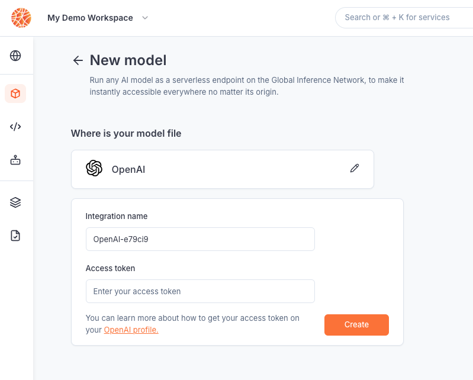

---

title: 'Get started'

description: 'Deploy your first AI agent worldwide in just 3 minutes.'

---

Beamlit is a serverless platform that enables AI teams to **push and run any AI agent in a production-critical environment** in a single click. This tutorial demonstrates how to deploy your first AI agent on Beamlit.

<Steps titleSize="h3”>

<Step title="Install the Beamlit CLI">

<AccordionGroup>

<Accordion title="Install on Mac" icon="apple">

<Warning>To install the Beamlit CLI, you must use [Homebrew](https://brew.sh/): make sure it is installed on your machine. We are currently in the process of supporting additional installers. Please reach out to [support@beamlit.com](mailto:support@beamlit.com) if you need to use an alternative to Homebrew.</Warning>

Install the Beamlit CLI by running the two following commands successively in a terminal:

```shell 

### Tap the Beamlit formula to Homebrew

brew tap beamlit/beamlit

```

```shell 

### Install the Beamlit CLI using Homebrew
brew install beamlit

```

</Accordion>

<Accordion title="Install on Linux" icon="linux">

Install the Beamlit CLI by running the following command in a terminal (alternatives below):

```shell 

curl -fsSL

https://raw.githubusercontent.com/beamlit/toolkit/main/install.sh

| BINDIR=$HOME/.local/bin sudo -E sh

```

If you need to use `sudo`, or specify a version, run one of the following commands instead:

```shell 

### With version
curl -fsSL

https://raw.githubusercontent.com/beamlit/toolkit/main/install.sh

| VERSION=0.16.0 BINDIR=$HOME/.local/bin sh

### With Sudo:
curl -fsSL

https://raw.githubusercontent.com/beamlit/toolkit/main/install.sh

| BINDIR=/usr/local/bin sudo -E sh

```

</Accordion>

</AccordionGroup>

</Step>

<Step title="Create a model API endpoint">

Make sure you have created an account on Beamlit, and created a first [workspace](Security/Workspace-access-control%2013847e47b1ea8151bd43efeccf5defe0). Then use the Beamlit console to create a [model API](Models/Overview). Model APIs allow developers to have a centralized API that unifies credentials management and access to LLM providers. 

Select **OpenAI** > **gpt-4o-mini**, make sure to enter an [OpenAI access token](Integrations/OpenAI) and deploy the endpoint on the *Production* environment.



</Step>

<Step title="Create your first AI agent">

Run the following command in a terminal to login to Beamlit. Use the **Device** mode to authenticate via your browser.

```bash
bl login your-workspace-slugified-name
```

Let’s initialize a first app. The following command creates a **pre-scaffolded local repository** ready for developing and deploying your agent on Beamlit. You will need to [have *uv* installed](https://docs.astral.sh/uv/getting-started/installation/) for this.

```bash
bl create-agent-app my-agent
```

Select *gpt-4o-mini* as the model API, choose the *Hello-world* template, and press Enter to create the repo.

<Tip>You could also just bring your own code and add [Beamlit SDK commands and decorators](Agents/Develop-an-agent) and required dependencies to deploy it. This scaffolded repository gives you everything set up and ready to go from scratch.</Tip>

You can now [develop](Agents/Develop-an-agent) your agent's core logic in `/my-agent/src/agent.py` and define your functions in `/my-agent/src/functions` (functions in this folder are automatically bound to the main agent). You may use any Python framework you prefer. This boilerplate repository is initialized with:

- A [LangChain ReAct agent](https://api.python.langchain.com/en/latest/agents/langchain.agents.react.agent.create_react_agent.html) as the core agent logic. This agent can be overridden by passing a custom agent as the `override-agent` parameter to the @agent decorator in */src/agent.py*

- A hello-world tool (a function) that returns a placeholder text string. This function can be customized by changing the code in the `helloworld` function in */src/functions/helloworld.py*, and additional functions can be created in the */src/functions* folder.

</Step>

<Step title="Test and deploy your AI agent">

Run the following command to serve your agent locally:

```bash
cd my-agent && source .venv/bin/activate;
bl serve --hotreload;
```

Query your agent locally by making a **POST** request to this endpoint: [`http://localhost:1338`](http://localhost:1338) with the following payload format: `{"inputs": "Hello world!"}`.

To push to Beamlit on the default *production* environment, run the following command. You’ll need to [have *Docker* installed](https://docs.docker.com/get-started/get-docker/) and running on your machine to build the app.

```bash
bl deploy
```

That’s it! 🌎 🌏 🌍 Your agent is now **distributed and available** across the entire Beamlit global infrastructure! [Global Inference Network](Models/Global-Inference-Network) significantly speeds up inferences by executing your agent’s workloads in sandboxed environments and smartly routing requests based on your policies.

</Step>

<Step title="Make a first inference">

Run a first inference on your Beamlit agent with the following command:

```bash
bl run agent my-agent --data '{"inputs":"Hello world!"}'
```

<Tip>Your agent is available behind a **global endpoint**. Read [this guide](Agents/Query-agents) on how to use it for HTTP requests.</Tip>

You can also run inference requests on your agent (or each function or model API) from the Beamlit console by using the Playground on the console.

</Step>

</Steps>

## Next steps

You are ready to run AI with Beamlit! Here’s a curated list of guides which may be helpful for you to make the most of the Beamlit platform, but feel free to explore the product on your own! 

<Card title="Deploy agents" icon="earth-americas" href="/Agents/Overview">
Complete guide for deploying AI agents on Beamlit.
</Card>

<Card title="Manage environment policies" icon="server" href="/Model-Governance/Overview">
Complete guide for managing deployment and routing policies on the Global Inference Network.
</Card>

<Card title="Guide for querying agents" icon="bolt" href="/Agents/Query-agents">
Complete guide for querying your AI agents on the Global Inference Network.
</Card>

## Any question?

Although we designed this documentation to be as comprehensive as possible, you are welcome to contact [**support@beamlit.com**](mailto:support@beamlit.com) with any questions or feedback you have.

Want to deploy Beamlit on-prem? [**Schedule a call**](mailto:support@beamlit.com) with us.