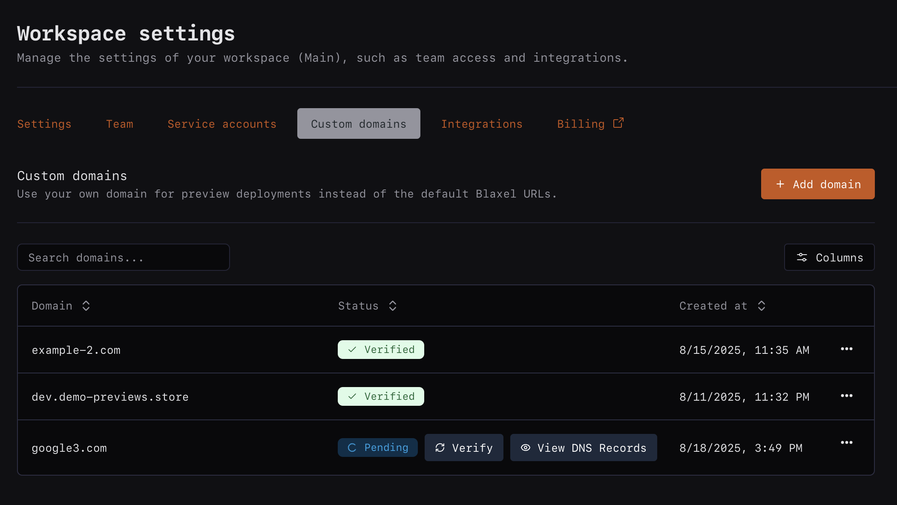

---

title: 'Custom domains'

description: 'Expose Blaxel resources using your own custom domains.'

---

<Warning>Custom domains are currently only available in [*us-west-2* region](Regions). Additional regions are coming soon.</Warning>

Blaxel allows you to connect your own domain names to your Blaxel workspace to use when exposing resources. This feature is currently only available in our **Custom plan**.

When you register a domain, you enable the use of wildcard subdomains. For example:

- If you register `mycompany.com`, Blaxel can use any `*.mycompany.com` subdomain to create custom URLs.
- If you register `preview.mycompany.com`, Blaxel can use any `*.preview.mycompany.com` subdomain to create custom URLs.
- And so on.

In your workspace settings, add a new custom domain. Then, you'll need to configure DNS records with your domain provider. Finally, verify from within Blaxel: after DNS propagation completes, your custom domain will become fully usable.

## Use a custom domain

Custom domains can currently be used for:

- [Sandboxes previews](../Sandboxes/Preview-url)
- Agents: coming soon!
- MCP servers: coming soon!