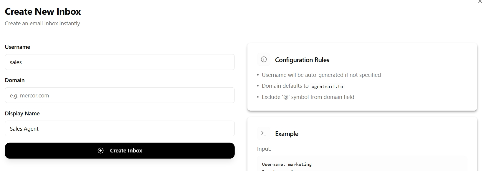
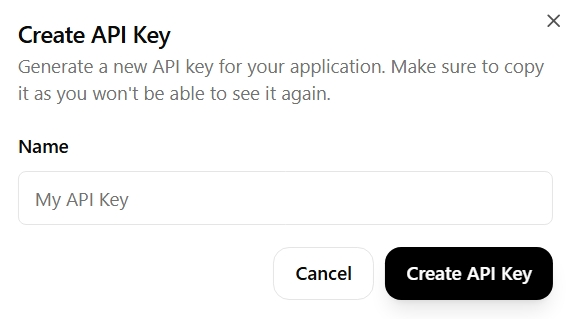
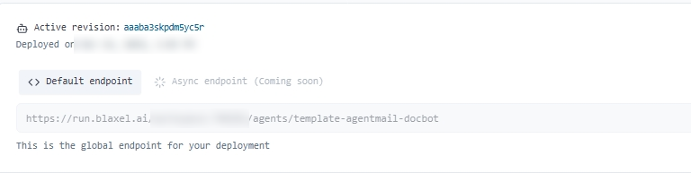

---

title: 'AgentMail'
description: 'Build an intelligent assistant that answers technical queries via email'
---

This example shows how to integrate agentic inbox provider [AgentMail](https://agentmail.to/) with Blaxel to create a customer success agent that autonomously handles technical questions via email (inbound and outbound).

## Requirements

To use this example, you'll need:

- the unique username for your AgentMail inbox
- an AgentMail API key

## Create an AgentMail inbox and API key

From your AgentMail dashboard, create a new inbox, providing a unique username (by default, the domain is set to `agentmail.to`):



From the same dashboard, obtain an API key:



## Configure the project

Clone the [example repository](https://github.com/blaxel-templates/template-agentmail-docbot) and follow the instructions provided.

Note that you must configure the following environment variables for your deployment:

```
INBOX_USERNAME=      # a unique username for your inbox
AGENTMAIL_API_KEY=   # your AgentMail API key

```

Create a `.env` file in the project root with these variables, or set them in your deployment environment.

## Deploy the agent

[Deploy the agent](../Agents/Deploy-an-agent) on Blaxel. Once the agent is deployed, retrieve its [inference endpoint](../Agents/Query-agents).



You will need an API key to query the agent externally. Follow [this guide to create a service account in your workspace and generate an API key](../Security/Service-accounts).

<Card title="AgentMail Documentation" icon="book" href="[https://docs.agentmail.to/](https://docs.agentmail.to/welcome)">
Complete documentation for using AgentMail.
</Card>