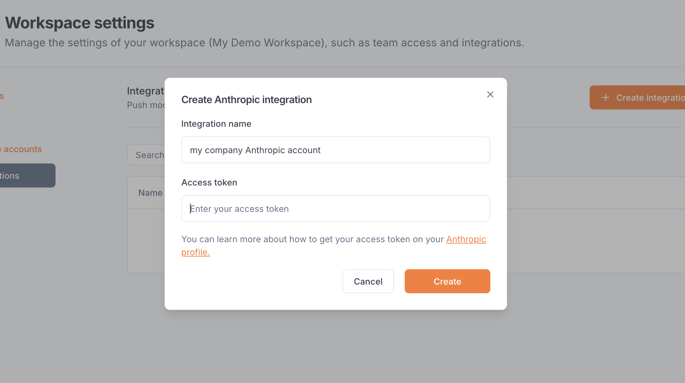

---

title: 'Anthropic integration'

description: 'Connect your agents to LLMs from Anthropic.'

---

The Anthropic integration allows Blaxel users to **call Anthropic models using a Blaxel endpoint** in order to unify access control, credentials and observability management. 

The integration must be set up by an [admin](../Security/Workspace-access-control) in the Integrations section in the [workspace settings](../Security/Workspace-access-control).

## Set up the integration

In order to use this integration, you must register an Anthropic access token into your Blaxel workspace settings. The scope of this access token (i.e. the Anthropic workspace it is allowed to access) will be the scope that Blaxel has access to.

First, generate an [Anthropic API key](https://docs.anthropic.com/en/api/getting-started) from [your Anthropic organization settings](https://console.anthropic.com/settings/keys). Select the workspace to use for this key.

On Blaxel, in Workspace Settings > Anthropic integration, create a new connection and paste this token into the “API key” section.

## Connect to an Anthropic model

Once you’ve set up the integration in the workspace, any workspace member can use it to reference an Anthropic model as an [external model API](../Models/External-model-apis).

When creating a model API, select Anthropic. You can search for any model from the Anthropic catalog.

After the model API is created, you will receive a dedicated global Blaxel endpoint to call the model. Blaxel will forward inference requests to Anthropic, using your Anthropic credentials for authentication and authorization.

<Info>Because your own credentials are used, any inference request on this endpoint will incur potential costs on your Anthropic account, as if you queried the model directly on Anthropic.</Info>