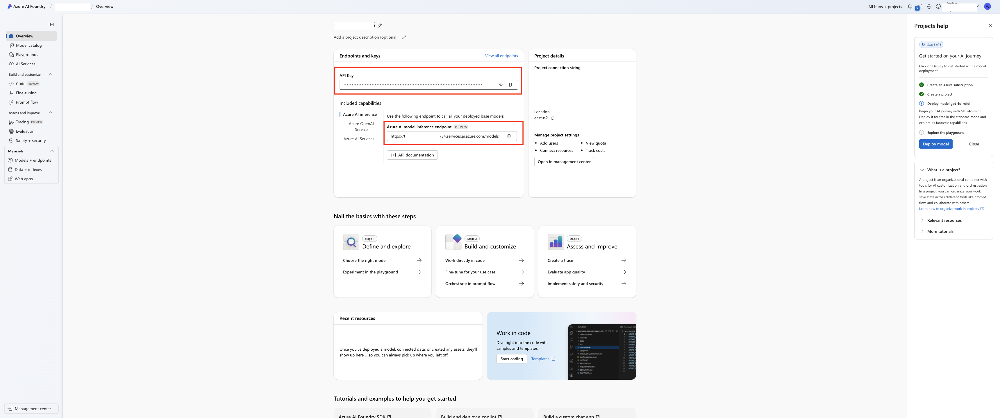
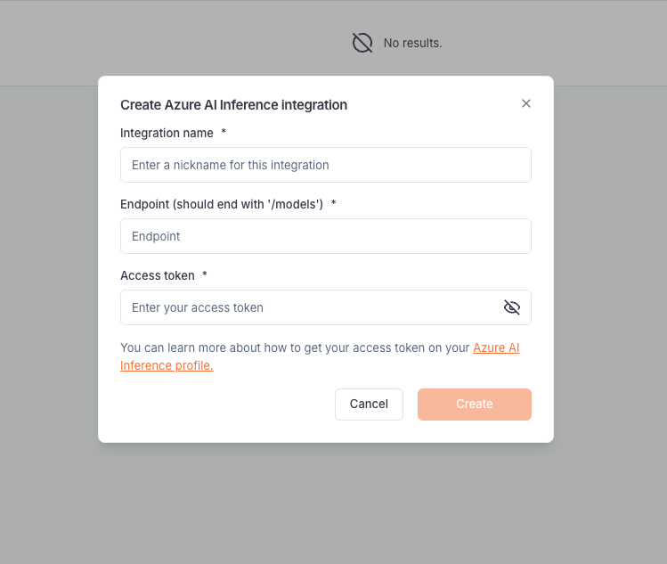
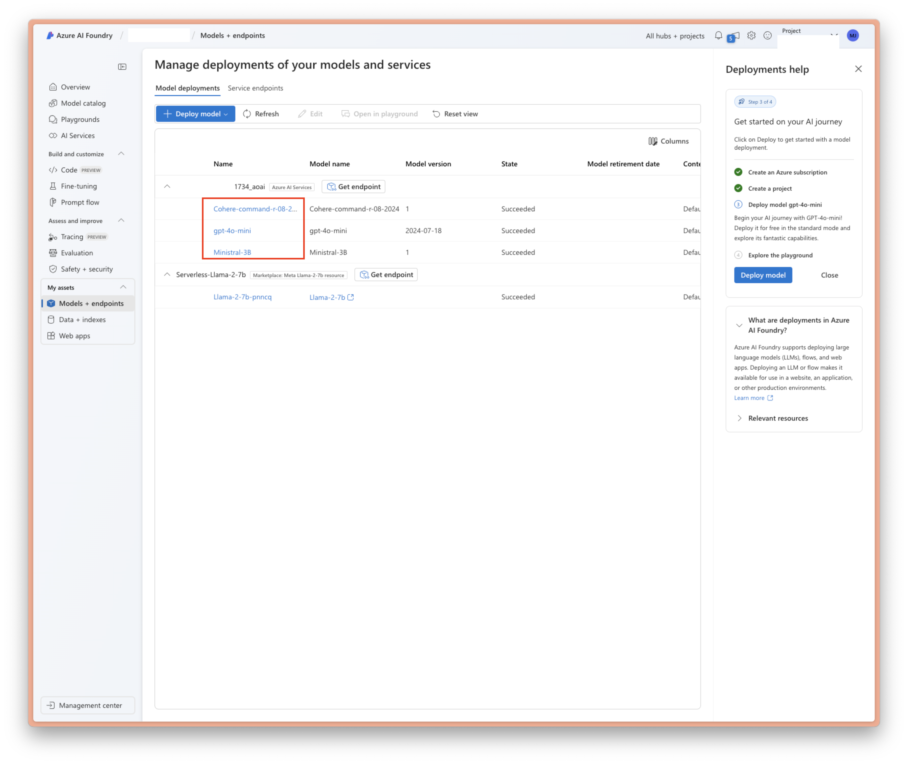
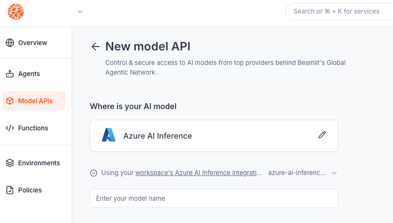

---

title: 'Azure AI Foundry integration'

description: 'Connect your agents to LLMs deployed in Azure AI Inference, Azure OpenAI Service, and Azure AI Services.'

---

The Azure AI Foundry integration allows Blaxel users to **call models deployments from [Azure AI Foundry](https://learn.microsoft.com/en-us/azure/ai-studio/what-is-ai-studio) services** (Azure AI Inference, Azure OpenAI Service, and Azure AI Services) through a Blaxel endpoint that unifies access control, credentials and observability management. 

There are 2 types of integrations related to this service:

- **Azure AI Inference**: connect to a model endpoint deployed as an “Azure AI Services” model on Azure. This typically includes OpenAI models.
- **Azure AI Marketplace**: connect to a model deployed from the Azure Marketplace. This typically includes Llama models.

The integration must be set up by an [admin](../Security/Workspace-access-control) in the Integrations section in the [workspace settings](../Security/Workspace-access-control).

## Azure AI Inference

### Set up the integration

In order to use this integration, you must register an Azure AI Inference endpoint and access key into your Blaxel workspace settings. 

First, go to the [Azure AI Foundry console](https://ai.azure.com/build/overview), and open your project. Select the “Azure AI Inference” capability, and retrieve both:

- the **API key**
- the **Azure AI model inference endpoint**

On Blaxel, in Workspace Settings > Azure AI Inference integration, create a new connection and paste the endpoint and the Access token there.

### Connect to a model

Once you’ve set up the integration in the workspace, any workspace member can use it to reference an “Azure AI Services” model as an [external model API](../Models/External-model-apis).

When creating a model API, select “Azure AI Inference”. Then, input the **name** of your model just as it is deployed on Azure.

After the model API is created, you will receive a dedicated global Blaxel endpoint to call the model. Blaxel will forward inference requests to Azure, using your Azure credentials for authentication and authorization.

<Info>Because your own credentials are used, any inference request on this endpoint will incur potential costs on your Azure account, as if you queried the model directly on Azure.</Info>

## Azure AI Marketplace

### Set up the integration & connect to a model

In order to use this integration, you must register an Azure endpoint and access token into your Blaxel workspace settings. 

<Warning>The difference with most other model API integrations is that the integration will be tied to your model.</Warning>

First, go to the [Azure AI Foundry console](https://ai.azure.com/build/overview), and open your project. Go to your models, and open the model you want to connect to. Retrieve:

- the **API key**
- the **Azure AI model inference endpoint**

On Blaxel, in Workspace Settings > Azure Marketplace integration, create a new connection and paste this token into the “Access token” section.

Once you’ve set up the integration in the workspace, any workspace member can use it to connect to the model as an [external model API](../Models/External-model-apis).

When creating a model API, select Azure Marketplace, input the name of the endpoint as you want it on Blaxel, and finish creating the model.

After the model API is created, you will receive a dedicated global Blaxel endpoint to call the model. Blaxel will forward inference requests to Azure, using your Azure credentials for authentication and authorization.

<Info>Because your own credentials are used, any inference request on this endpoint will incur potential costs on your Azure account, as if you queried the model directly on Azure.</Info>