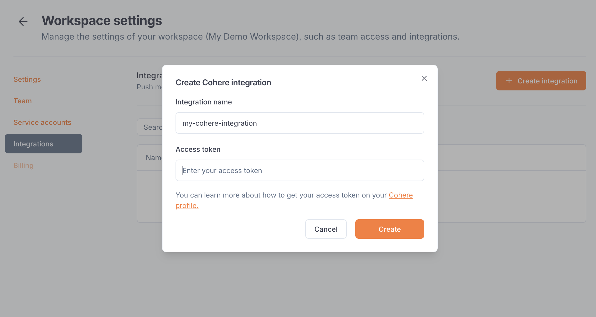
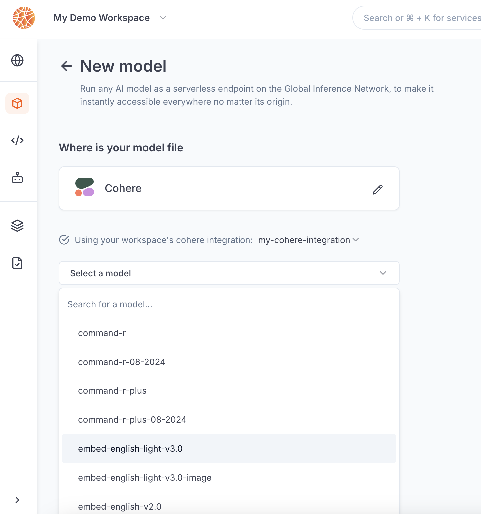

---

title: 'Cohere integration'

description: 'Connect your agents to LLMs from Cohere.'

---

The Cohere integration allows Blaxel users to **call Cohere models using a Blaxel endpoint** in order to unify access control, credentials and observability management. 

The integration must be set up by an [admin](../Security/Workspace-access-control) in the Integrations section in the [workspace settings](../Security/Workspace-access-control).

## Set up the integration

In order to use this integration, you must register a Cohere access token into your Blaxel workspace settings. First, generate a [Cohere API key](https://docs.cohere.com/v2/docs/rate-limits) from [the Cohere platform](https://dashboard.cohere.com/api-keys). 

On Blaxel, in Workspace Settings > Cohere integration, create a new connection and paste this token into the “API key” section.

## Connect to an Cohere model

Once you’ve set up the integration in the workspace, any workspace member can use it to reference a Cohere model as an [external model API](../Models/External-model-apis).

When creating a model API, select Cohere. You can search for any model from the Cohere catalog.

After the model API is created, you will receive a dedicated global Blaxel endpoint to call the model. Blaxel will forward inference requests to Cohere, using your Cohere credentials for authentication and authorization.

<Info>Because your own credentials are used, any inference request on this endpoint will incur potential costs on your Cohere account, as if you queried the model directly on Cohere.</Info>