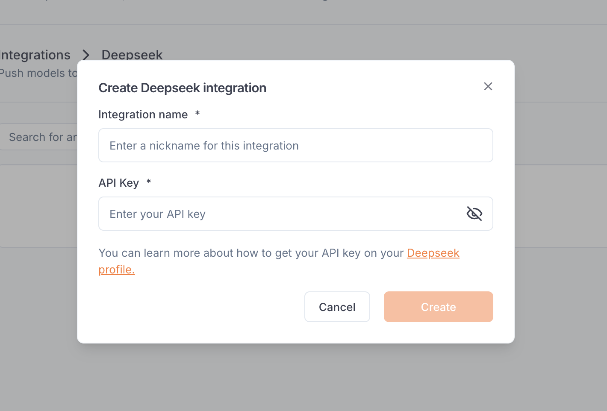

---

title: 'DeepSeek integration'

description: 'Connect your agents to LLMs from DeepSeek.'

---

The DeepSeek integration allows Beamlit users to **call DeepSeek models using a Beamlit endpoint** in order to unify access control, credentials and observability management. 

The integration must be set up by an [admin](../Security/Workspace-access-control%2013847e47b1ea8151bd43efeccf5defe0) in the Integrations section in the [workspace settings](../Security/Workspace-access-control).

## Set up the integration

In order to use this integration, you must register an DeepSeek access token into your Beamlit workspace settings. First, generate an DeepSeek API key from [your DeepSeek console](https://platform.deepseek.com/api_keys). 

On Beamlit, in Workspace Settings > DeepSeek integration, create a new connection and paste this token into the “API key” section.

## Connect to an DeepSeek model

Once you’ve set up the integration in the workspace, any workspace member can use it to reference an DeepSeek model as an [external model API](../Models/External-model-apis).

When creating a model API, select DeepSeek. You can search for any model from the DeepSeek catalog.

After the model API is created, you will receive a dedicated global Beamlit endpoint to call the model. Beamlit will forward inference requests to DeepSeek, using your DeepSeek credentials for authentication and authorization.

<Info>Because your own credentials are used, any inference request on this endpoint will incur potential costs on your DeepSeek account, as if you queried the model directly on DeepSeek.</Info>