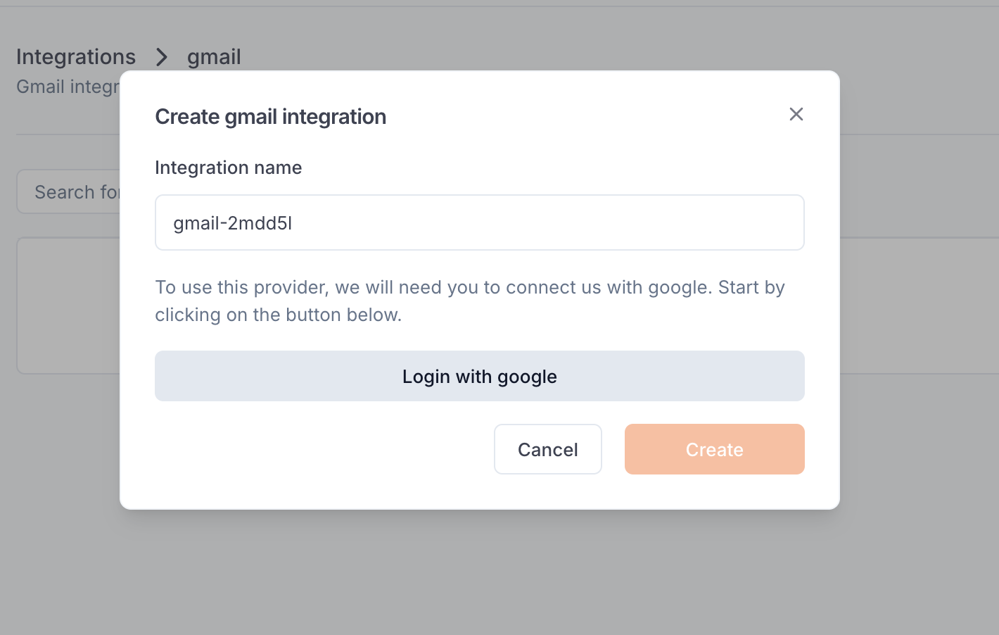

---

title: 'Gmail'

description: 'Integrate Gmail services into your agents for email communication capabilities.'

---

The *Gmail integration* allows you to equip your agents with tools to interact with Gmail services, enabling email communication and message processing within your applications.

## Set up the integration

In order to use this integration, you must sign-in to your Google account. This will create an integration to Gmail in your workspace settings.

## Create a Gmail function

Once you’ve set up the integration in the workspace, any workspace member can use it to create a Gmail [function](../Functions/Overview).

When creating a function, select Gmail. After the function is created, you will receive a dedicated global Beamlit endpoint to call it.

### Available tools

This integration provides the following tools:

- `send_email`: Send an email using Gmail. No sender will be needed, it use a default configuration. You just have to set the recipient as an email string address inside the parameter "to", a subject and a body in string format