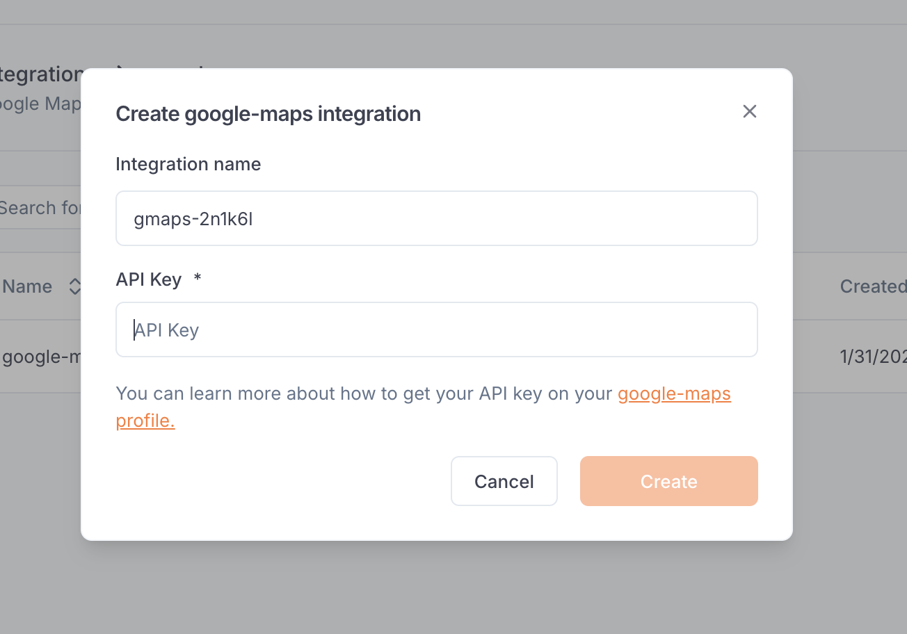

---

title: 'Google Maps'

description: 'Integrate Google Maps services into your agents for location-based capabilities.'

---

The *Google Maps integration* allows to equip your agents with tools to interact with Google Maps services, enabling location-based functionalities and geographic data processing within your applications.

## Set up the integration

In order to use this integration, you must register a Google Cloud Platform (GCP) API access token. The scope of this access token will be the scope that Beamlit has access to.

First, generate a GCP API key from [your GCP 'API & Services' section](https://console.cloud.google.com/apis/credentials). Then on Beamlit, in the workspace settings, in the *Google Maps* integration, paste this token into the “API key” section.

## Create a Google Maps function

Once you’ve set up the integration in the workspace, any workspace member can use it to create a Google Maps [function](../Functions/Overview).

When creating a function, select Google Maps. After the function is created, you will receive a dedicated global Beamlit endpoint to call it.

### Available tools

This integration provides the following tools:

- `maps_geocode`: Convert an address into geographic coordinates
- `maps_reverse_geocode`: Convert coordinates into an address
- `maps_search_places`: Search for places using Google Places API
- `maps_place_details`: Get detailed information about a specific place
- `maps_distance_matrix`: Calculate travel distance and time for multiple origins and destinations
- `maps_elevation`: Get elevation data for locations on the earth
- `maps_directions`: Get directions between two points