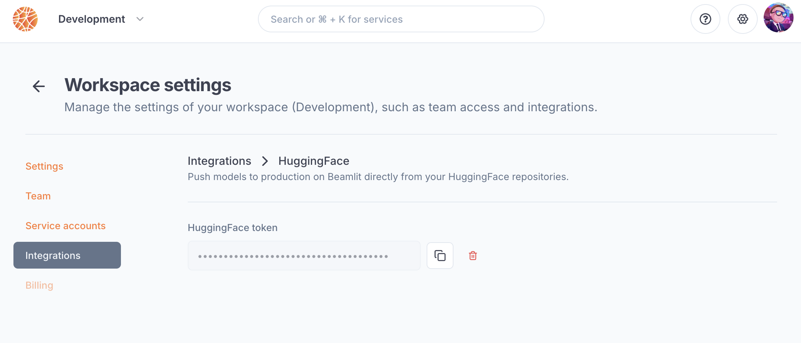
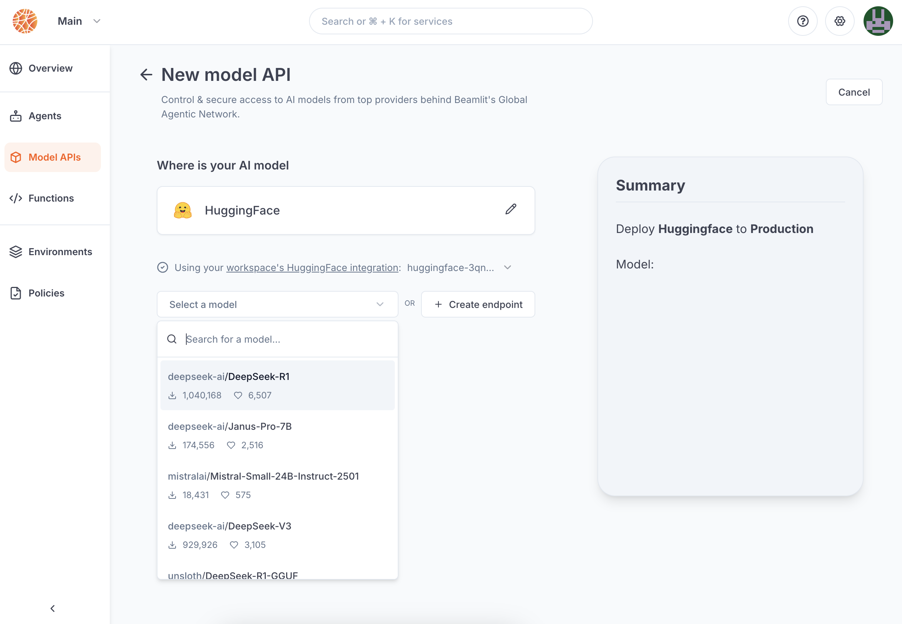

---

title: 'HuggingFace integration'

description: 'Deploy public or private AI models from HuggingFace.'

---

The [HuggingFace](https://huggingface.co/) integration enables Beamlit users to **connect to [serverless endpoints](https://huggingface.co/docs/api-inference/en/index) from HuggingFace**—whether public, gated, or private—directly through their agents on Beamlit. The integration is bidirectional, letting you create new [deployments](https://huggingface.co/docs/inference-endpoints/index) on HuggingFace from the Beamlit console to use as [model APIs](../Models/External-model-apis).

The integration must be set up by an [admin](../Security/Workspace-access-control%2013847e47b1ea8151bd43efeccf5defe0) in the Integrations section in the [workspace settings](../Security/Workspace-access-control).

## Set up the integration

In order to use this integration, you must register a HuggingFace access token into your Beamlit workspace settings. The scope of this access token (i.e. the HuggingFace resources it is allowed to access) will be the scope that Beamlit has access to.

First, generate a [HuggingFace access token](https://huggingface.co/docs/hub/security-tokens) from [your HuggingFace settings](https://huggingface.co/settings/tokens). Give this access token the scope that you want Beamlit to access on HuggingFace (e.g. repositories, etc.). 

On Beamlit, in the workspace settings, in the *HuggingFace* integration, paste this token into the “API key” section.

## Connect to a HuggingFace model

Once you’ve set up the integration in the workspace, any workspace member can use it to reference a HuggingFace model as an [external model API](../Models/External-model-apis).

### Public and private models

When [creating a model API](../Models/Overview) on Beamlit, select “HuggingFace”. You can search for:

- any **public model** from [Inference API (serverless)](https://huggingface.co/docs/api-inference/index)
- any **private model** from [Inference Endpoints (dedicated)](https://huggingface.co/docs/inference-endpoints/index) ****in the organizations & repositories allowed by the integration’s token.

After the model API is created, you will receive a dedicated global Beamlit endpoint to call the model. Beamlit will forward inference requests to HuggingFace, using your OpenAI credentials for authentication and authorization.

### Gated models

If the model you're trying to connected to is [gated](https://huggingface.co/docs/hub/models-gated), you'll **first need to request access on HuggingFace,** and accept their terms and conditions of usage (if applicable). Access to some HuggingFace models is granted immediately after request, while others require manual approval.

When the model gets deployed, Beamlit will check if the **integration token is allowed access to the model** on HuggingFace. If you have not been allowed access, the model deployment will fail in error. 

## Create a HuggingFace Inference Endpoint

You can deploy a model in HuggingFace’s [Inference Endpoints](https://huggingface.co/docs/inference-endpoints/index) directly from the Beamlit console when creating a new [external model API](../Models/External-model-apis).

- **Organization**: select the HuggingFace namespace in which the endpoint will be deployed
- **Model**: select the model to deploy
- **Instance**: choose the type (GPU) and size of the instance to use for the deployment. Beamlit will trigger a deployment on Google Cloud Platform with default auto-scaling parameters.
- **Endpoint**: enter the name for your endpoint on HuggingFace

<Warning>This action will incur costs on your HuggingFace subscription, depending on the choice of instance selected.</Warning>

Once you launch a deployment, it will be available in your HuggingFace console, as well as your Beamlit console. You will receive a dedicated global Beamlit endpoint to call the model which proxies the requests to the HuggingFace endpoint and enforces token usage control and observability.