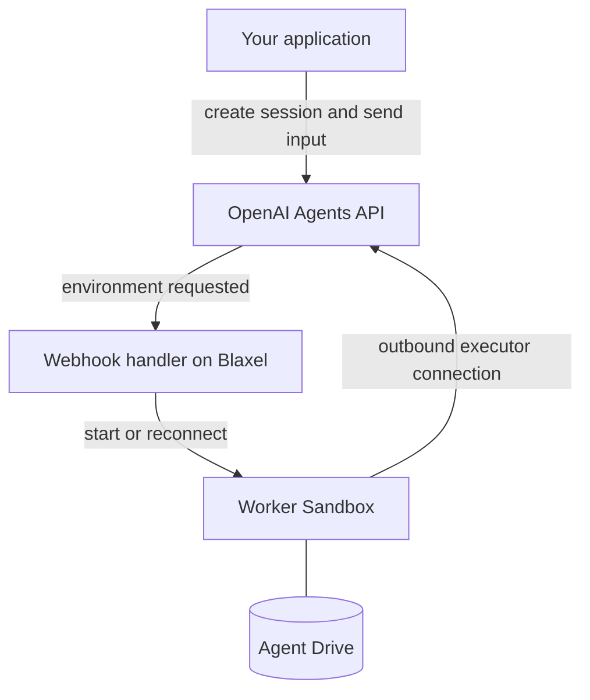

Connect an OpenAI-hosted agent to a Blaxel Sandbox to run commands, read documents, and create files. Agent Drive keeps selected files available when you replace a Sandbox or hand work to another agent.

<Info>
  The [cookbook](https://github.com/blaxel-ai/blaxel-openai-agents-api-cookbook) currently uses OpenAI's Agents API preview client. You need an OpenAI project with Agents API access and GitHub access to the client referenced in `pyproject.toml`.
</Info>

## Architecture

OpenAI manages the agent, model calls, and session state. Blaxel supplies the computer that runs its commands, plus storage and controls for that computer. Your application defines the task, agent instructions, and resource lifecycle.

The cookbook connects `codex exec-server` in each worker Sandbox to the session's self-hosted environment. That connection is outbound, so the worker does not need a public inbound port.

The diagram shows webhook-managed execution. For an application-managed run, your application starts the Sandbox and executor directly through the Blaxel SDK.

| Mode | Sandbox provisioning | Application responsibilities |
| --- | --- | --- |
| Application-managed | Your application creates the Sandbox and connects its executor | Create the session, submit work, verify the result, and delete temporary resources |
| Webhook-managed | A handler deployed in your Blaxel workspace starts or reconnects workers when OpenAI requests an environment | Submit work through the Agents API and manage session and worker cleanup |

## Credentials and access

The cookbook requires Python 3.11 through 3.14, Git, OpenAI Agents API access, and a Blaxel workspace. Application-managed examples accept a `bl login` session or `BL_WORKSPACE` and `BL_API_KEY`. The deployed handler requires the latter because it creates workers after your local process exits.

| Credential | Used by | Purpose |
| --- | --- | --- |
| `OPENAI_API_KEY` | Your application and the webhook controller | Create agents and sessions, submit work, and retrieve session state |
| `OPENAI_EXECUTOR_API_KEY` | Worker Sandboxes | Authenticate the executor's connection to OpenAI |
| `BL_WORKSPACE` and `BL_API_KEY` | Your application or webhook controller | Create and manage resources in the selected Blaxel workspace |
| `OPENAI_WEBHOOK_SECRET` | Webhook controller | Verify incoming OpenAI webhook signatures |

Create the executor key in the same OpenAI project and under the same owner as the application key. Under strict executor permission enforcement, it needs `api.agents.environments.connect`; List models: Read alone is insufficient. Ask your OpenAI representative if that permission is unavailable.

<Warning>
  If the executor key is absent, application-managed examples warn and pass the project key into the Sandbox. Webhook deployment requires a separate executor key and rejects reuse of the project key.
</Warning>

This integration connects directly to the Agents API. It does not require a Model Gateway connection in Blaxel's OpenAI integration settings.

## Persistent files and agent teams

Agent Drive mounts durable files at `/workspace/context` in the cookbook. Those files survive deletion of the Sandbox that wrote them. Unmounted Sandbox files remain temporary.

| Workflow | What continues | Drive scope |
| --- | --- | --- |
| Fresh-session handoff | A new session reads `summary.md` and writes `review.md` after the first session and Sandbox are deleted | One Drive shared by the trusted handoff |
| Parallel agent team | Engineering and support specialists write separate findings; a coordinator reads both and writes `plan.md` | A unique Drive and workload label for each team run |
| Worker replacement | The same OpenAI session reconnects to a fresh worker and reads files from its previous worker | A separate Drive and matching access labels for each session |

The team example uses Python to schedule two specialists in parallel and wait for their verified outputs before submitting the coordinator's task. Agent Drive stores their files; it does not schedule tasks or transfer conversation history or model memory.

Use [Agent Drive permissions](/Agent-drive/Permissions) to define which workloads can access each Drive and path. A mount subdirectory alone does not isolate unrelated tenants or sessions.

## Webhook lifecycle

The cookbook includes a handler deployed in a controller Sandbox with a public webhook endpoint. The first deployment prints `OPENAI_AGENT_ID`; export that ID so later deployments and the reconnect example use the same saved agent. Register the handler's URL in your OpenAI project for `agent.session.action_required` and `agent.session.failed`.

- The handler verifies each signature and accepts environment work only for its configured `OPENAI_AGENT_ID`.
- On an `agent.session.action_required` delivery with an `environment_connection` action, it stores the session ID in SQLite, acknowledges the delivery, and re-reads the session before provisioning.
- One worker serves each session. The worker connects outbound to OpenAI, and the pending input continues without being resubmitted.
- The handler keeps the worker awake while its executor is connected. It does not delete a worker when the session becomes `idle`.
- A failed session triggers worker cleanup. Deleting a session sends no cleanup webhook, so your application must also delete its worker.

To release a worker deliberately, stop its executor before deleting the Sandbox. Wait for OpenAI's `session.environment.disconnected` event before sending the next input. OpenAI can then request a replacement worker, which mounts the same session's Drive.

<Warning>
  Sending input before OpenAI reports the environment disconnected can leave the turn without file access and does not trigger the provisioning webhook. Wait for the event rather than assuming deletion has already updated the OpenAI session.
</Warning>

The controller's SQLite queue survives process restarts inside that Sandbox. Deleting or expiring the controller loses the local queue.

## Configuration and limits

These are cookbook defaults and behavior, not platform-wide limits.

| Setting | Behavior |
| --- | --- |
| `BL_AGENT_DRIVE_MODE` | `auto` uses Agent Drive when available; `required` stops when it is unavailable; `off` uses temporary storage |
| Region | Agent Drive requires `us-was-1`, the default for both application-managed runs and webhook deployment |
| Application-managed Sandbox lifetime | 15 minutes from creation |
| `WORKER_TTL` | Webhook workers default to `2h` from creation |
| `CONTROLLER_TTL` | The controller defaults to `24h` from creation; restarting its process does not renew this lifetime |
| Resource namespace | `OPENAI_WEBHOOK_RESOURCE_PREFIX` selects a separate controller and worker namespace; use the same prefix for deployment and reconnection |
| Client and executor | The cookbook refreshes the OpenAI preview client from `main` and installs Codex from the `alpha` npm tag; its README records the last verified versions |

The baseline can complete with temporary storage when Agent Drive access is unavailable. The fresh-session handoff, team example, and file-preserving reconnection check require Agent Drive. With temporary storage, a replacement worker starts with an empty filesystem.

The examples verify a completed turn and durable idle state before reading the output file. They submit each task once, reject concurrent input to the same session, and use bounded waits: 180 seconds for application-managed turns and 600 seconds for webhook-managed turns, including worker setup.

## Examples and cleanup

The [cookbook README](https://github.com/blaxel-ai/blaxel-openai-agents-api-cookbook#run-it-yourself) provides installation and credential setup. From a configured checkout, choose the example for your workflow:

| Command | Result |
| --- | --- |
| `./run.sh` | One agent reads the sample brief and creates a verified `summary.md` |
| `./run.sh --handoff` | A fresh session reads the saved summary and creates `review.md` |
| `.venv/bin/python -m examples.openai_agent_drive` | Two specialists and a coordinator create a shared plan |
| `.venv/bin/python examples/agent_drive.py` | A storage-only handoff verifies the same file in a replacement Sandbox without invoking a model |
| `./run.sh --deploy-webhook` | Deploys the controller; run it again after registering the URL and exporting its signing secret |
| `./run.sh --reconnect` | Verifies that a replacement worker in the same session reads the first worker's file |

These examples create hosted resources, and the agent examples invoke a model. Check their printed cleanup results: the scripts delete temporary sessions and workers, while Agent Drive is retained deliberately. The reconnect example also retains the controller and webhook registration.

When a deployment is no longer needed, remove its OpenAI webhook, controller, remaining workers, and API sessions. Inspect or export retained files before deleting their Drive, and use the configured resource prefix to avoid removing another deployment's resources.

## Resources

<Card title="OpenAI Agents API cookbook" href="https://github.com/blaxel-ai/blaxel-openai-agents-api-cookbook">Run the examples and inspect their lifecycle, verification, and cleanup code.</Card>

<Card title="Agent Drive" href="/Agent-drive/Overview">Configure durable files and access permissions.</Card>

<Card title="Blaxel Sandboxes" href="/Sandboxes/Overview">Configure the computer, network controls, and resource lifetime.</Card>
