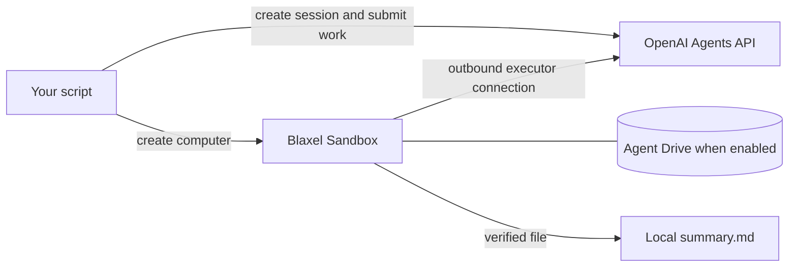

Give an OpenAI-hosted agent a Blaxel computer to turn a source report into a summary. The cookbook saves a verified local result and optionally uses Agent Drive so a fresh session can review the work after the first computer is deleted.

<Info>
  The Agents API is a public beta. The [cookbook](https://github.com/blaxel-ai/blaxel-openai-agents-api-cookbook) uses the public `openai` package and `client.beta.agents`; private GitHub access is not required.
</Info>

## Architecture

OpenAI manages the agent, model calls, and session state. Blaxel supplies the computer that runs its commands, plus storage and controls for that computer. Your application defines the task, agent instructions, and resource lifecycle.

The cookbook connects `codex exec-server` in each worker Sandbox to the session's self-hosted environment. That connection is outbound, so the worker does not need a public inbound port.



The baseline is application-managed: the script starts one computer, runs the file task, verifies the result, and deletes its session and computer. The optional handoff starts a fresh pair only after the first has been deleted. Follow the [tutorial](/Tutorials/OpenAI-Agents-API) for that reader journey.

Webhook-managed execution is an optional extension. A controller starts or reconnects a worker when OpenAI requests an environment. Its [separate cookbook guide](https://github.com/blaxel-ai/blaxel-openai-agents-api-cookbook/blob/main/webhook/README.md) covers deployment and registration.

## Credentials and access

The cookbook requires Python 3.11 through 3.14, Git, OpenAI Agents API access, and a Blaxel workspace. Application-managed examples accept `BL_WORKSPACE` and `BL_API_KEY`, or an [installed Blaxel CLI](/cli-reference/introduction) with a `bl login` session. The deployed handler requires `BL_WORKSPACE` and `BL_API_KEY` because it creates workers after your local process exits.

| Credential | Used by | Purpose |
| --- | --- | --- |
| `OPENAI_API_KEY` | Your application and the webhook controller | Create agents and sessions, submit work, and retrieve session state |
| `OPENAI_EXECUTOR_API_KEY` | Worker Sandboxes | Authenticate the executor's connection to OpenAI |
| `BL_WORKSPACE` and `BL_API_KEY` | Your application or webhook controller | Create and manage resources in the selected Blaxel workspace |
| `OPENAI_WEBHOOK_SECRET` | Webhook controller | Verify incoming OpenAI webhook signatures |

Create `OPENAI_API_KEY` on the [API keys page](https://platform.openai.com/api-keys) with Agents read/write and Responses write permissions. Create a separate `OPENAI_EXECUTOR_API_KEY` on the [Agents environment-key page](https://platform.openai.com/agents?tab=environments&environment_view=keys), in the same organization, project, and user or service account as the session. Set all other permissions to None. The environment key permits connecting the executor only; a generic restricted API key with List models access does not establish that permission.

Both keys are required. Missing or identical keys fail before a worker is provisioned. The application key stays outside workers; only the environment key is passed as `CODEX_API_KEY` to `codex exec-server`. Follow the [OpenAI self-hosted setup](https://developers.openai.com/api/docs/guides/agents-api/environments/self-hosted#authentication) for the current dashboard flow.

This integration connects directly to the Agents API. It does not require a Model Gateway connection in Blaxel's OpenAI integration settings.

## Persistent files

The baseline saves a verified local copy in `outputs/<run-id>/summary.md`. Handoff saves `review.md` beside it. These copies let the reader inspect the result after temporary resources are removed.

Agent Drive mounts durable files at `/workspace/context` in the cookbook. Those files survive deletion of the Sandbox that wrote them. Unmounted Sandbox files remain temporary.

| Workflow | What continues | Drive scope |
| --- | --- | --- |
| Fresh-session handoff | A new session reads `summary.md` and writes `review.md` after the first session and Sandbox are deleted | One Drive shared by the trusted handoff |
| Parallel agent team | Engineering and support specialists write separate findings; a coordinator reads both and writes `plan.md` | A unique Drive and workload label for each team run |
| Worker replacement | The same OpenAI session reconnects to a fresh worker and reads files from its previous worker | A separate Drive and matching access labels for each session |

The team example uses Python to schedule two specialists in parallel and wait for their verified outputs before submitting the coordinator's task. Agent Drive stores their files; it does not schedule tasks or transfer conversation history or model memory.

Use [Agent Drive permissions](/Agent-drive/Permissions) to define which workloads can access each Drive and path. A mount subdirectory alone does not isolate unrelated tenants or sessions.

## Webhook lifecycle

The cookbook includes a handler deployed in a controller Sandbox with a public webhook endpoint. The first deployment saves its agent ID and controller identity in `.runs/deployment-<prefix-or-default>.json`. Later deployments and reconnection reuse that saved identity; `OPENAI_AGENT_ID` can select an existing saved agent explicitly. Register the handler's URL in your OpenAI project for `agent.session.action_required` and `agent.session.failed`.

- The handler verifies each signature and accepts environment work only for its configured `OPENAI_AGENT_ID`.
- On an `agent.session.action_required` delivery with an `environment_connection` action, it stores the session ID in SQLite, acknowledges the delivery, and re-reads the session before provisioning.
- One worker serves each session. The worker connects outbound to OpenAI, and the pending input continues without being resubmitted.
- The handler keeps the worker awake while its executor is connected. It does not delete a worker when the session becomes `idle`.
- A failed session triggers worker cleanup. Deleting a session sends no cleanup webhook, so your application must also delete its worker.

To release a worker deliberately, stop its executor before deleting the Sandbox. Wait for OpenAI's `agent.session.environment.disconnected` event before sending the next input. OpenAI can then request a replacement worker, which mounts the same session's Drive.

<Warning>
  Sending input before OpenAI reports the environment disconnected can leave the turn without file access and does not trigger the provisioning webhook. Wait for the event rather than assuming deletion has already updated the OpenAI session.
</Warning>

The controller's SQLite queue survives process restarts inside that Sandbox. Deleting or expiring the controller loses the local queue.

## Configuration and limits

These are cookbook defaults and behavior, not platform-wide limits.

| Setting | Behavior |
| --- | --- |
| `BL_AGENT_DRIVE_MODE` | `auto` uses Agent Drive when available; `required` stops when it is unavailable; `off` uses temporary storage |
| Region | Agent Drive requires `us-was-1`, the default for both application-managed runs and webhook deployment |
| Application-managed Sandbox lifetime | 15 minutes from creation |
| `WORKER_TTL` | Webhook workers default to `2h` from creation |
| `CONTROLLER_TTL` | The controller defaults to `24h` from creation; restarting its process does not renew this lifetime |
| Resource namespace | `OPENAI_WEBHOOK_RESOURCE_PREFIX` selects a separate controller and worker namespace; use the same prefix for deployment and reconnection |
| Client and executor | The public client range is `openai>=3.13.0,<4`; Codex uses the prescribed `alpha` npm tag. Update dependencies deliberately and rerun the lifecycle checks; the README records verified versions |

The baseline can complete with temporary storage when Agent Drive access is unavailable. The fresh-session handoff, team example, and file-preserving reconnection check require Agent Drive. With temporary storage, a replacement worker starts with an empty filesystem.

The examples verify a completed turn and durable idle state before reading the output file. They submit each task once, reject concurrent input to the same session, and use bounded waits: 180 seconds for application-managed turns and 600 seconds for webhook-managed turns, including worker setup.

## Examples and cleanup

The [cookbook README](https://github.com/blaxel-ai/blaxel-openai-agents-api-cookbook#run-it-yourself) provides installation and credential setup. Start with the baseline, then try the optional handoff. The remaining commands are separate advanced examples:

| Command | Result |
| --- | --- |
| `./run.sh` | One agent reads the sample brief and creates a verified `summary.md` |
| `./run.sh --handoff` | Runs both stages: a summary, first-pair cleanup, then a fresh session that creates `review.md` |
| `.venv/bin/python -m examples.openai_agent_drive` | Two specialists and a coordinator create a shared plan |
| `.venv/bin/python -m examples.agent_drive` | A storage-only handoff verifies the same file in a replacement Sandbox without invoking a model |
| `./run.sh --deploy-webhook` | Deploys the controller; run it again after registering the URL and exporting its signing secret |
| `./run.sh --reconnect` | Verifies that a replacement worker in the same session reads the first worker's file |

These examples create hosted resources, and the agent examples invoke a model. Check their printed cleanup results: the scripts delete temporary sessions and workers, while Agent Drive is retained deliberately. The reconnect example also retains the controller and webhook registration.

When a deployment is no longer needed, remove its OpenAI webhook, controller, remaining workers, and API sessions. Inspect or export retained files before deleting their Drive, and use the configured resource prefix to avoid removing another deployment's resources.

Temporary resources are recorded immediately in `.runs/<run-id>.json`. Receipts distinguish created/reused ownership, deletion requested, deletion verified, intentional retention, and cleanup failure. Preserve the receipt if the process is interrupted:

```bash
.venv/bin/python cleanup_run.py .runs/<run-id>.json
```

The recovery command acts on the exact owned sessions and workers in that receipt and preserves Drives. Inspect or export retained files before deleting their named Drive.

For a webhook deployment, keep the same `OPENAI_WEBHOOK_RESOURCE_PREFIX` and inspect or tear down its recorded resources:

```bash
.venv/bin/python -m webhook.deploy --inspect
.venv/bin/python -m webhook.deploy --teardown
```

The deployment manifest binds recovery to the original Blaxel workspace and API endpoint. A target mismatch stops cleanup. The controller records the workers and Drives it actually allocates, including resources left by partial setup; teardown stops provisioning before reading that inventory. Reused resources and application-owned OpenAI sessions are preserved. Before removing the controller, teardown saves its final inventory locally so a later cleanup attempt can resume. If the controller expires before that inventory is captured, automatic teardown stops because ownership cannot be recovered safely.

Teardown retains Drives by default. Add `--delete-drives` only when you intend to remove the deployment's recorded owned Drives and their files.

OpenAI webhook registration is a separate dashboard resource. Export `OPENAI_WEBHOOK_ID` when deploying to record its identity. Teardown reports manual registration removal as pending until you remove that exact registration in the OpenAI dashboard and record your confirmation:

```bash
.venv/bin/python -m webhook.deploy --confirm-registration-removed
```

This command records your dashboard verification; it does not delete the registration through an API. Keep the signing secret in the environment, never in the manifest.

## Troubleshooting

| Error or symptom | Cause and action |
| --- | --- |
| `invalid_beta`, missing beta header, or `agent_api_sdk` import error | Install the public dependencies from the current cookbook with `python -m pip install -e '.[dev]'`. Public `openai` supplies `OpenAI-Beta: agents=v1`; raw HTTP clients must supply it too. |
| Unknown `session.input.message` event | Use the current public client and `agent.session.input.message`. Update the checkout; do not patch generated SDK files. |
| Executor `403` or missing `api.agents.environments.connect` | Create an environment key on the Agents dashboard. Confirm the same organization, project, and owner as the application key. Do not substitute the application key. |
| Exported Blaxel key fails while `bl login` works | The deployed controller uses the exported key. Replace it with a valid key for `BL_WORKSPACE`; a local login does not prove that key works. |
| Executor exits or installation fails | Check the reported worker, process status, and bounded logs. Verify Node/npm, Codex, ripgrep, outbound registration, and WebSocket access. |
| Connection or turn deadline expires | Inspect the exact session and controller/worker IDs. OpenAI allows five minutes for an input-time connection; an expired request does not replay itself when a worker connects later. Do not blindly resend uncertain input. |
| Agent Drive unavailable or wrong region | Request access at the printed Console URL, use `us-was-1`, or choose `BL_AGENT_DRIVE_MODE=off` for the baseline. Handoff, team, and file-preserving reconnect require Drive access. Auth and mount errors are not fallback cases. |
| Webhook returns `503` | Register the deployment URL and export its signing secret before redeploying. Controller health alone does not prove signing is configured. |
| No worker after submitting webhook work | Confirm the saved agent, registration events, signature status, delivery history, and queued/failed jobs on this deployment. Successful local signing is not proof of an OpenAI-origin delivery. |
| Turn is `failed`, `cancelled`, or idle without a new completed turn | Inspect the original error. Idle alone is not success; require the current turn and independently verified file. |
| Cleanup `409` | Retry only the bounded cancellation/cleanup path for the exact receipt. If `no durably bound CCA root` persists, retain the session/request IDs for OpenAI support; do not start an extra model turn as a deletion workaround. |
| Interrupted process | Use its exact `.runs` receipt to inspect and clean up owned resources. Verify session 404 and worker absence or `TERMINATED`; a deletion request or TTL is not proof. |

<CardGroup cols={2}>
<Card title="OpenAI Agents API tutorial" href="/Tutorials/OpenAI-Agents-API">Create a summary, open the result, and let a fresh agent review the saved file.</Card>

<Card title="OpenAI Agents API cookbook" href="https://github.com/blaxel-ai/blaxel-openai-agents-api-cookbook">Run the examples and inspect their lifecycle, verification, and cleanup code.</Card>

<Card title="Agent Drive" href="/Agent-drive/Overview">Configure durable files and access permissions.</Card>

<Card title="Blaxel Sandboxes" href="/Sandboxes/Overview">Configure the computer, network controls, and resource lifetime.</Card>
</CardGroup>
