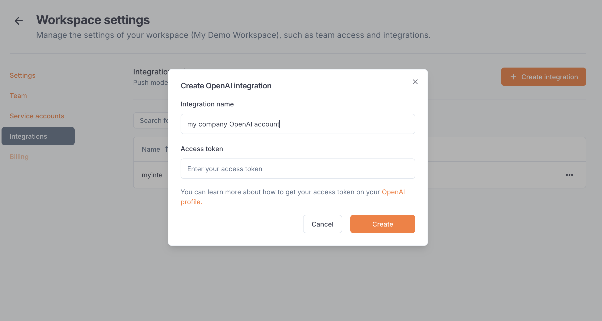
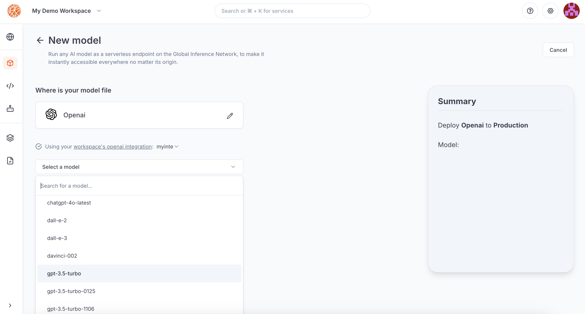

---

title: 'OpenAI integration'

description: 'Connect your agents to LLMs from OpenAI.'

---

The OpenAI integration allows Blaxel users to **call OpenAI models using a Blaxel endpoint** in order to unify access control, credentials and observability management. 

The integration must be set up by an [admin](../Security/Workspace-access-control) in the Integrations section in the [workspace settings](../Security/Workspace-access-control).

## Set up the integration

In order to use this integration, you must register an OpenAI access token into your Blaxel workspace settings. The scope of this access token (i.e. the OpenAI resources it is allowed to access) will be the scope that Blaxel has access to.

First, generate an [OpenAI API key](https://platform.openai.com/docs/api-reference/authentication) from [your OpenAI Platform settings](https://platform.openai.com/api-keys). Set this API key in `Read-only` mode.

On Blaxel, in Workspace Settings > OpenAI integration, create a new connection and paste this token into the “API key” section.

## Connect to an OpenAI model

Once you’ve set up the integration in the workspace, any workspace member can use it to reference an OpenAI model as an [external model API](../Models/External-model-apis).

When creating a model API, select OpenAI. You can search for any model from the OpenAI catalog.

After the model API is created, you will receive a dedicated global Blaxel endpoint to call the model. Blaxel will forward inference requests to OpenAI, using your OpenAI credentials for authentication and authorization.

<Info>Because your own credentials are used, any inference request on this endpoint will incur potential costs on your OpenAI account, as if you queried the model directly on OpenAI.</Info>