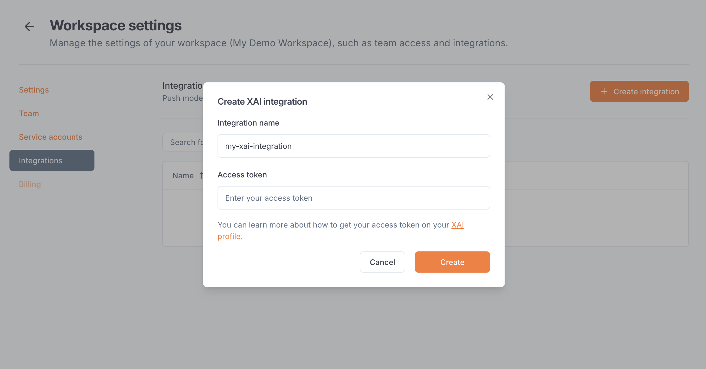
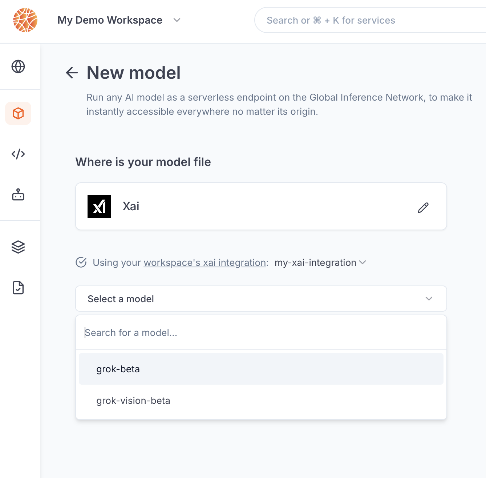

---

title: 'xAI integration'

description: 'Connect your agents to LLMs from xAI.'

---

The xAI integration allows Blaxel users to **call xAI models using a Blaxel endpoint** in order to unify access control, credentials and observability management. 

The integration must be set up by an [admin](../Security/Workspace-access-control%2013847e47b1ea8151bd43efeccf5defe0) in the Integrations section in the [workspace settings](../Security/Workspace-access-control).

## Set up the integration

In order to use this integration, you must register an xAI access token into your Blaxel workspace settings. First, generate an [xAI API key](https://docs.x.ai/docs/tutorial#step-2-generate-an-api-key) from [your xAI team console](https://console.x.ai/team/default/api-keys). This key must have access to at least the *Chat* and *Models* endpoints.

On Blaxel, in Workspace Settings > xAI integration, create a new connection and paste this token into the “API key” section.

## Connect to an xAI model

Once you’ve set up the integration in the workspace, any workspace member can use it to reference an xAI model as an [external model API](../Models/External-model-apis).

When creating a model API, select xAI. You can search for any model from the xAI catalog.

After the model API is created, you will receive a dedicated global Blaxel endpoint to call the model. Blaxel will forward inference requests to xAI, using your xAI credentials for authentication and authorization.

<Info>Because your own credentials are used, any inference request on this endpoint will incur potential costs on your xAI account, as if you queried the model directly on xAI.</Info>