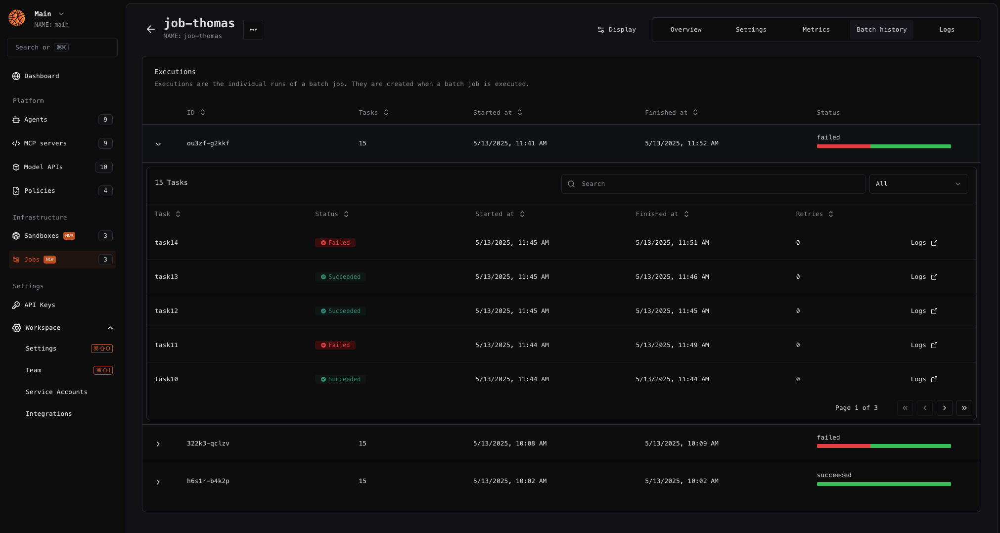

---

title: 'Jobs'

sidebarTitle: "Overview"

description: 'Scheduled jobs of batch processing tasks for your AI workflows.'

---

Jobs allow you to run many AI tasks in parallel using batch processing. 



## Concepts

- **Job**: A code definition that specifies a batch processing task. Jobs can run multiple times within a single execution and accept optional input parameters.
- **Execution**: A specific instance of running a batch job at a given timestamp. Each execution consists of multiple tasks running in parallel.
- **Task**: A single instance of a job definition running as part of an execution.


## Quickstart

<Warning>It is required to have *npm* (TypeScript) *or uv* (Python) installed to use the following command.</Warning>

You can quickly **initialize a new job from scratch** by using CLI command `bl create-job`. 

```bash
bl create-job myjob
```

This will create a pre-scaffolded local directory where your entire code can be added. In the generated folder, you'll find a boilerplate job with multiple steps in the entrypoint file `index.ts`. 

<CodeGroup>
```typescript index.ts
import { blStartJob, withSpan } from '@blaxel/core'; // You can load any Blaxel SDK function
import '@blaxel/telemetry'; // This import is required to connect all the metrics and tracing with blaxel platform
import step1 from './steps/step1';
import step2 from './steps/step2';
import step3 from './steps/step3';

type JobArguments = {
  name: string;
}

async function myJob({name}: JobArguments) {
  console.log(`Hello, world ${name}!`);

  // You can call standard Javascript functions
  await step1();
  await step2();
  ...
}

// You need to use a Blaxel SDK function to wrap your job, this is the only requirement to make it work with Blaxel 
blStartJob(myJob);

```

</CodeGroup>

Start the job locally:

```bash
# Run the job with a sample batch file
bl run job jobs-ts --local --file batches/sample-batch.json

# Or directly with --data argument
bl run job jobs-ts --local --data '{"tasks": [{"name": "John"}]}'

# Or without blaxel CLI
pnpm start --name John
```

## Deploy a job with Blaxel CLI

This section assumes you have developed a job locally. 

The [Blaxel SDK](../sdk-reference/introduction) allows you to connect to and orchestrate other resources (such as model APIs, tool servers, multi-agents) during development, and ensures telemetry, secure connections to third-party systems or private networks, smart global placement of workflows, and much more when jobs are deployed.

<Accordion title="Set up authentication to Blaxel">

The Blaxel SDK authenticates with your workspace using credentials from these sources, in priority order:

1. when running on Blaxel, authentication is handled automatically
2. variables in your `.env` file (`BL_WORKSPACE` and `BL_API_KEY`, or see [this page](../Agents/Variables-and-secrets) for other authentication options). 
3. environment variables from your machine
4. configuration file created locally when you log in through [Blaxel CLI](../cli-reference/introduction) (or deploy on Blaxel)

When developing locally, the recommended method is to just **log in to your workspace with Blaxel CLI.** This allows you to run Blaxel SDK functions that will automatically connect to your workspace without additional setup. When you deploy on Blaxel, this connection persists automatically.

When running Blaxel SDK from a remote server that is not Blaxel-hosted, we recommend using environment variables as described in the third option above.

</Accordion>

### Serve locally

You can serve the job locally in order to make the entrypoint function (by default: `index.py` / `index.ts`) available on a local endpoint. 

Run the following command to serve the job:

```bash
bl serve
```

Calling the provided endpoint will execute the job locally. Add the flag `--hotreload`  to get live changes.

```bash
bl serve --hotreload
```

### Deploy on production

You can deploy the job in order to make the entrypoint function (by default: `index.ts` / `server.py`) **callable on a global endpoint**. When deploying to Blaxel, you get a dedicated endpoint that enforces your [deployment policies](../Model-Governance/Policies).

Run the following command to build and deploy a local job on Blaxel:

```bash
bl deploy
```

### Run a job

You can run a job via API or using Blaxel CLI. 

**API**

Start a batch job execution by [calling the inference API for your batch job](../api-reference/inference).

```http Execute a job

POST https://run.blaxel.ai/{YOUR-WORKSPACE}/jobs/{YOUR-JOB-NAME}/executions

```

<Accordion title="Example of using this API in TypeScript">

```tsx
async function execJob() {
  console.log("Executing job");
  const WORKSPACE = "YOUR_WORKSPACE_NAME"; // ex : my-workspace (not the display name)
  const JOB_NAME = "YOUR_JOB_NAME"; // ex : my-job (not the display name)
  const response = await fetch(`https://run.blaxel.ai/${WORKSPACE}/jobs/${JOB_NAME}/executions`, {
    method: 'POST',
    headers: {
      'Content-Type': 'application/json',
      'X-Blaxel-Authorization': `Bearer ${process.env.BL_API_KEY}`, // You can go to ApiKey from UI to generate one
      'X-Blaxel-Workspace': WORKSPACE
    },
    body: JSON.stringify({
      tasks: [
        { name: "John" },
        { name: "Jane" }
      ]
    })
  });
  if(response.status !== 200) {
    console.error(`Failed to execute job : ${response.statusText}`);
    return;
  }
  const result = await response.json();
  console.log(result);
}

execJob().catch(console.error);
```

</Accordion>

**CLI**

Start a batch job execution by running:

```bash
# Run a job using Blaxel CLI with --data argument
bl run job jobs-ts --data '{"tasks": [{"name": "John"}, {"name": "Jane"}]}'
```

You can cancel a job execution from the Blaxel Console or via API.

### Retries

You can set a maximum number of **retries per task** in the job definition. Check out the reference for `blaxel.toml` configuration file down below.

### Deploy with a Dockerfile

While Blaxel uses predefined, optimized container images to build and deploy your code, you can also deploy your agent using your own [Dockerfile](https://docs.docker.com/reference/dockerfile/).

<Card title="Deploy using Dockerfile" icon="folder-tree" href="/Agents/Deploy-dockerfile">
Deploy resources using a custom Dockerfile.
</Card>

## Template directory reference

### Overview

```
package.json            # Mandatory. This file is the standard package.json file, it defines the entrypoint of the project and dependencies.
blaxel.toml             # This file lists configurations dedicated to Blaxel to customize the deployment.
tsconfig.json           # This file is the standard tsconfig.json file, only needed if you use TypeScript.
src/
└── index.ts            # This file is the standard entrypoint of the project. It is where the core logic of the job is implemented.
└── steps               # This is an example of organization for your sub steps, feel free to change it.
```

### package.json

Here the most notable imports are the scripts. They are used for the `bl serve` and `bl deploy` commands.

```json

{
  "name": "job-ts",
  "version": "1.0.0",
  "description": "Job using Blaxel Platform",
  "main": "src/index.ts",
  "keywords": [],
  "license": "MIT",
  "author": "Blaxel",
  "scripts": {
    "start": "tsx src/index.ts",
    "prod": "node dist/index.js",
    "build": "tsc"
  },
  "dependencies": {
    "@blaxel/core": "0.2.5",
    "@blaxel/telemetry": "0.2.5"
  },
  "devDependencies": {
    "@types/express": "^5.0.1",
    "@types/node": "^22.13.11",
    "tsx": "^4.19.3",
    "typescript": "^5.8.2"
  }
}
```

Depending of what you do, all of the `scripts` are not required. With TypeScript, all 4 of them are used.

- `start` : start the job locally through the TypeScript command, to avoid having to build the project when developing.
- `prod` : start the job remotely from the dist folder, the project needs to be have been built before.
- `build` : build the project. It is done automatically when deploying.

The remaining fields in package.json follow standard JavaScript/TypeScript project conventions. Feel free to add any dependencies you need, but keep in mind that devDependencies are only used during the build process and are removed afterwards.

### blaxel.toml

This file is used to configure the deployment of the job on Blaxel. The only mandatory parameter is the `type` so Blaxel knows which kind of entity to deploy. Others are not mandatory but allow you to customize the deployment.

```toml

type = "job"
name = "my-job"
workspace = "my-workspace"

policies = ["na"]

[env]
DEFAULT_CITY = "San Francisco"

[runtime]
memory = 1024
maxConcurrentTasks = 10
timeout = 900
maxRetries=0
```

- `name`, `workspace`, and `type` fields are optional and serve as default values. Any bl command run in the folder will use these defaults rather than prompting you for input.
- `policies` fields is also optional. It allow you to specify a Blaxel [policy](../Model-Governance/Policies) to customize the deployment. For example, deploy it only in a specific region of the world.
- `[env]` section defines environment variables that the job can access via the SDK. Note that these are NOT secrets.
- `[runtime]` section allows to override job execution parameters: maximum number of concurrent tasks, maximum number of retries for each task, timeout (in s), or memory (in MB) to allocate.