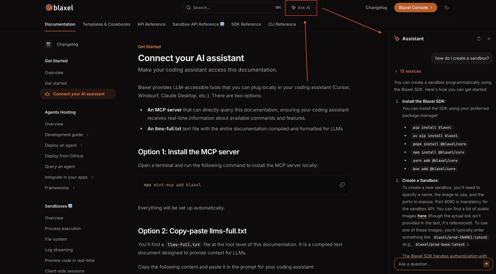

---

title: 'Connect your AI to this documentation'

sidebarTitle: "Connect your AI to this doc"

icon: 'book'

description: 'Make your coding assistant access this documentation.'

---

Blaxel provides LLM-accessible tools that you can plug locally in your coding assistant (Cursor, Windsurf, Claude Desktop, etc.). There are two options:

- **A remote MCP server** that can directly query this documentation, ensuring your coding assistant receives real-time information about available commands and features.
- **An llms-full.txt** text file with the entire documentation compiled and formatted for LLMs

Alternatively you can also use the native AI assistant built into this documentation portal.

## Option 1: Install the MCP server

### For Cursor

1. Open **Cursor Settings**
2. Go to **MCP & Integrations**
3. Click **”+ Add a custom MCP server”**
4. Add this configuration:

```json
{
  "mcpServers": {
    ... // Your other MCP servers
    "blaxel-docs": {
      "url": "https://docs.blaxel.ai/mcp"
    }
  }
}
```

### For Claude Code

[Add the remote HTTP server to your Claude Code](https://docs.anthropic.com/en/docs/claude-code/mcp#option-3%3A-add-a-remote-http-server) by running the following command:

```bash
claude mcp add --transport http blaxel-docs https://docs.blaxel.ai/mcp
```

## Option 2: Copy-paste llms-full.txt

You'll find a `llms-full.txt` file at the root level of this documentation. It is a compiled text document designed to provide context for LLMs. 

Copy the following content and paste it in the prompt for your coding assistant:

[https://docs.blaxel.ai/llms-full.txt](https://docs.blaxel.ai/llms-full.txt)

## Option 3: Use the documentation's built-in assistant

This documentation portal has a built-in AI assistant. Simply click "✨**Ask AI**" at the top of any page to use it.

