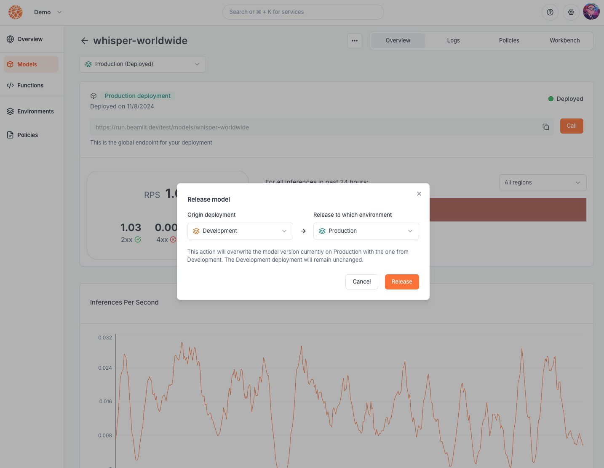

---

title: 'Environments'

description: 'Enforce deployment strategies across your entire workspace.'

---

**Environments** are logical entities that provide a structured framework for managing the lifecycle of your applications across various stages of development, testing, and production.

By bundling deployment policies, environments ensure that all workloads deployed within them adhere to consistent guidelines — promoting predictability, control, and quality throughout your organization.

Currently, Beamlit provides all workspaces with two different environments: **production** and **development**. 

- They are created without any [policy](Policies): by default, models deployed in these environments won’t have any deployment restrictions.
- They allow for a development/production release lifecycle: each environment provides a specific inference endpoint for models deployed within it.

<Info>Please reach out to us at [support@beamlit.com](mailto:support@beamlit.com) if you would like to use more than two environments.</Info>

## **Attaching policies to an environment**

You can attach [deployment policies](Policies%2013847e47b1ea817daa5bcd58129a9bdb) to any environment in order to enforce them across all workloads in that environment that are in the scope of the [target](Policies) of the policy.

When no policies are enforced on a type, all options for this type are considered allowed. Workloads are executed using [Global Inference Network](../Models/Global-Inference-Network)’s default optimizations.

Read our [complete reference for environments](https://docs.beamlit.com/api-reference/environments/create-or-update-environment).

### Attaching multiple policies to an environment

When attaching multiple policies to the same environment, it is important to understand the resulting effect to avoid any error.

In this situation, their combined effect is the **UNION** of all of their effects for the same [type](Policies%2013847e47b1ea817daa5bcd58129a9bdb) of policy (a.k.a *OR* clause), and **INTERSECTION** across all [types](Policies) of policies (a.k.a *AND* clause).

For example, let’s say you attach the following three policies on environment ‘development’:

- US only: Country is United States *(type of policy: location)*
- Asia only: Continent is Asia *(type of policy: location)*
- T4 only: GPU is T4 *(type of policy: gpu)*

Then, all models deployed in ‘development’ will run **necessarily on T4 accelerators**, which are on **any** location that is either in the US or in any country in Asia. 

## **Deploying models to an environment**

### Deploying a model

When [deploying a model](../Models/Model-deployment), you can choose an environment on which to deploy it. When a model is deployed in an environment, this produces a “*model deployment*”.

If you don’t specify an environment when deploying a model, the model is deployed in the *production* environment by default.

Read our [complete reference for deploying models](https://docs.beamlit.com/api-reference/models/create-or-update-model-deployment). You can also use the Beamlit console, APIs or CLI for this.

### Rolling out a model deployment to a new environment

Model deployments can be **released** to a new environment. This replaces the model that was initially on the new target environment, and keeps the origin model deployment intact.

For example, for Model XYZ:

1. Let’s say you have version A of the model running on the *production* environment (this is the  production deployment), and version B of the model running on the *development* environment (this is the development deployment). Each version can be called through the [respective model deployment endpoint](../Models/Query-a-model) allowing to test version B while version A still runs.
2. Once version B is tested and ready, you [release](../Models/Model-deployment) the *development deployment* on the *production* environment.
3. Now: version B runs on the *production* environment, and version B also runs on the *development* environment. Version A can no longer be called.
4. You [replace](../Models/Model-deployment) the *development* deployment with version C of the model. 
5. Now: version B runs on the *production* environment, and version C runs on the *development* environment. 

