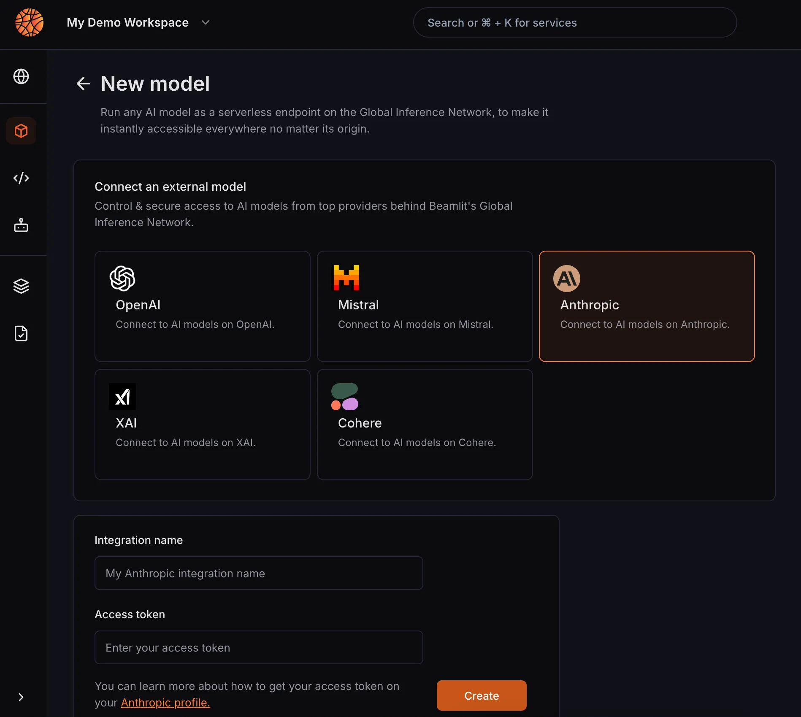

---

title: 'External model APIs'

description: 'Control & secure access to AI models from top providers behind Beamit Global Inference Network.'

---

You can query any LLM or other generative AI model from top API providers via Beamlit, in order to benefit from a **unified layer of access control and telemetry,** especially when running whole AI agents. 

## Creating a model endpoint on Beamlit

Adding model endpoints from external providers on Beamlit gives you single endpoints to call the model on the same base URL, rather than calling each provider separately. Beamlit handles the authentication, authorization and monitoring automatically for you.

This is done in a two step process:

1. First, you need to create a workspace integration that will contain the credentials to connect to your model API provider. Check out the dedicated documentation for each available integration.
2. Second, you can create a dedicated endpoint for a specific model from this provider. You will need to choose the model from the list of available models for the provider.

You can then query the model using its [dedicated global inference endpoint](Query-a-model). Any call to this endpoint will be passed to the underlying provider.

### Environment

Select the environment on which to deploy your workload. Environments give you a dedicated production or development endpoint for your application life-cycle. A function or model API that is deployed in an environment can only be used by agents in the same environment.

## Provider reference

The following providers are available:

- [OpenAI](../Integrations/OpenAI)
- [Anthropic](../Integrations/Anthropic)
- [Mistral AI](../Integrations/MistralAI)
- [Cohere](../Integrations/Cohere)
- [xAI](../Integrations/xAI)
- [DeepSeek](../Integrations/DeepSeek)