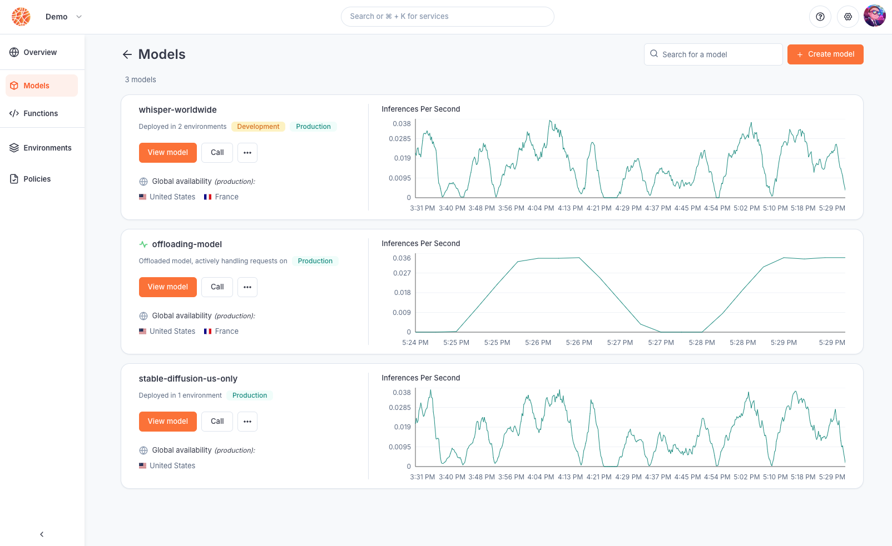
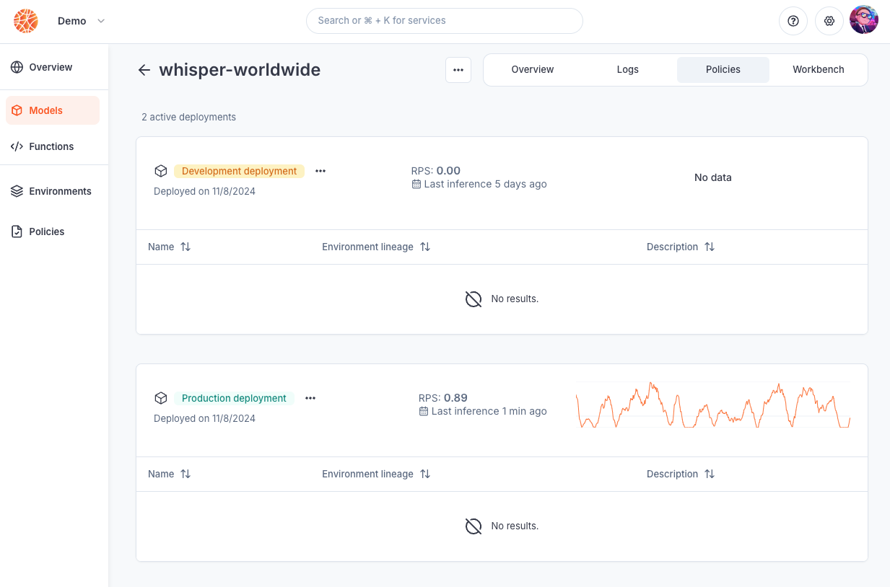
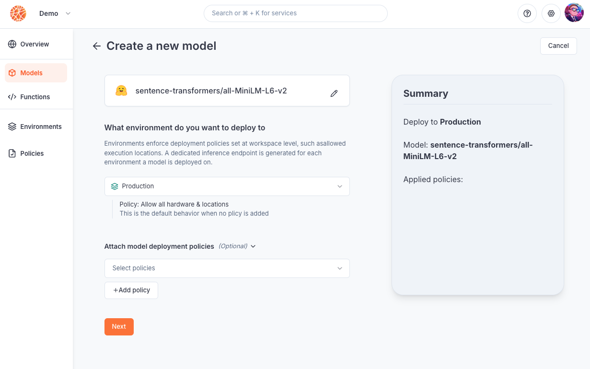
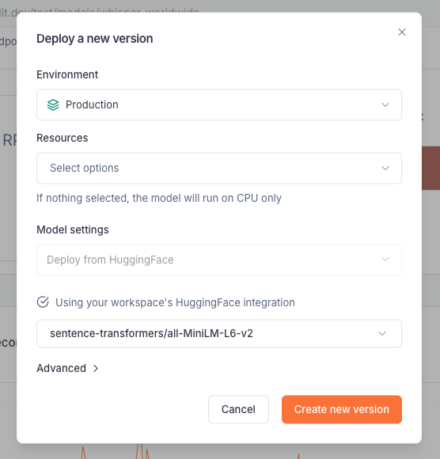
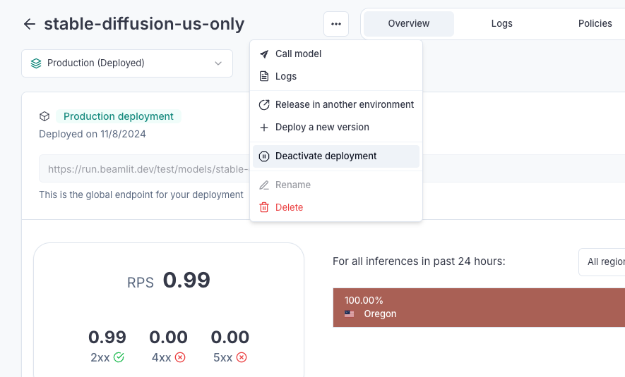

---

title: 'Model deployment'

description: 'Deploy AI models and manage the life-cycle of deployments in production.'

---

As a natively serverless and distributed serving infrastructure, Beamlit let you bring any model trained externally and serve them on Global Inference Network, whether they are public models, or private fine-tuned models. For each model deployment, an [inference endpoint](../Overview.md) is generated by Beamlit for consumers to invoke inference requests. 

Models can be deployed using either Beamlit’s APIs, CLI, console ; or using [our Kubernetes operator](Cloud-Burst-Network/Install-Beamlit-operator.md).

## How model deployment works

### Introduction

Beamlit is a cloud-native infrastructure platform that is natively **serverless**. Any AI workload pushed to Beamlit is ran in response to requests without requiring provisioning or management of serving/inference servers or hardware. It automatically scales compute resources and you pay only for the compute time used.

Beamlit is also natively **distributed.** By default, all workloads (such an AI model processing inference requests for example) run across multiple execution locations, that can span over multiple geographic areas or cloud providers, in order to optimize for ultra-low-latency or other strategies. This is accomplished by decoupling this execution layer from a data layer made of a smart distributed network that federates all those execution locations.

### Models and deployments

Beamlit model deployment works using two conceptual entities: **models** and **deployments**.

- **Models** are the base logical entity labeling an AI model throughout it’s life-cycle. A model can be instantiated into multiple deployments over different environments. This effectively allows to run multiple versions of the model at the same time, each on a different environment.
- **Deployments** (a.k.a model deployments) are the instantiation of one model version over one specific [environment](../Model-Governance/Environments.md). For example, you can have a *deployment* XYZ of *model* ABC on the *production environment*.
- **Executions** (a.k.a inference executions) are ephemeral invocations of model deployments by a [consumer](Query-a-model.md). Because Beamlit is serverless, a model deployment is only materialized onto one of the execution locations when it actively receives and processes requests. Workload placement and request routing is fully managed by the Global Inference Network, as defined by your [environment policies](../Model-Governance/Environments.md).

A model can be uploaded into Beamlit from a variety of [origins](Model-deployment.md). At this moment, it can be either: **just** **created** (a *model deployment* exists but it is deactivated), or **created and deployed** (as a *model deployment*). At any time, you can [deactivate a model deployment](Model-deployment.md), and [update it with a new version](Model-deployment.md).



## Deployment life-cycle

### Deploying a model

Deploying a model will create the associated [model deployment](Model-deployment.md). At this time: 

- it is [reachable](Query-a-model.md) through a specific endpoint
- it does not consume resources [until it is actively being invoked and processing inferences](Query-a-model.md)
- its deployment/inference policies are governed by the associated [environment](../Model-Governance/Environments.md)
- its status can be monitored either on the console or using the CLI/APIs



Deploy a model by running the following [CLI](https://docs.beamlit.com/cli-reference/beamlit_apply) command:

```
beamlit apply -f ./my-model-deployment.yaml
```

Read our [reference for model deployments](https://docs.beamlit.com/api-reference/models/create-or-update-model-deployment). Models can also be deployed using the Beamlit console, and the [Beamlit Kubernetes operator](Cloud-Burst-Network/Install-Beamlit-operator.md). 



### Updating a model version

As you iterate on software development, you will need to update the version of a model that is currently deployed and used by your consumers.

One way to manage this is through multiple [environments](../Model-Governance/Environments.md), and [releasing](Model-deployment.md) the model version that is on one environment (e.g. development) to another environment (e.g. production). Another more straightforward way is to directly update a model deployment on an environment.

When updating a model deployment, you can:

- update the underlying model file/origin
- update the inference runtime for the model
- update the policies directly attached to the model deployment

Model deployments are updated following a **blue-green** paradigm. The Global Inference Network will wait for the new version to be completely up and ready before routing inference requests to the new deployment.

When using the Beamlit console, you can update all model configurations (model file, runtime, etc.) except policies by selecting ***Deploy a new version***.



To update the policies of a model deployment using the Beamlit console, go the the ***Policies*** page and edit them here.


Model deployments can also be updated via the Beamlit [APIs](https://docs.beamlit.com/api-reference/models/create-or-update-model-deployment) or [CLI](https://docs.beamlit.com/cli-reference/beamlit_apply).

### Releasing to another environment

Because you have several environments, you can manage deployment of a model version from one environment to the other. On Beamlit, this is called ***releasing*** a model deployment. 

When releasing, you need to choose an *origin* environment and a *destination* environment. Upon releasing:

1. the model deployment on the *destination* environment (if it exists) will be overwritten (i.e. [updated](Model-deployment.md)) with the model deployment from the *origin* environment. This includes all configurations in the model deployment: the model file/origin and model runtime. 
    - You can choose whether to also release the [policies set at the level of the origin model deployment](Model-deployment.md) on the destination deployment. This will overwrite all deployment-level policies in the destination environment with the ones from the origin deployment.
    - ⚠️ Warning: if the [environment-level policies](../Model-Governance/Environments.md) are different between the origin and destination, the behavior of the deployment may be different between the two environments.
2. the model deployment on the *origin* environment will remain unchanged, and will still be reachable after release

Read more on our [reference on model releases](https://docs.beamlit.com/api-reference/model_releases/release-model-from-an-environment).

### Deactivating a model deployment

Any model deployment can be deactivated at any time. When deactivated, it will **no longer be reachable** through the inference endpoint and will stop consuming resources. 

Models can be deactivated and activated at any time from the Beamlit console, or via [API](https://docs.beamlit.com/api-reference/models/create-or-update-model-deployment) or [CLI](https://docs.beamlit.com/cli-reference/beamlit_apply).



## Deployment reference

### Model origins

Beamlit supports the following origins for models:

- **Uploading a file.** Use a static file containing the model. Uploading through the interface has a limit of 5GB, else you must use the CLI.
    - For the moment, Beamlit only support uploading Torch-based models. We are currently working on extending model support, please reach out if you need a specific model type.
    - Supported extensions: `.MAR` only
- **HuggingFace.** Beamlit will use your [workspace integration](../Integrations/HuggingFace.md) to retrieve any model deployed on HuggingFace. For private models, it will only be able to retrieve models within the scope of allowed models for your HuggingFace token.

Read about [the API parameters in the reference](https://docs.beamlit.com/api-reference/models/create-or-update-model-deployment).

### Runtime

Beamlit suggests an optimized inference runtime for each model you attempt to deploy. You can override it by passing the Docker image for a custom inference runtime when deploying the model.

Beamlit natively supports the following runtimes:

- **Beamlit Transformers/Diffusers**: our optimized inference engine made for Transformers and Diffusers models
- **Beamlit Torch**: our optimized inference engine made for Torch-based models
- **TGI**
- **TEI**

Read about [the API parameters in the reference](https://docs.beamlit.com/api-reference/models/create-or-update-model-deployment).

### Environment

You must choose an [environment](../Model-Governance/Environments.md) when deploying a model on Beamlit. Environments allow you to pre-attach [policies](../Model-Governance/Policies.md) to a model deployment (for example: to make it so the model only runs in certain countries, or on a certain hardware). 

Read about [the API parameters in the reference](https://docs.beamlit.com/api-reference/models/create-or-update-model-deployment).

### Policies

Additional [policies](../Model-Governance/Policies.md) can be optionally attached to a model deployment directly. If there already are policies set in the environment, policies of the **same policy type** (e.g. location-based, flavor-based, etc.) will collide. In this case, the result will be [as described here](../Model-Governance/Policies.md).

<Tip>To force execution of the model on a certain type of GPU, it is best to configure it in the model deployment [resources](Model-deployment.md) directly.</Tip>

Read about [the API parameters in the reference](https://docs.beamlit.com/api-reference/models/create-or-update-model-deployment).

### Resources

Data scientists often have strong preferences for specific GPU types when running certain models. To accommodate this, Beamlit allows you to specify which flavors (i.e., which GPU types) should be used for running a particular model.

Flavors refer to the specific CPU or GPU types that the model deployment will use for processing inferences. During inferences execution, the Global Inference Network intelligently routes each request to a location containing the desired CPU/GPU types. It then schedules the workload based on resource availability, ensuring optimal performance.

For one model deployment, the selected flavors can either be several CPU types, or several GPU types, but not both at the same time.

<Note>You can only select flavors allowed by the policies set in the environment or the deployment.</Note>

Read about [the API parameters in the reference](https://docs.beamlit.com/api-reference/models/create-or-update-model-deployment).

## Deploy a replica of a on-prem model

Minimal-footprint deployments can be setup using Cloud Burst Network, by referencing a model deployed on your own private infrastructure (on-prem or cloud) and make it overflow on Beamlit only in case of unexpected burst traffic or infrastructure failure.

<Card title="Deploy a replica for your own model" icon="book" href="/Models/Cloud-Burst-Network/Model-overflow">
Read our documentation for offloading your own model on a Beamlit replica.
</Card>

## Examples

<Card title="Deploy a custom model" icon="book-open" href="/Examples/Deploy-a-custom-model-from-HuggingFace" horizontal=true>
Read our tutorial for deploying a custom fine-tuned model from HuggingFace.
</Card>

<Card title="Offload requests from a self-hosted model" icon="book-open" href="/Examples/Offload-burst-inferences-from-a-self-hosted-model" horizontal=true>
Read our tutorial for offloading ****burst inferences from a self hosted model.
</Card>