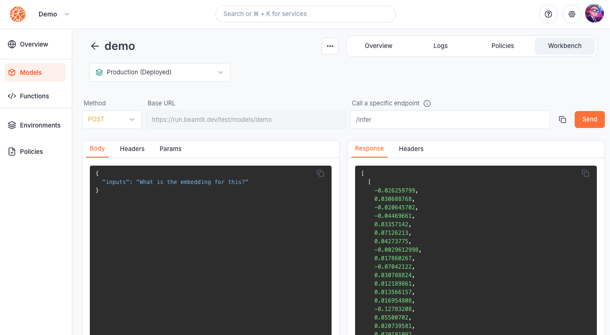

---

title: 'Query a model'

description: 'Make inference requests on your models.'

---

Model [deployments](Model-deployment.md) on Beamlit have an **inference endpoint** which can be used by external consumers to request an inference execution. Inference requests are then routed on the [Global Inference Network](Global-Inference-Network.md) based on the [deployment policies](Model-deployment.md) associated with your model deployment. 

## Inference endpoints

Whenever you deploy a model on Beamlit, an **inference endpoint** is generated on Global Inference Network.

The inference URL looks like this:

`run.beamlit.com/{your-workspace}/models/{your-model}`

There is one distinct endpoint for each **model deployment,** i.e. for each combination of a [model](Model-deployment.md) and an [environment](../Model-Governance/Environments.md) on which it is deployed. 

For example, if you have one version of model “your-model” deployed on the *production* environment and one version deployed on the *development* environment:

- `run.beamlit.com/{your-workspace}/models/{your-model}?environment=production` will call the production deployment

- `run.beamlit.com/{your-workspace}/models/{your-model}?environment=development` will call the development deployment

If you do not specify the environment in the inference request, it will call the *production* environment by default. If the model is not deployed on the production environment, it will return an error.

### Specific API endpoints in your model

The URL above hosts your model and can be called directly in most cases. However your model may **implement additional endpoints.** These sub-endpoints will be hosted on this URL.

For example, if you deploy a text generation model that also implements the ChatCompletions API:

- calling `run.beamlit.com/your-workspace/models/your-model` (the base endpoint) will generate text based on a prompt
- calling `run.beamlit.com/your-workspace/models/your-model/v1/chat/completions` (the ChatCompletions API implementation) will generate response based on a list of messages

### Endpoint authentication

By default, models deployed on Beamlit aren’t public. It is necessary to authenticate all inference requests, via a [bearer token](../Security/Access-tokens.md).

The evaluation of authentication/authorization for inference requests is managed by the Global Inference Network based on the [access given in your workspace](../Security/Workspace-access-control.md).

<Info>Making a model publicly available is not yet available. Please contact us at [support@beamlit.com](mailto:support@beamlit.com) if this is something that you need today.</Info>

## Make an inference request

### Beamlit API

Make a **POST** request to the [inference endpoint](Query-a-model.md) for the model deployment you are requesting:

```
curl 'https://run.beamlit.com/YOUR-WORKSPACE/models/YOUR-MODEL?environment=YOUR-ENVIRONMENT' \
  -H 'accept: application/json, text/plain, */*' \
  -H 'x-beamlit-authorization: Bearer YOUR-TOKEN' \
  -H 'x-beamlit-workspace: YOUR-WORKSPACE' \
  --data-raw $'{"inputs":"Enter your input here."}'
```

Read about [the API parameters in the reference](https://docs.beamlit.com/api-reference/inference).

### Beamlit CLI

Make an inference request to the model deployment by running the following command:

```bash
beamlit run your-model --data '{"inputs":"Enter your input here."}'
```

Read about [the CLI parameters in the reference](https://docs.beamlit.com/cli-reference/beamlit_run).

### Beamlit console

Inference requests can be made from the Beamlit console from the model deployment’s workbench page.

