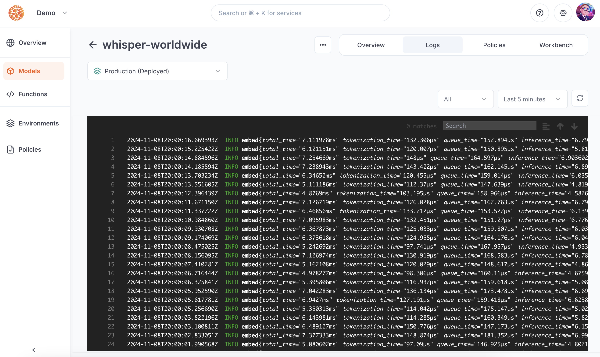

---

title: 'Monitoring'

description: 'Get visibility over all inference requests on your models.'

---

Beamlit stores inference logs for model deployments to give you visibility and troubleshooting abilities. Only model deployments on Beamlit Global Inference Network generate logs. Logs for models you have deployed privately/on-premise are not collected, but logs for inferences that [overflow](../Models/Cloud-Burst-Network/Model-overflow) on Beamlit are.

## Logs overview

Logs about what happens inside the inference runtime while processing an inference request are collected. Logs contain typically the following information:

- Inference runtime initialization
- Model download
- inference duration (broken down per tokenization, queue, inference time)
- Idle period finished

### Deployment mode

Depending on [how you are deployed on Global Inference Network](../Models/Global-Inference-Network), logs storage and querying will behave differently.

- Models that are deployed on Beamlit, either by [direct deployment](../Models/Model-deployment) or when [overflowing on Beamlit](../Models/Cloud-Burst-Network/Model-overflow), **automatically export inference logs**. They can be [viewed](View-model-logs) per specific model deployment.
- Models that are deployed on your own clusters as an [origin to be offloaded on Beamlit](../Models/Cloud-Burst-Network/Model-overflow) **do not export logs**. Please [contact us](mailto:support@beamlit.com) if you would be interested to centralize these logs with Beamlit logs, either on Beamlit or in your cluster.

### Retention duration

The default duration during which inference logs are kept and accessible is **72 hours**. After this retention period, logs are erased from Beamlit.

<Note>Enterprise plans have longer logs duration. If you need this retention period increased on your workspace, please contact us at [support@beamlit.com](mailto:support@beamlit.com).</Note>

## Accessing logs

### Using the Beamlit console

On the Beamlit console, open a model deployment and get to the ***Logs*** tab. You can search for logs, and filter on a specific time window on the page.

### Using the API

Read our [reference for the metrics API](https://docs.beamlit.com/api-reference/models/get-models-deployments-metrics).

### Externally

<Info>This feature is coming soon.</Info>