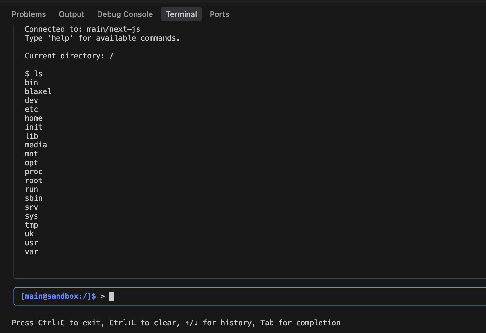

---

title: 'Sandboxes'

sidebarTitle: "Overview"

description: 'Lightweight virtual machines where both you and your agents can run code with sub-20ms cold starts.'

---

Sandboxes are fast-launching virtual machines that both humans and AI agents can operate. They provide a basic [REST API interface](https://docs.blaxel.ai/api-reference/filesystem) for accessing the file system and processes, along with an [MCP server](../Functions/Overview) that makes these capabilities available to agents.

They natively serve as **sandboxed compute runtimes for agents**. You can securely run untrusted code inside these VMs — particularly AI-generated code — making them ideal for coding agents that need access to an operating system to run commands with no risk of escaping.

Blaxel sandboxes start from hibernation state in **under 25 milliseconds**, and scale back down to zero **after a few seconds of inactivity**, maintaining the memory state even after scaling down. This includes all filesystem as well as running processes. For cost-effective long-term persistence, you can attach [volumes](Volumes) to sandboxes.

## Create a sandbox

Create a new sandbox using the [Blaxel SDK](../sdk-reference/introduction) by specifying a name, image to use, optional [deployment region](../Infrastructure/Regions), and the ports to expose. Note that **ports** **80** (system), and **443** & **8080** (sandbox API) are reserved by Blaxel. 

<Accordion title="Set up authentication to Blaxel">

The Blaxel SDK authenticates with your workspace using credentials from these sources, in priority order:

1. when running on Blaxel, authentication is handled automatically
2. variables in your `.env` file (`BL_WORKSPACE` and `BL_API_KEY`, or see [this page](../Agents/Variables-and-secrets) for other authentication options). 
3. environment variables from your machine
4. configuration file created locally when you log in through [Blaxel CLI](../cli-reference/introduction) (or deploy on Blaxel)

When developing locally, the recommended method is to just **log in to your workspace with Blaxel CLI.** This allows you to run Blaxel SDK functions that will automatically connect to your workspace without additional setup. When you deploy on Blaxel, this connection persists automatically.

When running Blaxel SDK from a remote server that is not Blaxel-hosted, we recommend using environment variables as described in the third option above.

</Accordion>

<CodeGroup>

```typescript TypeScript
import { SandboxInstance } from "@blaxel/core";

// Create a new sandbox
const sandbox = await SandboxInstance.create({
  name: "my-sandbox",
  image: "blaxel/prod-base:latest",  // public or custom image
  memory: 4096, // in MB
  ports: [{ target: 3000, protocol: "HTTP" }], // ports to expose, so you can create a preview URL on this port
  region: "us-east-1" // if not specified, Blaxel will choose a default region
});
```

```python Python
from blaxel.core import SandboxInstance

# Create a new sandbox
sandbox = await SandboxInstance.create({
  "name": "my-sandbox",
  "image": "blaxel/prod-base:latest", # public or custom image
  "memory": 4096, # in MB
  "ports": [{ "target": 3000 }], # ports to expose, so you can create a preview URL on this port
})
  "region": "us-east-1" # if not specified, Blaxel will choose a default region
```

</CodeGroup>

### Images

<Info>The list of public images [can be found here](https://github.com/blaxel-ai/sandbox/tree/main/hub). To create a sandbox with one of those images, enter `blaxel/prod-{NAME}:latest` (e.g. *blaxel/prod-base:latest*).</Info>

[Custom sandbox images](Templates) (or *templates*) enable you to create sandboxes with a consistent, customized set of tools, configurations, or entrypoint scripts. 

### Ports

The following ports are reserved by Blaxel's system:

- **443**: This port hosts the main [sandbox API](https://docs.blaxel.ai/api-reference/filesystem/get-file-or-directory-information) and is exposed via HTTPS
- **80**: Reserved for system operations
- **8080**: Reserved for sandbox API functionality

You can expose specific non-reserved ports [**when creating a new sandbox**](Overview) by using the `ports` parameter.

### Expiration date

Set **time-to-live (TTL)** on the sandbox to **automatically** **delete** it after a specific period using the `ttl` parameter, or at a specific date using the `expiresAt`/`expires_at` parameter.

The `ttl` parameter accepts a string with the following time units: `s` (seconds), `m` (minutes), `h` (hours), `d` (days), and `w` (weeks).

<Info>This differs from the automatic shut down (*scale-to-zero*) which happens to all sandboxes when inactive and where the memory and filesystem are snapshotted to be resumed instantly.</Info>

<CodeGroup>

```typescript TypeScript {10-12}

import { SandboxInstance } from "@blaxel/core";

// Create a new sandbox
const sandbox = await SandboxInstance.create({
  name: "my-sandbox",
  image: "blaxel/prod-base:latest",
  memory: 4096,
  ports: [{ target: 3000, protocol: "HTTP" }],
  ttl: "24h", // Total duration before auto-deletion. Supported units: s, m, h, d, w
  // OR
  // expiresAt: new Date(Date.now() + 60000) // Alternative: set a date at which it will be deleted
});
```

```python Python {10-12}

from blaxel.core import SandboxInstance

# Create a new sandbox
sandbox = await SandboxInstance.create({
  "name": "my-sandbox",
  "image": "blaxel/prod-base:latest",
  "memory": 4096,
  "ports": [{ "target": 3000 }],
  "ttl": "24h", ## Total duration before auto-deletion. Supported units: s, m, h, d, w
  ## OR
  ## expires_at: new Date(Date.now() + 60000) // Alternative: set a date at which it will be deleted
})
```

</CodeGroup>

## Retrieve an existing sandbox

To reconnect to an existing sandbox, simply provide its name:

<CodeGroup>

```typescript TypeScript
import { SandboxInstance } from "@blaxel/core";

// Connect to existing sandbox
const sandbox = await SandboxInstance.get("my-sandbox");
```

```python Python
from blaxel.core import SandboxInstance

# Connect to existing sandbox
sandbox = await SandboxInstance.get("my-sandbox")
```

</CodeGroup>

<Tip>Complete code examples demonstrating all operations are available on Blaxel's GitHub: [in TypeScript](https://github.com/blaxel-ai/sdk-typescript/tree/main/tests/sandbox) and [in Python](https://github.com/blaxel-ai/sdk-python/tree/main/tests/integration/sandbox).</Tip>

### Create if not exists

This helper function either retrieves an existing sandbox or creates a new one if it doesn't exist. Blaxel first checks for an existing sandbox with the provided `name` and either retrieves it or creates a new one using your specified configuration.

<CodeGroup>

```typescript TypeScript
import { SandboxInstance } from "@blaxel/core";

// Create sandbox if it doesn't exist
const sandbox = await SandboxInstance.createIfNotExists({
  name: "my-sandbox",
  image: "blaxel/prod-base:latest",
  memory: 4096,
  ports: [{ target: 3000, protocol: "HTTP" }],
  region: "us-east-1"
});
```

```python Python
from blaxel.core import SandboxInstance

# Create sandbox if it doesn't exist
sandbox = await SandboxInstance.create_if_not_exists({
  "name": "my-sandbox",
  "image": "blaxel/prod-base:latest",
  "memory": 4096,
  "ports": [{ "target": 3000, "protocol": "HTTP" }],
  "region": "us-east-1"
})
```

</CodeGroup>

## Connect to a sandbox with a terminal

You can explore the contents of a sandbox with a terminal-like interface by running:

```bash
bl connect sandbox your-sandbox-name
```



While not a true SSH connection, this interface lets you list and manage files, and execute commands as you would in a traditional terminal.

## MCP server for a sandbox

Every sandbox is also exposed via an MCP server that allows agents to **operate a sandbox using tool calls.**

The MCP server operates through WebSockets at the sandbox's base URL: 

```
wss://run.blaxel.ai/{{WORKSPACE_ID}}/sandboxes/{{SANDBOX_ID}}
```

<Accordion title="Tools available in the MCP server…">

1. Process management:
    1. `processExecute` - Execute a command.
    2. `processGet` - Get process information by identifier (PID or name).
    3. `processGetLogs` - Get logs for a specific process.
    4. `processKill` - Kill a specific process.
    5. `processStop` - Stop a specific process.
    6. `processesList` - List all running processes.
2. Filesystem operations
    1. `fsDeleteFileOrDirectory` - Delete a file or directory.
    2. `fsGetWorkingDirectory` - Get the current working directory.
    3. `fsListDirectory` - List contents of a directory.
    4. `fsReadFile` - Read contents of a file.
    5. `fsWriteFile` - Create or update a file.
3. Tools specialized for code generation AI:
    1. `codegenEditFile` - Propose and apply a targeted edit to a specified file, with instructions and partial contents. This tool uses [MorphLLM](https://morphllm.com/) for fast edits, and requires a Morph API key set as an environment variable when creating the sandbox.
    2. `codegenCodebaseSearch` - Find semantic code snippets from the codebase based on a natural language query.
    3. `codegenFileSearch` - Fast fuzzy filename search in the project.
    4. `codegenGrepSearch` - Run fast, exact regex/text searches on files for locating patterns or strings.
    5. `codegenListDir` - List contents of a directory in the project.
    6. `codegenParallelApply` - Plan and apply similar changes to multiple locations/files simultaneously.
    7. `codegenReadFileRange` - Read a specific range of lines in a file (max 250 lines at once).
    8. `codegenReapply` - Retry the application of the last edit, in case it previously failed.

</Accordion>

Connect to this MCP server [like any other MCP server](../Functions/Invoke-functions) though the endpoint shown above.

Using Blaxel SDK, you can retrieve the tools for a sandbox in any supported framework format by passing the sandbox’s name. For example, in LangGraph: 

<CodeGroup>

```typescript TypeScript
import { blTools } from "@blaxel/vercel";

const tools = await blTools([`sandbox/${sandboxName}`])

```

```python Python
from blaxel.langgraph import bl_tools

tools = await bl_tools([f"sandbox/{sandbox_name}"])

```

</CodeGroup>

[Read more documentation](../Functions/Invoke-functions) on connecting to the MCP server directly from your code.

## Sandbox statuses

Blaxel sandboxes start from `standby` to `active` in **under 25 milliseconds**, and scale back down top `standby` **after a few seconds of inactivity**, maintaining their previous state after scaling down.

Here is the summary on the possible statuses for a sandbox:

- **`standby`**: The sandbox is created but is hibernating. Sandboxes transition from *standby* to *active* mode in approximately 20 ms.
    - **Cost**: You are not charged for CPU/memory while a sandbox is in standby mode. However, you are charged for the storage of the snapshot and/or the volumes.
- **`active`**: The sandbox is running and processing tasks. You **are** charged for active runtime. Sandboxes automatically return to standby mode after 1 second of inactivity.
    - **Cost**: You are for CPU/memory and storage while a sandbox is in active mode.
- **`stopped`**: The sandbox is shut down and **requires manual restart** to access its API. This is useful if you want to deactivate a sandbox’s preview URLs.
    - **Cost**: You are not charged for CPU/memory while a sandbox is in stopped mode. However, you are charged for the storage of the snapshot and/or the volumes.

The **scale-to-zero functionality is based on network activity.** When your connection to the sandbox closes, Blaxel automatically creates a snapshot of the entire state (including the complete file system in memory, preserving both files and running processes) and transitions to standby mode within approximately 5 seconds. 

Any running processes are included in this snapshot and will be **instantly restored** when you reconnect to the sandbox.

<CardGroup>
<Card title="Processes and commands" icon="terminal" href="/Sandboxes/Processes">
Execute and manage processes in sandboxes.
</Card>
<Card title="File system operations" icon="file-lines" href="/Sandboxes/Filesystem">
Manage directories and files in sandboxes.
</Card>
<Card title="Tools for AI codegen" icon="file-lines" href="/Sandboxes/Codegen-tools">
Manage codebases with tools specifically designed for code generation.
</Card>
<Card title="Log streaming" icon="table-list" href="/Sandboxes/Log-streaming">
Access logs generated in a sandbox.
</Card>
<Card title="Ports" icon="network-wired" href="/Sandboxes/Ports">
Expose and connect to ports of a sandbox.
</Card>
<Card title="Preview in real-time" icon="eye" href="/Sandboxes/Preview-url">
Render code in real-time via a direct preview URL.
</Card>
<Card title="Sessions" icon="user" href="/Sandboxes/Sessions">
Manage temporary sessions to connect to sandboxes from a frontend client.
</Card>
<Card title="Volumes (private preview)" icon="database" href="/Sandboxes/Volumes">
Attach volumes to sandboxes to persist files.
</Card>
<Card title="Templates" icon="box" href="/Sandboxes/Templates">
Create custom sandbox templates.
</Card>
</CardGroup>

Or explore the Sandbox API reference:

<Card title="Sandbox API" icon="code" href="https://docs.blaxel.ai/api-reference/filesystem">
Access the your sandbox with an HTTP REST API.
</Card>