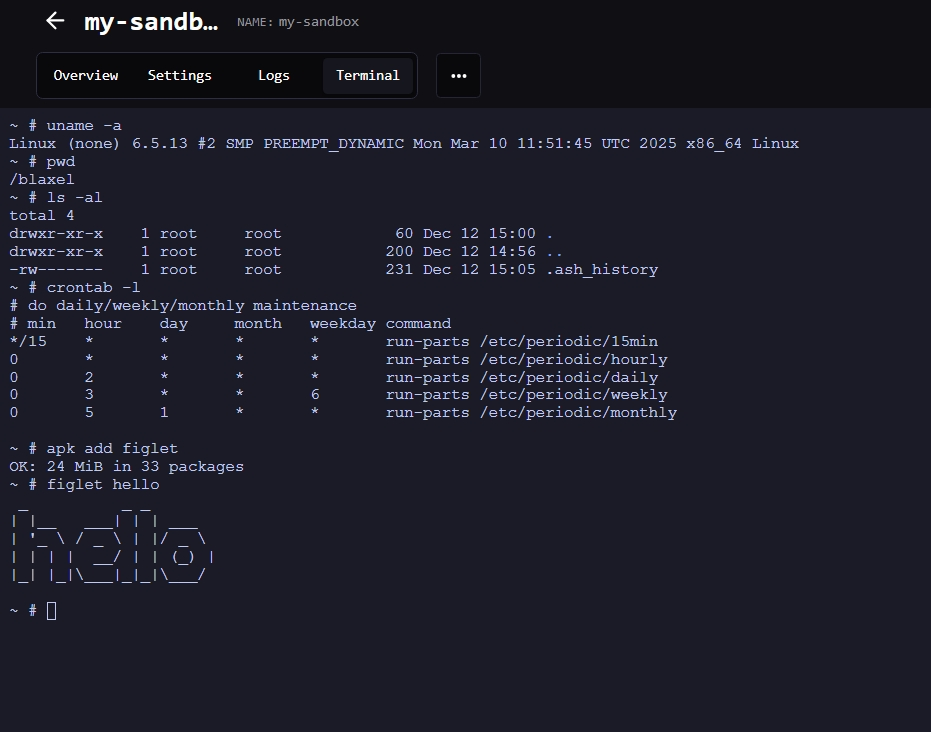

---

title: 'Sandboxes'

sidebarTitle: "Overview"

description: 'Lightweight virtual machines where your agents can run AI code with sub-25ms cold starts.'

---

Sandboxes are instant-launching virtual machines serving as **sandboxed compute runtimes for agents**. You can securely run LLM-generated code inside these VMs making them ideal for agents that need access to an operating system to run commands with no risk of escaping.

They provide a basic [REST API interface](https://docs.blaxel.ai/api-reference/filesystem) for accessing the file system and processes, along with an [MCP server](./MCP) that makes these capabilities available as tool calls.

Blaxel sandboxes have two states: `ACTIVE` (processing requests) and `STANDBY` (idle). Unlike traditional sandbox infrastructure, Blaxel's **standout feature** is fully managed lifecycle. Sandboxes resume from standby in **under 25 milliseconds** and automatically scale to zero **after a few seconds of inactivity —** such that you can leave sandboxes idle without paying for compute. Memory state is maintained even after scaling down, including the running processes and entire filesystem. For cost-effective long-term persistence, you can attach [volumes](Volumes) to sandboxes.


<Accordion title="Some examples of use cases include…">

- **Code review agents** that analyze repositories to detect the effects of changes. These agents run fully isolated compute environments for each tenant while keeping them snapshotted in standby between sessions, eliminating the need to clone the repo every time.
- **Code generation agents** that iterate in their own compute environments, and instantly render live application previews as human users build, step away, and log back in.
- **Data analyst agents** that execute adhoc data analysis workflows, generating scripts on-the-fly and running them securely against private files or data within an isolated, ZDR-compliant environment.
- **Background agents** that operate beyond their pre-configured tools. Each agent gets its own "personal computer" where it can autonomously install packages, execute custom scripts, store files, and adapt to new requirements securely. They can parallelize dozens of those personal computers.

</Accordion>

## Create a sandbox

Create a new sandbox using the [Blaxel SDK](../sdk-reference/introduction) by specifying a name, image to use, optional [deployment region](../Infrastructure/Regions), and the ports to expose. Note that **ports** **80** (system), and **443** & **8080** (sandbox API) are reserved by Blaxel.

<Accordion title="Set up authentication to Blaxel">

The Blaxel SDK authenticates with your workspace using credentials from these sources, in priority order:

1. when running on Blaxel, authentication is handled automatically
2. variables in your `.env` file (`BL_WORKSPACE` and `BL_API_KEY`, or see [this page](../Agents/Variables-and-secrets) for other authentication options).
3. environment variables from your machine
4. configuration file created locally when you log in through [Blaxel CLI](../cli-reference/introduction) (or deploy on Blaxel)

When developing locally, the recommended method is to just **log in to your workspace with Blaxel CLI.** This allows you to run Blaxel SDK functions that will automatically connect to your workspace without additional setup. When you deploy on Blaxel, this connection persists automatically.

When running Blaxel SDK from a remote server that is not Blaxel-hosted, we recommend using environment variables as described in the third option above.

</Accordion>

<CodeGroup>

```typescript TypeScript
import { SandboxInstance } from "@blaxel/core";

// Create a new sandbox
const sandbox = await SandboxInstance.create({
  name: "my-sandbox",
  image: "blaxel/base-image:latest",   // public or custom image
  memory: 4096,   // in MB
  ports: [{ target: 3000, protocol: "HTTP" }],   // ports to expose
  region: "us-pdx-1"   // if not specified, Blaxel will choose a default region
});
```

```python Python
from blaxel.core import SandboxInstance

# Create a new sandbox
sandbox = await SandboxInstance.create({
  "name": "my-sandbox",
  "image": "blaxel/base-image:latest",   # public or custom image
  "memory": 4096,   # in MB
  "ports": [{ "target": 3000 }],   # ports to expose
  "region": "us-pdx-1"   # if not specified, Blaxel will choose a default region
})
```

</CodeGroup>

### Images

<Info>The list of public images [can be found here](https://github.com/blaxel-ai/sandbox/tree/main/hub). To create a sandbox with one of those images, enter `blaxel/{NAME}:latest` (e.g. *blaxel/nextjs:latest*).</Info>

[Custom sandbox images](Templates) (or *templates*) enable you to create sandboxes with a consistent, customized set of tools, configurations, or entrypoint scripts.

### Memory and filesystem

For maximum performance, Blaxel sandboxes store part of their filesystem in memory. The base of the filesystem (the user-supplied image) is stored as read-only files on host storage using a highly-efficient format called [EROFS (Extendable Read-Only File System)](https://en.wikipedia.org/wiki/EROFS). On top of the read-only base, a writable layer lives entirely in the sandbox's RAM using `tmpfs`. [OverlayFS](https://en.wikipedia.org/wiki/OverlayFS) serves as orchestrator, directing reads to the EROFS base and writes to the in-memory `tmpfs` filesystem.

Due to this, Blaxel sandboxes reserve, when possible, approximately 50% of the available memory for the `tmpfs` filesystem. More information on our implementation is available in this [blog post](https://blaxel.ai/blog/how-to-slash-sandbox-memory-usage-by-75-using-overlayfs).

To avoid out-of-memory errors or if additional storage is required, one option is to add storage using [volumes](/Sandboxes/Volumes). However, this requires deleting and recreating the sandbox first. In addition, volumes are not as fast as the native in-memory filesystem.

### Ports

The following ports are reserved by Blaxel's system:

- **443**: This port hosts the main [sandbox API](https://docs.blaxel.ai/api-reference/filesystem/get-file-or-directory-information) and is exposed via HTTPS
- **80**: Reserved for system operations
- **8080**: Reserved for sandbox API functionality

You can expose specific non-reserved ports [**when creating a new sandbox**](Overview) by using the `ports` parameter. This allows you to access these ports from outside the sandbox, typically to create a [preview URL](Preview-url) on them.

### Regions

Select the [region](../Infrastructure/Regions) where you want to deploy your sandbox. If you don't specify a region, Blaxel will automatically use a default region.

### Expiration date

Set time-to-live & expiration policies on a sandbox to **automatically** **delete** it based on specific conditions:

- expire at a specific date using the `expires` parameter.
- expire after a total maximum lifetime using the `ttl` parameter
- expire after a period of inactivity using the `lifecycle.expirationPolicies` / `lifecycle.expiration_policies` parameter

<Info>This differs from the automatic standby (*scale-to-zero*) which happens to all sandboxes when inactive and where the memory and filesystem are snapshotted to be resumed instantly.</Info>

<CodeGroup>

```typescript TypeScript {11-23}
import { SandboxInstance } from "@blaxel/core";

// Create a new sandbox
const sandbox = await SandboxInstance.create({
  name: "my-sandbox",
  image: "blaxel/base-image:latest",
  memory: 4096,
  ports: [{ target: 3000, protocol: "HTTP" }],
  region: "us-pdx-1",
  ttl: "24h", // Total duration before auto-deletion. Supported units: s, m, h, d, w
  // OR
  // expires: new Date(Date.now() + 60000) // Alternative: set a date at which it will be deleted
  // OR / AND
  lifecycle: {
    expirationPolicies: [
      {
        type: "ttl-idle",
        value: "30m",  // Delete after 30 minutes of inactivity. Supported units: s, m, h, d, w
        action: "delete"
      }
    ]
  }
});
```

```python Python {11-23}
from blaxel.core import SandboxInstance, SandboxLifecycle, ExpirationPolicy

# Create a new sandbox
sandbox = await SandboxInstance.create({
  "name": "my-sandbox",
  "image": "blaxel/base-image:latest",
  "memory": 4096,
  "ports": [{ "target": 3000 }],
  "region": "us-pdx-1",
  "ttl": "24h", ## Total duration before auto-deletion. Supported units: s, m, h, d, w
  ## OR
  ## expires: new Date(Date.now() + 60000) // Alternative: set a date at which it will be deleted
  ## OR / AND
  "lifecycle": SandboxLifecycle(
    expiration_policies=[
      ExpirationPolicy(
        type_="ttl-idle",
        value="30m",  # Delete after 30 minutes of inactivity. Supported units: s, m, h, d, w
        action="delete"
      )
    ]
  )
})
```

</CodeGroup>

<Tip>Lifecycle expirations policies also support types `ttl-max-age` and `date`: check out the API reference for a full documentation. You can combine multiple expiration policies: whichever condition is met first will trigger the action.</Tip>

The TTL-type parameters accept a string with the following time units: `s` (seconds), `m` (minutes), `h` (hours), `d` (days), and `w` (weeks).

## Retrieve an existing sandbox

To reconnect to an existing sandbox, simply provide its name:

<CodeGroup>

```typescript TypeScript
import { SandboxInstance } from "@blaxel/core";

// Connect to existing sandbox
const sandbox = await SandboxInstance.get("my-sandbox");
```

```python Python
from blaxel.core import SandboxInstance

# Connect to existing sandbox
sandbox = await SandboxInstance.get("my-sandbox")
```

</CodeGroup>

<Tip>Complete code examples demonstrating all operations are available on Blaxel's GitHub: [in TypeScript](https://github.com/blaxel-ai/sdk-typescript/tree/main/tests/sandbox) and [in Python](https://github.com/blaxel-ai/sdk-python/tree/main/tests/integration/sandbox).</Tip>

### Create if not exists

This helper function either retrieves an existing sandbox or creates a new one if it doesn't exist. Blaxel first checks for an existing sandbox with the provided `name` and either retrieves it or creates a new one using your specified configuration.

<CodeGroup>

```typescript TypeScript
import { SandboxInstance } from "@blaxel/core";

// Create sandbox if it doesn't exist
const sandbox = await SandboxInstance.createIfNotExists({
  name: "my-sandbox",
  image: "blaxel/base-image:latest",
  memory: 4096,
  ports: [{ target: 3000, protocol: "HTTP" }],
  region: "us-pdx-1"
});
```

```python Python
from blaxel.core import SandboxInstance

# Create sandbox if it doesn't exist
sandbox = await SandboxInstance.create_if_not_exists({
  "name": "my-sandbox",
  "image": "blaxel/base-image:latest",
  "memory": 4096,
  "ports": [{ "target": 3000, "protocol": "HTTP" }],
  "region": "us-pdx-1"
})
```

</CodeGroup>

## Connect to a sandbox with an interactive terminal

You can explore the contents of a sandbox with an interactive terminal-like interface. You can access this terminal in two ways:

- From the Blaxel Console, by visiting the detail page for your sandbox in your web browser and selecting the **Terminal** tab:

    

- From your local host, by running:

    ```bash
    bl connect sandbox your-sandbox-name
    ```

    

While not a true SSH connection, this interface lets you list and manage files, and execute commands as you would in a traditional terminal.

## Sandbox statuses

Blaxel sandboxes start from `standby` to `active` in **under 25 milliseconds**, and scale back down to `standby` **after a few seconds of inactivity**, maintaining their previous state after scaling down.

Here is the summary on the possible statuses for a sandbox:

- **`standby`**: The sandbox is created but is hibernating. Sandboxes transition from *standby* to *active* mode in approximately 25 ms.
    - **Cost**: You are not charged for CPU/memory while a sandbox is in standby mode. However, you are charged for the storage of the snapshot and/or the volumes.
- **`active`**: The sandbox is running and processing tasks. You **are** charged for active runtime. Sandboxes automatically return to standby mode after 1 second of inactivity.
    - **Cost**: You are charged for CPU/memory and storage while a sandbox is in active mode.

The **scale-to-zero functionality is based on network activity.** When your connection to the sandbox closes, Blaxel automatically creates a snapshot of the entire state (including the complete file system in memory, preserving both files and running processes) and transitions to standby mode within approximately 5 seconds.

Any running processes are included in this snapshot and will be **instantly restored** when you reconnect to the sandbox.

### Best practices

Unlike traditional sandbox providers, Blaxel Sandboxes automatically scale up and down at near-instant speeds. As such, here are some recommended best practices:

- If the end-user or agent is expected to continue a session soon, just leave the sandbox be. It will automatically suspend when the connection closes (= you will stop paying for compute runtime) and resume when reconnected.
- The definition of "soon" is at your discretion. It's a tradeoff between instant resume times from standby mode (~25ms) and paying for the [standby snapshot storage cost](https://blaxel.ai/pricing). As a rule of thumb, most customers keep sandboxes in standby for a few hours to a few days.
- Blaxel doesn't limit how long a sandbox can stay in standby mode, but doesn't guarantee data persistence. For guaranteed long-term data persistence, use [volumes](Volumes).
- If you persist data in a volume, you can delete the sandbox. To resume a session, you'll need to re-create the sandbox (~2–4 seconds) and restart processes to restore the same state.
- For automatic cleanup, set TTLs when creating your sandbox to delete it after a set idle duration or maximum age.
- When you delete a sandbox, all data is immediately erased. If the sandbox was never in standby mode, Blaxel guarantees ZDR (zero data retention).

<CardGroup>
<Card title="Processes and commands" icon="terminal" href="/Sandboxes/Processes">
Execute and manage processes in sandboxes.
</Card>
<Card title="File system operations" icon="file-lines" href="/Sandboxes/Filesystem">
Manage directories and files in sandboxes.
</Card>
<Card title="Tools for AI codegen" icon="file-lines" href="/Sandboxes/Codegen-tools">
Manage codebases with tools specifically designed for code generation.
</Card>
<Card title="Log streaming" icon="table-list" href="/Sandboxes/Log-streaming">
Access logs generated in a sandbox.
</Card>
<Card title="Ports" icon="network-wired" href="/Sandboxes/Ports">
Expose and connect to ports of a sandbox.
</Card>
<Card title="Preview in real-time" icon="eye" href="/Sandboxes/Preview-url">
Render code in real-time via a direct preview URL.
</Card>
<Card title="Sessions" icon="user" href="/Sandboxes/Sessions">
Manage temporary sessions to connect to sandboxes from a frontend client.
</Card>
<Card title="Volumes (private preview)" icon="database" href="/Sandboxes/Volumes">
Attach volumes to sandboxes to persist files.
</Card>
<Card title="Templates" icon="box" href="/Sandboxes/Templates">
Create custom sandbox templates.
</Card>
</CardGroup>

Or explore the Sandbox API reference:

<Card title="Sandbox API" icon="code" href="https://docs.blaxel.ai/api-reference/filesystem">
Access the your sandbox with an HTTP REST API.
</Card>
