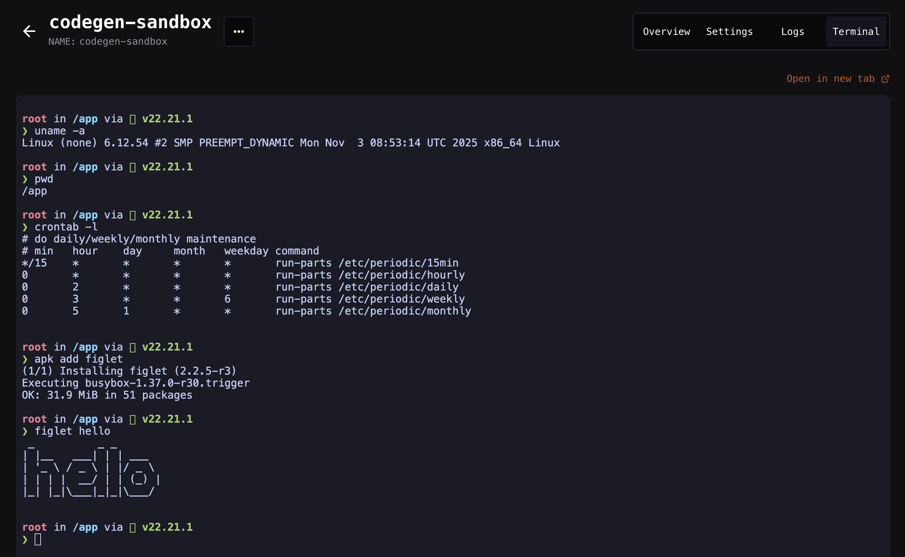
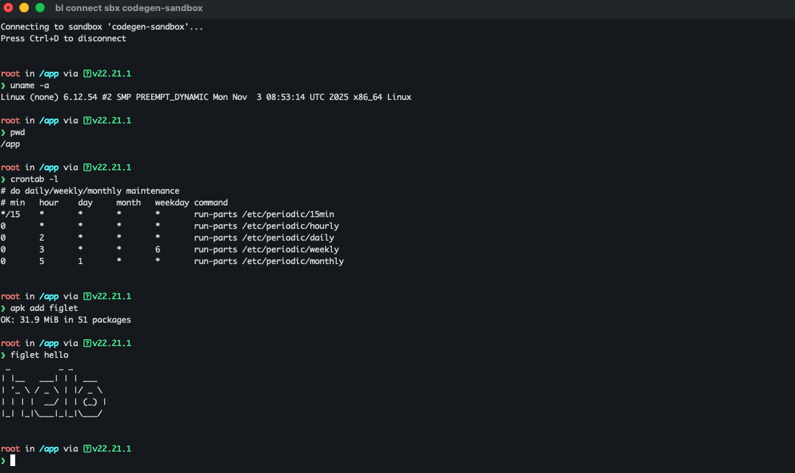

Sandboxes are instant-launching virtual machines serving as **sandboxed compute runtimes for agents**. You can securely run LLM-generated code inside these VMs making them ideal for agents that need access to an operating system to run commands with no risk of escaping.

They provide a basic [REST API interface](https://docs.blaxel.ai/api-reference/filesystem) for accessing the file system and processes, along with an [MCP server](./MCP) that makes these capabilities available as tool calls.

Unlike traditional sandbox infrastructure, Blaxel's **standout feature** is fully managed lifecycle. Sandboxes resume from standby in **under 25 milliseconds** and automatically scale to zero **after a few seconds of inactivity**. This means that your sandboxes wait on standby indefinitely when not used, eliminating cold starts without complex orchestration. Memory state is maintained even after scaling down, including the running processes and entire filesystem. For cost-effective long-term persistence, you can attach [volumes](Volumes) to sandboxes.


In addition to automatic scale-to-zero, Blaxel also supports [automatic sandbox deletion based on expiration policies](./Expiration). Starter quotas enforce time-to-live (TTLs), while higher quota tiers unlock sandboxes with unlimited persistence.

## Use cases

Some examples of use cases include:

- **Code review agents** that analyze repositories to detect the effects of changes. These agents run fully isolated compute environments for each tenant while keeping them snapshotted in standby between sessions, eliminating the need to clone the repo every time.
- **Code generation agents** that iterate in their own compute environments, and instantly render live application previews as human users build, step away, and log back in.
- **Data analyst agents** that execute adhoc data analysis workflows, generating scripts on-the-fly and running them securely against private files or data within an isolated, ZDR-compliant environment.
- **Background agents** that operate beyond their pre-configured tools. Each agent gets its own "personal computer" where it can autonomously install packages, execute custom scripts, store files, and adapt to new requirements securely. They can parallelize dozens of those personal computers.

## Create a sandbox

### Using the SDKs

Create a new sandbox using the [Blaxel SDK](../sdk-reference/introduction) by specifying a name, image to use, optional [deployment region](../Infrastructure/Regions), optional labels, and the ports to expose. Note that **ports** **80** (system), and **443** & **8080** (sandbox API) are reserved by Blaxel.

<Accordion title="Set up authentication to Blaxel">
  The Blaxel SDK authenticates with your workspace using credentials from these sources, in priority order:

  1. when running on Blaxel, authentication is handled automatically
  2. variables in your `.env` file (`BL_WORKSPACE` and `BL_API_KEY`, or see [this page](../Agents/Variables-and-secrets) for other authentication options).
  3. environment variables from your machine
  4. configuration file created locally when you log in through [Blaxel CLI](../cli-reference/introduction) (or deploy on Blaxel)

  When developing locally, the recommended method is to just **log in to your workspace with Blaxel CLI.** This allows you to run Blaxel SDK functions that will automatically connect to your workspace without additional setup. When you deploy on Blaxel, this connection persists automatically.

  When running Blaxel SDK from a remote server that is not Blaxel-hosted, we recommend using environment variables as described in the third option above.
</Accordion>

<CodeGroup>

```typescript TypeScript
import { SandboxInstance } from "@blaxel/core";

// Create a new sandbox
const sandbox = await SandboxInstance.create({
  name: "my-sandbox",
  image: "blaxel/base-image:latest",   // public or custom image
  memory: 4096,   // in MB
  ports: [{ target: 3000, protocol: "HTTP" }],   // optional; ports to expose
  labels: { env: "dev", project: "my-project" }, // optional; labels
  region: "us-pdx-1"   // optional; if not specified, Blaxel will choose a default region
});
```


```python Python
import asyncio
from blaxel.core import SandboxInstance

async def main():

    # Create a new sandbox
    sandbox = await SandboxInstance.create({
      "name": "my-sandbox",
      "image": "blaxel/base-image:latest",   # public or custom image
      "memory": 4096,   # in MB
      "ports": [{ "target": 3000 }],   # optional; ports to expose
      "labels": {"env": "dev", "project": "my-project"},  # optional; labels
      "region": "us-pdx-1"   # optional; if not specified, Blaxel will choose a default region
    })

if __name__ == "__main__":
    asyncio.run(main())
```

</CodeGroup>

An alternative is to use the helper function `createIfNotExists()` (TypeScript) / `create_if_not_exists()` (Python). This helper function either retrieves an existing sandbox or creates a new one if it doesn't exist. Blaxel first checks for an existing sandbox with the provided `name` and either retrieves it or creates a new one using your specified configuration.

<CodeGroup>

```typescript TypeScript
import { SandboxInstance } from "@blaxel/core";

// Create sandbox if it doesn't exist
const sandbox = await SandboxInstance.createIfNotExists({
  name: "my-sandbox",
  image: "blaxel/base-image:latest",  // public or custom image
  memory: 4096,    // in MB
  ports: [{ target: 3000, protocol: "HTTP" }],  // optional; ports to expose
  labels: { env: "dev", project: "my-project" }, // optional; labels
  region: "us-pdx-1"    // optional; if not specified, Blaxel will choose a default region
});
```


```python Python
import asyncio
from blaxel.core import SandboxInstance

async def main():

    # Create sandbox if it doesn't exist
    sandbox = await SandboxInstance.create_if_not_exists({
      "name": "my-sandbox",
      "image": "blaxel/base-image:latest",   # public or custom image
      "memory": 4096,   # in MB
      "ports": [{ "target": 3000 }],   # optional; ports to expose
      "labels": {"env": "dev", "project": "my-project"},  # optional; labels
      "region": "us-pdx-1"   # optional; if not specified, Blaxel will choose a default region
    })

if __name__ == "__main__":
    asyncio.run(main())
```

</CodeGroup>

### Using the CLI and Console

It is also possible to create a sandbox via the Blaxel CLI or the Blaxel Console.

<Tabs>
  <Tab title="CLI">
    ```shell
    bl new sandbox my-sandbox
    cd my-sandbox
    bl deploy
    ```

    This command initializes a new sandbox project and configuration file in the named directory `my-sandbox` and then deploys the sandbox on Blaxel.

    The project directory contains the Blaxel configuration file `blaxel.toml`, which can be further customized to suit your sandbox deployment requirements, by modifying the base image, memory, environment, etc. [`Learn more about the blaxel.toml file`](/deployment-reference).

    <Tip>
      Running `bl deploy` here also saves the image to be reused later as a template.
    </Tip>
  </Tab>
  <Tab title="Console">
    - Log in to the [Blaxel Console](https://app.blaxel.ai/).
    - Click **Sandboxes** in the left navigation menu.
    - Click **\+Create sandbox** -\> **Deploy from console**.
    - Select an image template.
    - On the next page, configure the sandbox resources, including memory, time-to-live and region.
    - Click **Next** to proceed.
    - On the next page, reconfirm the sandbox parameters. Click **Create** to create the sandbox.
  </Tab>
</Tabs>

### Using the API

Although less common, it is also possible to create a sandbox by directly interacting with the Blaxel REST API

Ensure that you have the following:

- A [Blaxel API key](../Security/Access-tokens)
- The workspace name

#### 1. Create a ZIP archive

Create a directory with the following project contents:

- `Dockerfile` (required) - Defines your custom sandbox image and must include `sandbox-api`
- Any custom scripts (e.g., `entrypoint.sh` for initialization logic)
- Configuration files or data files as needed
- Additional dependencies or binaries your sandbox requires

Here is an example of the expected project structure:

```
my-custom-sandbox/
├── Dockerfile              # Required - defines your image
└── entrypoint.sh          # Optional - for custom initialization
```

- The Dockerfile is the heart of your template. It defines what will be available in your sandbox environment. [See an example](./Templates#2-customize-the-dockerfile).
- The `entrypoint.sh` script runs when a sandbox is created from your template. [See an example](#4-define-initialization).

The Dockerfile can reference and use any files included in the ZIP archive. Everything gets extracted and built together as a Docker image.

Once the files are ready, create a ZIP archive containing:

```bash
cd my-custom-sandbox
zip -r ../my-sandbox.zip .
```

#### 2. Create a sandbox resource

Make an HTTP POST request to create or update your sandbox resource. This will return an upload URL where you'll send your code archive.

```bash
curl -X POST "https://api.blaxel.ai/v0/sandboxes?upload=true" \
  -H "Authorization: Bearer YOUR_API_KEY" \
  -H "X-Blaxel-Workspace: YOUR_WORKSPACE_NAME" \
  -H "Content-Type: application/json" \
  -d '{
    "apiVersion": "blaxel.ai/v1alpha1",
    "kind": "Sandbox",
    "metadata": {
      "name": "my-sandbox"
    },
    "spec": {
      "runtime": {
        "memory": 2048
      },
      "region": "us-pdx-1"
    }
  }'
```

Note the `upload=true` query parameter, which indicates intent to upload custom code.

Refer to the documentation on [sandbox configuration parameters](#understand-sandbox-configuration) for more information on the body of the POST request.

#### 3. Upload ZIP archive

The Blaxel API returns a JSON response. The response contains an `x-blaxel-upload-url` response header, containing the target URL to use when uploading your template. The URL is in the response headers, not the JSON body.

Example response:

```
HTTP/2 200
x-blaxel-upload-url: https://controlplane-prod-build-sources...
```

Use an HTTP PUT request to upload the ZIP file to the upload URL. Replace the placeholder URL in the command below with the value of the `x-blaxel-upload-url` response header received earlier.

```bash
curl -X PUT "https://storage.blaxel.ai/upload/sandbox/my-sandbox/abc123..." \
  -H "Content-Type: application/zip" \
  --data-binary @my-sandbox.zip
```

The upload is successful when you receive a `200 OK` status code.

#### 4: Monitor deployment status

After uploading, poll the sandbox status endpoint to track the build and deployment progress.

Make a GET request to `https://api.blaxel.ai/v0/sandboxes/<SANDBOX-NAME>`, where SANDBOX-NAME is the `metadata.name` specified in the initial POST request.

```bash
curl -X GET https://api.blaxel.ai/v0/sandboxes/my-sandbox \
  -H "Authorization: Bearer YOUR_API_KEY" \
  -H "X-Blaxel-Workspace: YOUR_WORKSPACE_NAME"
```

The `status` field of the response will progress through these values:

| Status | Description |
|--------|-------------|
| `UPLOADING` | Code archive is being uploaded |
| `BUILDING` | Docker image is being built |
| `DEPLOYING` | Container is being deployed to the cluster |
| `DEPLOYED` | Sandbox is ready to use |
| `FAILED` | Deployment failed (check build logs) |
| `DEACTIVATED` | Sandbox has been deactivated |


Continue polling every 3-5 seconds until the status reaches `DEPLOYED` or `FAILED`.

#### Example script

Here's a complete example script that performs all the steps above:

```bash
#!/bin/bash

# Real deployment script that executes the documented API workflow
set -e

# Configuration
SANDBOX_NAME="my-custom-sandbox-$(date +%s)"
SOURCE_DIR="my-sandbox"
ZIP_FILE="my-sandbox.zip"
BASE_URL="https://api.blaxel.ai/v0"

# Colors for output
GREEN='\033[0;32m'
RED='\033[0;31m'
YELLOW='\033[1;33m'
BLUE='\033[0;34m'
NC='\033[0m' # No Color

# Cleanup function
cleanup() {
  if [ -f "$ZIP_FILE" ]; then
    rm -f "$ZIP_FILE"
    echo -e "\n${GREEN}✓ Cleaned up temporary files${NC}"
  fi
}

# Set trap to cleanup on exit
trap cleanup EXIT

# Validate credentials
if [ -z "$BLAXEL_API_KEY" ]; then
  echo -e "${RED}Error: BLAXEL_API_KEY not set${NC}"
  echo "Get your API key from workspace settings and set it with:"
  echo "  export BLAXEL_API_KEY='your-api-key'"
  exit 1
fi

if [ -z "$BLAXEL_WORKSPACE" ]; then
  echo -e "${RED}Error: BLAXEL_WORKSPACE not set${NC}"
  echo "Set your workspace name with:"
  echo "  export BLAXEL_WORKSPACE='your-workspace-name'"
  exit 1
fi

# Check if source directory exists
if [ ! -d "$SOURCE_DIR" ]; then
  echo -e "${RED}Error: $SOURCE_DIR directory not found${NC}"
  exit 1
fi

# Create ZIP archive
echo -e "${BLUE}Creating ZIP archive from $SOURCE_DIR...${NC}"
cd "$SOURCE_DIR"
zip -q -r "../${ZIP_FILE}" .
cd ..

FILE_SIZE=$(wc -c < "$ZIP_FILE" | tr -d ' ')
echo -e "${GREEN}✓ ZIP archive created: $ZIP_FILE ($FILE_SIZE bytes)${NC}\n"

# Step 1: Create sandbox and get upload URL
echo -e "${BLUE}[1/4] Creating sandbox '$SANDBOX_NAME'...${NC}"

# Create temporary file for headers
HEADERS_FILE=$(mktemp)

CREATE_RESPONSE=$(curl -s -D "$HEADERS_FILE" -w "\n%{http_code}" -X POST "$BASE_URL/sandboxes?upload=true" \
  -H "Authorization: Bearer $BLAXEL_API_KEY" \
  -H "X-Blaxel-Workspace: $BLAXEL_WORKSPACE" \
  -H "Content-Type: application/json" \
  -d '{
    "apiVersion": "blaxel.ai/v1alpha1",
    "kind": "Sandbox",
    "metadata": {
      "name": "'"$SANDBOX_NAME"'"
    },
    "spec": {
      "runtime": {
        "memory": 2048
      },
      "region": "us-pdx-1"
    }
  }')

HTTP_CODE=$(echo "$CREATE_RESPONSE" | tail -n 1)
RESPONSE_BODY=$(echo "$CREATE_RESPONSE" | sed '$d')

if [ "$HTTP_CODE" != "200" ] && [ "$HTTP_CODE" != "201" ]; then
  echo -e "${RED}✗ Failed to create sandbox (HTTP $HTTP_CODE)${NC}"
  echo "$RESPONSE_BODY" | jq . 2>/dev/null || echo "$RESPONSE_BODY"
  rm -f "$HEADERS_FILE"
  exit 1
fi

# Extract upload URL from response headers
UPLOAD_URL=$(grep -i "x-blaxel-upload-url:" "$HEADERS_FILE" | cut -d' ' -f2- | tr -d '\r\n')

if [ -z "$UPLOAD_URL" ]; then
  echo -e "${RED}✗ No upload URL received in response headers${NC}"
  rm -f "$HEADERS_FILE"
  exit 1
fi

rm -f "$HEADERS_FILE"

echo -e "${GREEN}✓ Sandbox created${NC}"
echo ""

# Step 2: Upload ZIP file
echo -e "${BLUE}[2/4] Uploading code archive ($FILE_SIZE bytes)...${NC}"
UPLOAD_RESPONSE=$(curl -s -w "%{http_code}" -X PUT "$UPLOAD_URL" \
  -H "Content-Type: application/zip" \
  --data-binary "@$ZIP_FILE")

HTTP_CODE="${UPLOAD_RESPONSE: -3}"
if [ "$HTTP_CODE" != "200" ]; then
  echo -e "${RED}✗ Upload failed with status $HTTP_CODE${NC}"
  exit 1
fi

echo -e "${GREEN}✓ Upload completed${NC}"
echo ""

# Step 3: Monitor deployment status
echo -e "${BLUE}[3/4] Monitoring deployment status...${NC}"
MAX_WAIT=900  # 15 minutes
START_TIME=$(date +%s)
LAST_STATUS=""

while true; do
  # Check timeout
  CURRENT_TIME=$(date +%s)
  ELAPSED=$((CURRENT_TIME - START_TIME))
  if [ $ELAPSED -gt $MAX_WAIT ]; then
    echo -e "${RED}✗ Deployment timed out after $MAX_WAIT seconds${NC}"
    exit 1
  fi

  # Get current status
  STATUS_RESPONSE=$(curl -s -X GET "$BASE_URL/sandboxes/$SANDBOX_NAME" \
    -H "Authorization: Bearer $BLAXEL_API_KEY" \
    -H "X-Blaxel-Workspace: $BLAXEL_WORKSPACE")

  STATUS=$(echo "$STATUS_RESPONSE" | jq -r '.status // empty')

  if [ -z "$STATUS" ]; then
    echo -e "${YELLOW}Warning: Could not get status, retrying...${NC}"
    sleep 3
    continue
  fi

  # Log status changes
  if [ "$STATUS" != "$LAST_STATUS" ]; then
    echo "  Status: $STATUS"
    LAST_STATUS=$STATUS
  fi

  # Check terminal states
  if [ "$STATUS" = "DEPLOYED" ]; then
    IMAGE=$(echo "$STATUS_RESPONSE" | jq -r '.spec.runtime.image // empty')
    echo ""
    echo -e "${GREEN}🎉 Deployment complete!${NC}"
    echo "Sandbox: $SANDBOX_NAME"
    echo "Image: $IMAGE"
    echo ""

    # Step 4: Show how to use it
    echo -e "${BLUE}[4/4] How to use your sandbox:${NC}"
    echo ""
    echo "Run a command:"
    echo "  bl run sandbox $SANDBOX_NAME"
    echo ""
    echo "Get sandbox details:"
    echo "  bl get sandbox $SANDBOX_NAME"
    echo ""
    echo "View logs:"
    echo "  bl logs sandbox $SANDBOX_NAME"
    echo ""
    echo "Delete sandbox:"
    echo "  bl delete sandbox $SANDBOX_NAME"
    echo ""
    exit 0
  elif [ "$STATUS" = "FAILED" ]; then
    echo ""
    echo -e "${RED}✗ Deployment failed${NC}"
    echo ""
    echo "Check build logs with:"
    echo "  curl -X GET '$BASE_URL/sandboxes/$SANDBOX_NAME/build-logs' \\"
    echo "    -H 'Authorization: Bearer \$BLAXEL_API_KEY' \\"
    echo "    -H 'X-Blaxel-Workspace: \$BLAXEL_WORKSPACE'"
    exit 1
  elif [ "$STATUS" = "DEACTIVATED" ] || [ "$STATUS" = "DEACTIVATING" ] || [ "$STATUS" = "DELETING" ]; then
    echo ""
    echo -e "${RED}✗ Unexpected status: $STATUS${NC}"
    exit 1
  fi

  # Wait before next poll
  sleep 3
done
```

The script accepts a source directory path containing the Dockerfile and related code and uses it to deploy a sandbox on Blaxel. It monitors the deployment status until completion and also cleans up temporary files.

To use this script, first export your API key and credentials as below:

```
export BLAXEL_API_KEY=YOUR-API-KEY
export BLAXEL_WORKSPACE=YOUR-WORKSPACE-NAME
```

Create a sandbox directory named `my-sandbox` with the Dockerfile and entrypoint script:

```bash
mkdir -p my-sandbox
```

Save and run the script as `deploy-sandbox.sh`:

```bash
chmod +x deploy-sandbox.sh
./deploy-sandbox.sh
```

## Understand sandbox configuration

### Images

<Info>
  The list of public images [can be found here](https://github.com/blaxel-ai/sandbox/tree/main/hub). To create a sandbox with one of those images, enter `blaxel/{NAME}:latest` (e.g. _blaxel/nextjs:latest_).
</Info>

[Custom sandbox images](Templates) (or _templates_) enable you to create sandboxes with a consistent, customized set of tools, configurations, or entrypoint scripts.

### Memory and filesystem

For maximum performance, Blaxel sandboxes store part of their filesystem in memory. The base of the filesystem (the user-supplied image) is stored as read-only files on host storage using a highly-efficient format called [EROFS (Extendable Read-Only File System)](https://en.wikipedia.org/wiki/EROFS). On top of the read-only base, a writable layer lives entirely in the sandbox's RAM using `tmpfs`. [OverlayFS](https://en.wikipedia.org/wiki/OverlayFS) serves as orchestrator, directing reads to the EROFS base and writes to the in-memory `tmpfs` filesystem.

Due to this, Blaxel sandboxes reserve, when possible, approximately 50% of the available memory for the `tmpfs` filesystem. More information on our implementation is available in this [blog post](https://blaxel.ai/blog/how-to-slash-sandbox-memory-usage-by-75-using-overlayfs).

To avoid out-of-memory errors or if additional storage is required, one option is to add storage using [volumes](/Sandboxes/Volumes). However, this requires deleting and recreating the sandbox first. In addition, volumes are not as fast as the native in-memory filesystem.

### Ports

The following ports are reserved by Blaxel's system:

- **443**: This port hosts the main [sandbox API](https://docs.blaxel.ai/api-reference/filesystem/get-file-or-directory-information) and is exposed via HTTPS
- **80**: Reserved for system operations
- **8080**: Reserved for sandbox API functionality

You can expose specific non-reserved ports [**when creating a new sandbox**](Overview) by using the `ports` parameter. This allows you to access these ports from outside the sandbox.

<Important>
  If you plan to access the sandbox on a specific port, typically using a [preview URL](Preview-url), you **must** expose the port at sandbox creation time. It is currently not possible to expose sandbox ports post-creation.
</Important>

### Regions

Select the [region](../Infrastructure/Regions) where you want to deploy your sandbox. If you don't specify a region, Blaxel will automatically use a default region.

### Labels

You can also add optional labels for sandboxes. Labels are specified as key-value pairs during sandbox creation.

<CodeGroup>

```typescript TypeScript
// Create a new sandbox
const sandbox = await SandboxInstance.create({
  name: "my-sandbox",
  image: "blaxel/base-image:latest",   // public or custom image
  memory: 4096,   // in MB
  labels: { env: "dev", project: "my-project" }, // optional; labels
  region: "us-pdx-1"   // optional; if not specified, Blaxel will choose a default region
});
```


```python Python
# Create a new sandbox
sandbox = await SandboxInstance.create({
  "name": "my-sandbox",
  "image": "blaxel/base-image:latest",   # public or custom image
  "memory": 4096,   # in MB
  "labels": {"env": "dev", "project": "my-project"},  # optional; labels
  "region": "us-pdx-1"   # optional; if not specified, Blaxel will choose a default region
})
```

</CodeGroup>

You can use these labels for filtering sandboxes in the Blaxel CLI or Blaxel Console:

```shell
# Get sandboxes with specific label (e.g., env=dev)
bl get sandboxes -o json | jq -r '.[] | select(.metadata.labels.env == "dev") | .metadata.name'
```

### Expiration

Blaxel supports [automatic sandbox deletion](./Expiration) based on specific conditions.

## Retrieve an existing sandbox

To reconnect to an existing sandbox, simply provide its name:

<CodeGroup>

```typescript TypeScript
import { SandboxInstance } from "@blaxel/core";

// Connect to existing sandbox
const sandbox = await SandboxInstance.get("my-sandbox");
```


```python Python
from blaxel.core import SandboxInstance

# Connect to existing sandbox
sandbox = await SandboxInstance.get("my-sandbox")
```

</CodeGroup>

<Tip>
  Complete code examples demonstrating all operations are available on Blaxel's GitHub: [in TypeScript](https://github.com/blaxel-ai/sdk-typescript/tree/main/tests/sandbox) and [in Python](https://github.com/blaxel-ai/sdk-python/tree/main/tests/integration/sandbox).
</Tip>

## Delete a sandbox

<Important>
  When you delete a sandbox, all data is immediately erased. If the sandbox was never in standby mode, Blaxel guarantees ZDR (zero data retention).
</Important>

Delete a sandbox by calling:

- the class-level `delete()` method with the sandbox `name` as argument, or

  <CodeGroup>

  ```typescript TypeScript
  import { SandboxInstance } from "@blaxel/core";

  // Delete sandbox using class-level method
  await SandboxInstance.delete("my-sandbox");
  ```


  ```python Python
  from blaxel.core import SandboxInstance

  # Delete sandbox using class-level method
  await SandboxInstance.delete("my-sandbox")
  ```

  </CodeGroup>
- by calling the instance-level `delete()` method:

  <CodeGroup>

  ```typescript TypeScript
  import { SandboxInstance } from "@blaxel/core";

  // Get existing sandbox
  const sandbox = await SandboxInstance.get("my-sandbox");

  // Delete sandbox using instance-level method
  await sandbox.delete()
  ```


  ```python Python
  from blaxel.core import SandboxInstance

  # Get existing sandbox
  sandbox = await SandboxInstance.get("my-sandbox")

  # Delete sandbox using instance-level method
  await sandbox.delete()
  ```

  </CodeGroup>

## Upgrade a sandbox's API

Every Blaxel sandbox includes a [custom API binary](./Templates#how-sandbox-templates-work), which is necessary for sandbox functionality like process management and file operations. It is possible to perform an in-place upgrade of this API without needing to recreate or restart the sandbox.

<Note>
  This feature is currently in beta and only available for sandboxes built or created with sandbox API v0.2.0 or later (sandboxes created after 2 Feb 2026). For sandboxes built or created earlier than this date/API version, in-place upgrade is not possible; the sandbox must be recreated to obtain the new API.
</Note>

<CodeGroup>

```typescript TypeScript
import { SandboxInstance } from "@blaxel/core";

// Connect to existing sandbox
const sandbox = await SandboxInstance.get("my-sandbox")

// Upgrade sandbox API to "latest"
await sandbox.system.upgrade({ version: "latest" })
```


```python Python
from blaxel.core import SandboxInstance

# Connect to existing sandbox
sandbox = await SandboxInstance.get("my-sandbox")

# Upgrade sandbox API to "latest"
await sandbox.system.upgrade(version="latest")
```

</CodeGroup>

You can find a list of available API versions in [Blaxel's public repository](https://github.com/blaxel-ai/sandbox/).

## Connect to a sandbox with an interactive terminal

You can explore the contents of a sandbox with an interactive terminal. You can access this terminal in two ways:

- From the Blaxel Console, by visiting the detail page for your sandbox in your web browser and selecting the **Terminal** tab:

  
- From your local host, by running:

  ```bash
  bl connect sandbox your-sandbox-name
  ```

  

## Manage sandbox hibernation

Sandboxes stay active as long as there's an active connection to them, typically through a WebSocket connection. When a browser tab becomes inactive, the WebSocket should disconnect after some time, but this behavior depends on the specific browser implementation.

There are no built-in stop or start functions available in the SDKs to force hibernation. This means you'll need to rely on other approaches to better control when sandboxes remain active:

1. Hide iframe when tab is inactive

    Use JavaScript events to detect when a user is not active on the tab:
    - Listen for tab visibility events that indicate when the user switches away from your tab
    - When the user becomes inactive, hide the iframe containing the sandbox preview
    - Show the iframe again when the user returns to the tab

1. Implement auto-disconnect on tab switch

    Some browsers (like Chrome) may keep WebSockets alive even when tabs are inactive to improve performance. You can implement an auto-disconnect feature that:
    - Detects when users switch tabs
    - Automatically disconnects the WebSocket connection
    - Reconnects when the user returns

1. Use activity-based timeouts

    Set up a timer system in your interface that:
    - Monitors user activity (typing, interactions, etc.)
    - Hides the preview after a period of inactivity
    - Prompts the user to confirm they're still using the sandbox

You can use the SDKs from the frontend if you have the right headers set on the session. Use the [`sandbox.sessions.create` function](/Sandboxes/Sessions) to manage sessions.

Here is an example of auto disconnect on tab switch with Vite through a plugin:

<Warning>
The code below is illustrative and not intended for production use.
</Warning>

```typescript
// vite.config.ts
import { defineConfig } from 'vite'
import { hmrVisibility } from './vite-plugin-hmr-visibility'

// https://vite.dev/config/
export default defineConfig({
  plugins: [
    hmrVisibility({
      disconnectDelay: 2000, // Wait 2 seconds before disconnecting
      debug: true, // Enable debug logging
    }),
  ],
  server: {
    // Prevent Vite from aggressive reconnection attempts
    hmr: {
      overlay: false, // Disable error overlay which can trigger reconnections
    },
  },
})

// vite-plugin-hmr-visibility.ts
/**
 * Vite Plugin: HMR Visibility Manager
 * Automatically disconnects/reconnects HMR websocket based on tab visibility
 * to reduce serverless billing costs
 */

import type { Plugin } from 'vite'

export interface HMRVisibilityOptions {
  /**
   * Grace period before disconnecting (ms)
   * @default 2000
   */
  disconnectDelay?: number

  /**
   * Enable debug logging
   * @default false
   */
  debug?: boolean
}

export function hmrVisibility(options: HMRVisibilityOptions = {}): Plugin {
  const {
    disconnectDelay = 2000,
    debug = false,
  } = options

  return {
    name: 'vite-plugin-hmr-visibility',
    apply: 'serve', // Only apply in dev mode

    transformIndexHtml() {
      // Inject the HMR visibility manager as an inline script
      return [
        {
          tag: 'script',
          attrs: { type: 'module' },
          children: `
// HMR Visibility Manager - Disconnects HMR when tab is hidden
(function() {
  const log = (...args) => {
    if (${JSON.stringify(debug)}) {
      console.log('[HMR Visibility]', ...args);
    }
  };

  let disconnectTimer = null;
  let isTabVisible = !document.hidden;
  const DISCONNECT_DELAY = ${JSON.stringify(disconnectDelay)};

  // Store reference to original functions
  const OriginalWebSocket = window.WebSocket;
  const OriginalSetTimeout = window.setTimeout;
  const OriginalSetInterval = window.setInterval;

  let hmrSocket = null;
  let shouldBlockReconnect = false;
  let blockedTimers = new Set();

  // Patch setTimeout and setInterval to block Vite's reconnection timers
  window.setTimeout = function(callback, delay, ...args) {
    // Block timers when tab is hidden and it looks like a reconnection attempt
    if (shouldBlockReconnect && delay && delay >= 500 && delay <= 5000) {
      const callbackStr = callback.toString();
      if (callbackStr.includes('connect') || callbackStr.includes('WebSocket') || callbackStr.includes('ws')) {
        log('Blocked reconnection timer (setTimeout)');
        const timerId = OriginalSetTimeout(() => {}, 999999999);
        blockedTimers.add(timerId);
        return timerId;
      }
    }
    return OriginalSetTimeout.call(this, callback, delay, ...args);
  };

  window.setInterval = function(callback, delay, ...args) {
    // Block intervals when tab is hidden
    if (shouldBlockReconnect) {
      const callbackStr = callback.toString();
      if (callbackStr.includes('connect') || callbackStr.includes('WebSocket') || callbackStr.includes('ws')) {
        log('Blocked reconnection interval (setInterval)');
        const timerId = OriginalSetInterval(() => {}, 999999999);
        blockedTimers.add(timerId);
        return timerId;
      }
    }
    return OriginalSetInterval.call(this, callback, delay, ...args);
  };

  // Patch WebSocket to track and block HMR connections
  window.WebSocket = function(url, protocols) {
    // Block new WebSocket connections when tab is hidden
    if (shouldBlockReconnect) {
      log('Blocked WebSocket connection attempt while tab is hidden:', url);
      // Return a fake WebSocket that stays in CONNECTING state forever
      const fakeWs = {
        readyState: 0, // CONNECTING (keeps Vite waiting)
        close: () => { log('Fake WebSocket close called'); },
        send: () => { log('Fake WebSocket send called'); },
        addEventListener: () => {},
        removeEventListener: () => {},
        dispatchEvent: () => false,
        onopen: null,
        onclose: null,
        onerror: null,
        onmessage: null,
      };
      return fakeWs;
    }

    const ws = new OriginalWebSocket(url, protocols);

    // Track HMR WebSocket and intercept its event handlers
    if (typeof url === 'string') {
      hmrSocket = ws;
      log('HMR WebSocket created and tracked');

      // Intercept the onclose setter to control reconnection behavior
      let userOnClose = null;
      Object.defineProperty(ws, 'onclose', {
        get() { return userOnClose; },
        set(handler) {
          userOnClose = function(event) {
            // If we're blocking reconnect, don't call Vite's onclose handler
            if (shouldBlockReconnect) {
              log('Suppressed onclose handler - blocking reconnection');
              return;
            }
            // Otherwise, call the original handler
            if (handler) {
              handler.call(this, event);
            }
          };
        },
        configurable: true
      });

      // Also intercept addEventListener for 'close' events
      const originalAddEventListener = ws.addEventListener;
      ws.addEventListener = function(type, listener, options) {
        if (type === 'close') {
          const wrappedListener = function(event) {
            if (shouldBlockReconnect) {
              log('Suppressed close event listener - blocking reconnection');
              return;
            }
            listener.call(this, event);
          };
          return originalAddEventListener.call(this, type, wrappedListener, options);
        }
        return originalAddEventListener.call(this, type, listener, options);
      };
    }

    return ws;
  };

  // Copy static properties from original WebSocket
  Object.setPrototypeOf(window.WebSocket, OriginalWebSocket);
  window.WebSocket.prototype = OriginalWebSocket.prototype;

  // Copy static constants
  Object.defineProperty(window.WebSocket, 'CONNECTING', { value: 0, enumerable: true });
  Object.defineProperty(window.WebSocket, 'OPEN', { value: 1, enumerable: true });
  Object.defineProperty(window.WebSocket, 'CLOSING', { value: 2, enumerable: true });
  Object.defineProperty(window.WebSocket, 'CLOSED', { value: 3, enumerable: true });

  const disconnectHMR = () => {
    if (hmrSocket && (hmrSocket.readyState === 0 || hmrSocket.readyState === 1)) {
      log('Disconnecting HMR websocket (tab hidden) - saving costs ✅');
      hmrSocket.close(1000, 'Tab hidden');
      hmrSocket = null;
    }
    shouldBlockReconnect = true;
  };

  const reconnectHMR = () => {
    shouldBlockReconnect = false;

    // Clear any blocked timers
    blockedTimers.forEach(timerId => {
      try {
        clearTimeout(timerId);
        clearInterval(timerId);
      } catch (e) {}
    });
    blockedTimers.clear();

    // If HMR was disconnected, reload to reconnect
    if (!hmrSocket || hmrSocket.readyState === 3) {
      log('Reloading page to restore HMR connection');
      setTimeout(() => window.location.reload(), 100);
    }
  };

  // Handle tab visibility changes
  document.addEventListener('visibilitychange', () => {
    isTabVisible = !document.hidden;

    if (document.hidden) {
      log('Tab hidden - will disconnect HMR in ' + DISCONNECT_DELAY + 'ms');

      disconnectTimer = OriginalSetTimeout(() => {
        if (document.hidden) {
          disconnectHMR();
        }
      }, DISCONNECT_DELAY);

    } else {
      log('Tab visible - allowing HMR reconnection');

      // Clear disconnect timer if tab becomes visible again
      if (disconnectTimer) {
        clearTimeout(disconnectTimer);
        disconnectTimer = null;
      }

      OriginalSetTimeout(() => {
        reconnectHMR();
      }, 100);
    }
  });

  // Handle page freeze events
  window.addEventListener('freeze', () => {
    log('Page freeze detected - disconnecting HMR immediately');
    disconnectHMR();
  }, { capture: true });

  window.addEventListener('resume', () => {
    log('Page resume detected - allowing HMR reconnection');
    OriginalSetTimeout(() => {
      reconnectHMR();
    }, 100);
  }, { capture: true });

  log('HMR Visibility Manager initialized - will block reconnection attempts when tab is hidden');
})();
          `,
          injectTo: 'head-prepend',
        },
      ]
    },
  }
}
```

## Sandbox statuses

Blaxel sandboxes go from standby to active in **under 25 milliseconds**, and scale back down to standby **after a few seconds of inactivity**, maintaining their previous state after scaling down.

- In STANDBY mode: You are not charged for CPU/memory while a sandbox is in standby mode. However, you are charged for the storage of the snapshot and/or the volumes.
- In ACTIVE mode: You are charged for CPU/memory and storage while a sandbox is in active mode. Sandboxes automatically return to standby mode after 1 second of inactivity.

The **scale-to-zero functionality is based on network activity.** When your connection to the sandbox closes, Blaxel automatically creates a snapshot of the entire state (including the complete file system in memory, preserving both files and running processes) and transitions to standby mode within approximately 5 seconds.

Any running processes are included in this snapshot and will be **instantly restored** when you reconnect to the sandbox.

The possible sandbox statuses are:

- `UPLOADING`: A new sandbox version has just been uploaded; the build has not started yet.
- `BUILDING`: A new sandbox version has been uploaded and the build is in progress.
- `DEPLOYING`: The sandbox deployment is in progress.
- `DEPLOYED`: The sandbox is ready to use.
- `FAILED`: An error occurred during the build or deployment of the sandbox.
- `TERMINATED`: A TTL was set for the sandbox; it has been deleted and will be removed from the API/UI soon.
- `DELETING`: A deletion request has been triggered and the deletion is in progress.

<Note>
  `UPLOADING/BUILDING` statuses only appear when using `bl deploy` from a sandbox template folder.
</Note>

<CardGroup>
  <Card title="Expiration policies" icon="hourglass-half" href="/Sandboxes/Expiration">
    Automatically delete sandboxes based on specific conditions.
  </Card>
  <Card title="MCP server" icon="robot" href="/Sandboxes/MCP">
    Interact with a sandbox through its MCP server.
  </Card>
  <Card title="Processes and commands" icon="terminal" href="/Sandboxes/Processes">
    Execute and manage processes in sandboxes.
  </Card>
  <Card title="File system operations" icon="file-lines" href="/Sandboxes/Filesystem">
    Manage directories and files in sandboxes.
  </Card>
  <Card title="Tools for AI codegen" icon="file-lines" href="/Sandboxes/Codegen-tools">
    Manage codebases with tools specifically designed for code generation.
  </Card>
  <Card title="Log streaming" icon="table-list" href="/Sandboxes/Log-streaming">
    Access logs generated in a sandbox.
  </Card>
  <Card title="Ports" icon="network-wired" href="/Sandboxes/Ports">
    Expose and connect to ports of a sandbox.
  </Card>
  <Card title="Preview in real-time" icon="eye" href="/Sandboxes/Preview-url">
    Render code in real-time via a direct preview URL.
  </Card>
  <Card title="Sessions" icon="user" href="/Sandboxes/Sessions">
    Manage temporary sessions to connect to sandboxes from a frontend client.
  </Card>
  <Card title="Volumes" icon="database" href="/Sandboxes/Volumes">
    Attach volumes to sandboxes to persist files.
  </Card>
  <Card title="Templates" icon="box" href="/Sandboxes/Templates">
    Create custom sandbox templates.
  </Card>
</CardGroup>

See tutorials and examples:

<CardGroup>
  <Card title="Example: Connect Claude Code to a Blaxel Sandbox" icon="cube" iconType="light" href="/Tutorials/Claude-Agent-SDK-MCP">
    Connect a Claude Agent SDK agent to a Blaxel sandbox and operate it using its MCP server.
  </Card>
  <Card title="See more tutorials and examples" icon="rocket" href="/Tutorials/Sandboxes-Overview">
  Read tutorials for running applications built with popular frameworks like Astro, Expo and Next.js on Blaxel.
  </Card>
</CardGroup>

Or explore the Sandbox API reference:

<Card title="Sandbox API" icon="code" href="https://docs.blaxel.ai/api-reference/filesystem">
  Access the your sandbox with an HTTP REST API.
</Card>
