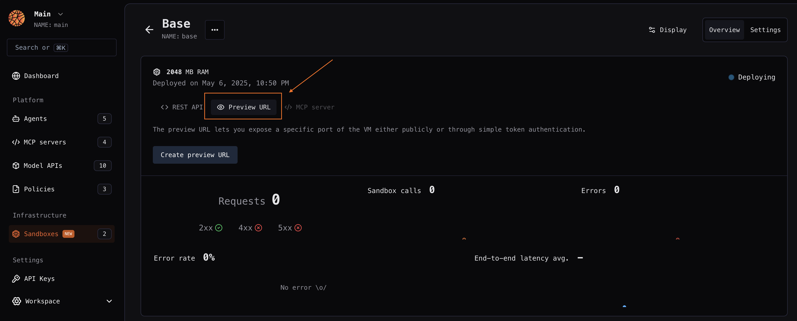

---

title: 'Preview code in real-time'

description: 'Render an application in real-time via a direct preview URL for its running sandbox.'

---

Sometimes you may need to access a running sandbox application and preview the content in real time in a front-end client. This is useful for example to instantly preview React code generated by a codegen AI agent. 

You can do this via a **preview URL** that routes to a specific port on your sandbox (e.g. *port 3000* for `npm run dev`). This preview URL can be either **public** (does not require you to be authenticated to access it) or **private** (see down below).

They will look something like this:

```
https://tkmu0oj2bf6iuoag6mmlt8.preview.bl.run
```

Setting a **custom domain** on the preview URL is a feature coming soon!

## Current limitations of real-time previews

JavaScript module bundlers handle real-time previewing. Here are the key compatibility requirements and limitations:

- Module bundler **must implement** [ping-pong](https://datatracker.ietf.org/doc/html/rfc6455#section-5.5.2)
- [Webpack](https://webpack.js.org/) has been tested and works
- [Turbopack](https://nextjs.org/docs/app/api-reference/turbopack) currently doesn't work as it doesn't support ping-pong (see [issue raised to Vercel](https://github.com/vercel/next.js/discussions/78947))
- Blaxel has a **15-minute connection timeout**. To maintain previews beyond this limit, ensure your bundler implements automatic reconnection

## Private preview URLs

When you create a private preview URL a token is required to access the URL. You must include the token as:

- a `bl_preview_token` query parameter when accessing the preview URL (e.g. *https://tkmu0oj2bf6iuoag6mmlt8.preview.bl.run/health?bl_preview_token={token.value}*)
- a `X-Blaxel-Preview-Token` header

## Manage preview URLs

### Blaxel console

You can create a preview URL for a sandbox from the Blaxel Console, on the overview of a sandbox:



### Blaxel SDK

<Accordion title="Set up authentication to Blaxel">

The Blaxel SDK authenticates with your workspace using credentials from these sources, in priority order:

1. when running on Blaxel, authentication is handled automatically
2. variables in your `.env` file (`BL_WORKSPACE` and `BL_API_KEY`, or see [this page](../Agents/Variables-and-secrets) for other authentication options). 
3. environment variables from your machine
4. configuration file created locally when you log in through [Blaxel CLI](../cli-reference/introduction) (or deploy on Blaxel)

When developing locally, the recommended method is to just **log in to your workspace with Blaxel CLI.** This allows you to run Blaxel SDK functions that will automatically connect to your workspace without additional setup. When you deploy on Blaxel, this connection persists automatically.

When running Blaxel SDK from a remote server that is not Blaxel-hosted, we recommend using environment variables as described in the third option above.

</Accordion>

Create and manage a sandbox’s public preview URL: 

<CodeGroup>

```typescript TypeScript {8-16}

import { SandboxInstance } from "@blaxel/core";

const sandbox = await SandboxInstance.get("my-sandbox")

/// Create a public preview
try {
    await sandbox.previews.create({
        metadata: {
            name: "preview-test-1"
        },
        spec: {
            port: 443,
            public: true
        }
    })
    const previews = await sandbox.previews.list()
    if (previews.length < 1) {
        throw new Error("No previews found");
    }
    const preview = await sandbox.previews.get("preview-test-1")
    if (preview.name !== "preview-test-1") {
        throw new Error("Preview name is not correct");
    }
    const url = preview.spec?.url
    if (!url) {
        throw new Error("Preview URL is not correct");
    }
    const response = await fetch(`${url}/health`)
    if (response.status !== 200) {
        throw new Error("Preview is not working");
    }
    console.log("Preview is healthy :)")
} catch (e) {
    console.log("ERROR IN PREVIEWS NOT EXPECTED => ", e.error);
}
```

```python Python {18-25}

import asyncio
import logging
from datetime import datetime, timedelta, timezone

import aiohttp

from blaxel.core.client.models import (Metadata, Port, Preview, PreviewSpec,
                                  Runtime, Sandbox, SandboxSpec)
from blaxel.core import settings
from blaxel.core.sandbox import SandboxInstance

logger = logging.getLogger(__name__)

async def test_public_preview(sandbox: SandboxInstance):
    try:
        # Create a public preview
        await sandbox.previews.create(Preview(
            metadata=Metadata(name="preview-test-public"),
            spec=PreviewSpec(
                port=443,
                prefix_url="small-prefix",
                public=True
            )
        ))

        # List previews
        previews = await sandbox.previews.list()
        assert len(previews) >= 1, "No previews found"

        # Get the preview
        retrieved_preview = await sandbox.previews.get("preview-test-public")
        assert retrieved_preview.name == "preview-test-public", "Preview name is not correct"

        # Check the URL
        url = retrieved_preview.spec.url if retrieved_preview.spec else None
        assert url is not None, "Preview URL is not correct"
        workspace = settings.workspace
        expected_url = f"https://small-prefix-{workspace}.preview.bl.run"
        assert url == expected_url, f"Preview URL is not correct => {url}"

        # Test the preview endpoint
        async with aiohttp.ClientSession() as session:
            async with session.get(f"{url}/health") as response:
                assert response.status == 200, f"Preview is not working => {response.status}:{await response.text()}"

        logger.info("Public preview is healthy :)")
    except Exception as e:
        logger.error("ERROR IN PUBLIC PREVIEW TEST => ", exc_info=e)
        raise

async def main():
    sandbox = await SandboxInstance.get("sandbox-test")
    await test_public_preview(sandbox)

if __name__ == "__main__":
    asyncio.run(main())

```

</CodeGroup>

Or create a private preview:

<CodeGroup>

```typescript TypeScript {8-16, 23}

import { SandboxInstance } from "@blaxel/core";

const sandbox = await SandboxInstance.get("my-sandbox")

/// Create a private preview
try {
    const preview = await sandbox.previews.create({
      metadata: {
        name: "preview-test-private"
      },
      spec: {
        port: 443,
        public: false
      }
    })
    const url = preview.spec?.url
    if (!url) {
      throw new Error("Preview URL is not correct");
    }
    const retrievedPreview = await sandbox.previews.get("preview-test-private")
    console.log(`Retrieved preview => url = ${retrievedPreview.spec?.url}`)
    const token = await preview.tokens.create(new Date(Date.now() + 1000 * 60 * 10)) // 10 minutes expiration
    console.log("Token created => ", token.value)
    const tokens = await preview.tokens.list()
    if (tokens.length < 1) {
      throw new Error("No tokens found");
    }
    if (!tokens.find((t) => t.value === token.value)) {
      throw new Error("Token not found in list");
    }
    console.log("Token created => ", token.value)
    const response = await fetch(`${url}/health`)
    if (response.status !== 401) {
      throw new Error(`Preview is not protected by token, response => ${response.status}`);
    }

    const responseWithToken = await fetch(`${url}/health?bl_preview_token=${token.value}`)
    if (responseWithToken.status !== 200) {
      throw new Error(`Preview is not working with token, response => ${responseWithToken.status}`);
    }
    console.log("Preview is healthy with token :)")
    await preview.tokens.delete(token.value)
} catch (e) {
  console.log("ERROR IN PREVIEWS NOT EXPECTED => ", e);
} 

```

```python Python {18-24, 31}

import asyncio
import logging
from datetime import datetime, timedelta, timezone

import aiohttp

from blaxel.core.client.models import (Metadata, Port, Preview, PreviewSpec,
                                  Runtime, Sandbox, SandboxSpec)
from blaxel.core. import settings
from blaxel.core.sandbox import SandboxInstance

logger = logging.getLogger(__name__)

async def test_private_preview(sandbox: SandboxInstance):
    try:
        # Create a private preview
        preview = await sandbox.previews.create(Preview(
            metadata=Metadata(name="preview-test-private"),
            spec=PreviewSpec(
                port=443,
                public=False
            )
        ))

        # Get the preview URL
        url = preview.spec.url if preview.spec else None
        assert url is not None, "Preview URL is not correct"

        # Create a token
        token = await preview.tokens.create(datetime.now(timezone.utc) + timedelta(minutes=10))
        logger.info(f"Token created => {token.value}")

        # List tokens
        tokens = await preview.tokens.list()
        assert len(tokens) >= 1, "No tokens found"
        assert any(t.value == token.value for t in tokens), "Token not found in list"

        # Test the preview endpoint without token
        async with aiohttp.ClientSession() as session:
            async with session.get(f"{url}/health") as response:
                assert response.status == 401, f"Preview is not protected by token, response => {response.status}"

        # Test the preview endpoint with token
        async with aiohttp.ClientSession() as session:
            async with session.get(f"{url}/health?bl_preview_token={token.value}") as response:
                assert response.status == 200, f"Preview is not working with token, response => {response.status}"

        logger.info("Private preview is healthy with token :)")

        # Delete the token
        await preview.tokens.delete(token.value)
    except Exception as e:
        logger.error("ERROR IN PRIVATE PREVIEW TEST => ", exc_info=e)
        raise

async def main():
    sandbox = await SandboxInstance.get("sandbox-test")
    await test_private_preview(sandbox)

if __name__ == "__main__":
    asyncio.run(main())

```

</CodeGroup>

### Create if not exists

Just like for sandboxes, this helper function either retrieves an existing preview or creates a new one if it doesn't exist. Blaxel first checks for an existing preview with the provided `name` and either retrieves it or creates a new one using your specified configuration.

<CodeGroup>

```typescript TypeScript

const sandbox = await SandboxInstance.get("my-sandbox")

const preview = await sandbox.previews.createIfNotExists({
      metadata: {
        name: "preview-name"
      },
      spec: {
        port: 443,
        public: false
      }
    })

```

</CodeGroup>