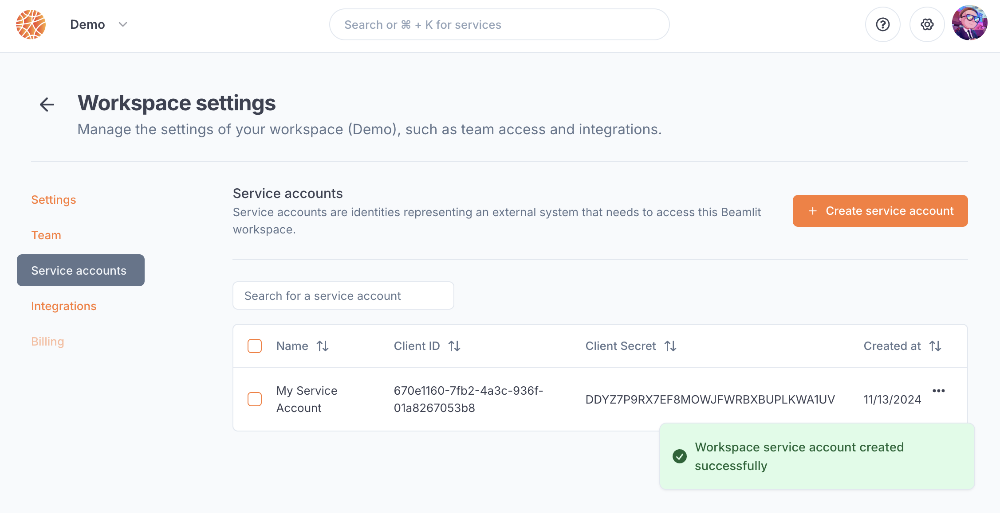

---

title: 'Access tokens'

description: 'Interact with Blaxel by API or CLI using access tokens.'

---

User access tokens can be used in order to authenticate to Blaxel by API or CLI. They apply for both [users](Workspace-access-control) and [service accounts](Service-accounts). They are generated through a variety of methods, which are documented below.

## Overview of authentication methods on Blaxel

Blaxel employs two main authentication paradigms: **short-lived tokens** (OAuth) and **long-lived tokens** (API keys).

Long-lived tokens are easier to use but are less secure as their validity can go from multiple days to infinite. They are generated as **API keys** from the Blaxel console. 

**OAuth tokens** are recommended for security reasons, as their duration is only of 2 hours (short-lived). They are generated through [OAuth 2.0](https://oauth.net/2/) authentication endpoints.

## API keys

Long-lived authentication tokens are called **API keys** on Blaxel. Their validity duration can be infinite.

### Using API keys

API keys can be used in the Blaxel APIs, CLI and SDK.

**To authenticate in the SDKs**, use the following two variables **`BL_WORKSPACE`** and **`BL_API_KEY`**, which can be set in one of these sources:

1. your **`.env`** file
2. your machine's environment variables
3. the local configuration file created when you log in through the CLI (see below)

**To authenticate in the CLI** use this command

```
export BL_API_KEY=YOUR-API-KEY
bl login YOUR-WORKSPACE
```

**To authenticate in the APIs**, use the API key as an authorization bearer in the headers `Authorization` or `X-Blaxel-Authorization` in any call to the Blaxel APIs. For example, to list models:

```
curl 'https://api.blaxel.ai/v0/models' \
  -H 'Accept: application/json, text/plain, */*' \
  -H 'Authorization: Bearer YOUR-API-KEY'
```

### Manage API keys

You can create private API keys for your Blaxel account to authenticate directly when using the Blaxel APIs or CLI. Your [permissions in each workspace](Workspace-access-control) will be the ones given to your account in each of them.

API keys can be managed from the Blaxel console in **Profile > Security**.


For production-grade access to workspace resources that should be independent of individual users, it's strongly recommended to use [service accounts](Service-accounts) in the workspace.

## OAuth 2.0 tokens

These short-lived tokens are based on the [OAuth 2.0](https://oauth.net/2/) authentication protocol, and have a validity period of **2 hours**.

### Use OAuth tokens in the CLI

Use `bl login`  command.

You will then be redirected to the Blaxel console to finish logging in. Sign in using your Blaxel account if you aren’t already. 

Once this is done, return to your terminal: the login will be finalized and you will then be able to run CLI commands. 

<Tip>Your [permissions in each workspace](Workspace-access-control) will be the ones given to your account in each of them.</Tip>

### Use OAuth tokens in the API via service accounts

[Service accounts](Service-accounts) can retrieve a short-lived token via the *OAuth client credentials grant type* in the authentication API, using their *client ID* and *client secret*. These two keys are generated automatically when creating a service account. Make sure to copy the secret at its generation as you will never be able to see it again after.



<Info>Service accounts can also connect to the API using a long-lived API key, as detailed [in the section below](Access-tokens).</Info>

To retrieve the token, pass the service account’s *client ID* and *client secret* in the header to the `/oauth/token` endpoint.

```
curl --request POST \
  --url https://api.blaxel.ai/v0/oauth/token \
  --header 'Authorization: Basic base64(CLIENT_ID:CLIENT_SECRET)' \
  --header 'Content-Type: application/json' \
  --data '{
	"grant_type":"client_credentials"
}'
```

Alternatively, you can also pass pass the *client ID* and *client secret* in the body:

```
curl --request POST \
  --url https://api.blaxel.ai/v0/oauth/token \
  --header 'Content-Type: application/json' \
  --data '{
	"grant_type":"client_credentials",
    "client_id": CLIENT_ID,
    "client_secret": CLIENT_SECRET
}'
```

You will retrieve a bearer token valid for 2 hours, which can then be passed in any call to a Blaxel APIs through any of the following headers: `Authorization` or `X-Blaxel-Authorization`, as such:

```
curl 'https://api.blaxel.ai/v0/models' \
  -H 'Accept: application/json, text/plain, */*' \
  -H 'X-Blaxel-Authorization: Bearer YOUR_TOKEN'
```

### (Advanced) Use OAuth tokens in the APIs

<Note>This section assumes you are a developer experienced with OAuth 2.0. For a simpler guide of how to use short-lived tokens in Blaxel APIs, read the [section on authenticating service accounts](Access-tokens).</Note>

Blaxel implements all **grant types** in the OAuth 2.0 convention, including [client credentials](https://www.oauth.com/oauth2-servers/access-tokens/client-credentials/), [authorization code](https://www.oauth.com/oauth2-servers/access-tokens/authorization-code-request/), and [refresh tokens](https://www.oauth.com/oauth2-servers/access-tokens/refreshing-access-tokens/). If you are a developer experienced with OAuth 2.0, you can find the **well-known configuration endpoint** at the following URL:

```
https://api.blaxel.ai/v0/.well-known/openid-configuration
```

Through the endpoints discoverable in the aforementioned URL, you can implement any authentication flow in your application, and use the retrieved tokens in any of the following headers: `Authorization` or `X-Blaxel-Authorization` .

Alternatively, you can retrieve a token using the SDK:

```tsx
import { settings } from ´blaxel/core’

await settings.authenticate() // Refreshes the token only if needed
console.log(settings.token)
```

*Note: when using the Blaxel SDK to operate Blaxel (e.g. to create an agent), token retrieval and refresh [is done automatically based on either being authenticated with CLI or using environment variables](../sdk-reference/introduction).*