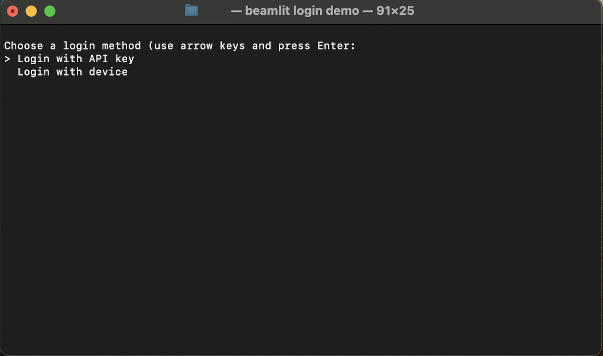

---

title: 'Access tokens'

description: 'Interact with Beamlit by API or CLI using access tokens.'

---

User access tokens can be used in order to authenticate to Beamlit by API or CLI. They apply for both [users](Workspace-access-control.md) and [service accounts](Service-accounts.md). They are generated through a variety of methods, which are documented below.

## Overview of authentication methods on Beamlit

Beamlit employs two main authentication paradigms: **short-lived tokens** (OAuth) and **long-lived tokens** (API keys).

**OAuth tokens** are recommended for security reasons, as their duration is only of 2 hours (short-lived). They are generated through [OAuth 2.0](https://oauth.net/2/) authentication endpoints.

Long-lived tokens are easier to use but are less secure as their validity can go from multiple days to infinite. They are generated as **API keys** from the Beamlit console. 

## OAuth 2.0 tokens

These short-lived tokens are based on the [OAuth 2.0](https://oauth.net/2/) authentication protocol, and have a validity period of **2 hours**.

### Use OAuth tokens in the CLI

When using the `beamlit login YOUR-WORKSPACE`  command, you will be asked to authenticate using one of two methods: via **the Beamlit console (OAuth 2.0 Device mode**), or via an API key. The former option makes use of short-lived tokens. 



Choosing “***device***” (the OAuth option), you will be redirected to the Beamlit console to finish logging in. Sign in using your Beamlit account if you aren’t already. 

Once this is done, return to your terminal: the login will be finalized and you will then be able to run CLI commands. 

<Tip>Your [permissions in each workspace](Workspace-access-control.md) will be the ones given to your account in each of them.</Tip>

### Use OAuth tokens in the API via service accounts

[Service accounts](Service-accounts.md) can retrieve a short-lived token via the *OAuth client credentials grant type* in the authentication API, using their *client ID* and *client secret*. These two keys are generated automatically when creating a service account. Make sure to copy the secret at its generation as you will never be able to see it again after.


<Info>Service accounts can also connect to the API using a long-lived API key, as detailed [in the section below](Access-tokens.md).</Info>

To retrieve the token, pass the service account’s *client ID* and *client secret* in the header to the `/oauth/token` endpoint.

```
curl --request POST \
  --url https://api.beamlit.dev/v0/oauth/token \
  --header 'Authorization: Basic base64(CLIENT_ID:CLIENT_SECRET)' \
  --header 'Content-Type: application/json' \
  --data '{
	"grant_type":"client_credentials"
}'
```

Alternatively, you can also pass pass the *client ID* and *client secret* in the body:

```
curl --request POST \
  --url https://api.beamlit.dev/v0/oauth/token \
  --header 'Content-Type: application/json' \
  --data '{
	"grant_type":"client_credentials",
    "client_id": CLIENT_ID,
    "client_secret": CLIENT_SECRET
}'
```

You will retrieve a bearer token valid for 2 hours, which can then be passed in any call to a Beamlit APIs through any of the following headers: `Authorization` ou `X-Beamlit-Authorization`, as such:

```
curl 'https://api.beamlit.com/v0/models' \
  -H 'Accept: application/json, text/plain, */*' \
  -H 'X-Beamlit-Authorization: Bearer YOUR_TOKEN'
```

### (Advanced) Use OAuth tokens in the APIs

<Note>This section assumes you are a developer experienced with OAuth 2.0. For a simpler guide of how to use short-lived tokens in Beamlit APIs, read the [section on authenticating service accounts](Access-tokens.md).</Note>

Beamlit implements all **grant types** in the OAuth 2.0 convention, including [client credentials](https://www.oauth.com/oauth2-servers/access-tokens/client-credentials/), [authorization code](https://www.oauth.com/oauth2-servers/access-tokens/authorization-code-request/), and [refresh tokens](https://www.oauth.com/oauth2-servers/access-tokens/refreshing-access-tokens/). If you are a developer experienced with OAuth 2.0, you can find the **well-known configuration endpoint** at the following URL:

```
https://api.beamlit.com/v0/.well-known/openid-configuration
```

Through the endpoints discoverable in the aforementioned URL, you can implement any authentication flow in your application, and use the retrieved tokens in any of the following headers: `Authorization` ou `X-Beamlit-Authorization` .

## API keys

Long-lived authentication tokens are called **API keys** on Beamlit. Their validity duration is infinite.

### Manage API keys

You can create private API keys for your Beamlit account to authenticate directly when using the Beamlit APIs or CLI. Your [permissions in each workspace](Workspace-access-control.md) will be the ones given to your account in each of them.

API keys can be managed from the Beamlit console in **Profile > Security**.


For production-grade access to workspace resources that should be independent of individual users, it's strongly recommended to use [service accounts](Service-accounts.md) in the workspace.

### Using API keys

API keys can be used in both the Beamlit APIs and CLI. 

**To authenticate in the APIs**, use the API key in place of the authorization headers `Api-Key` or `X-Beamlit-Api-Key` in any call to the Beamlit APIs. For example, to list models:

```
curl 'https://api.beamlit.com/v0/models' \
  -H 'Accept: application/json, text/plain, */*' \
  -H 'X-Beamlit-Api-Key: YOUR-API-KEY'
```

**To authenticate in the CLI,** use the `beamlit login` command. You will be asked to authenticate using one of two methods: via the Beamlit console (OAuth 2.0 device mode), or **via an API key**. Choose the latter, and you will be prompted to enter the API key generated for your user or service account.


You will then be authenticated in this terminal session.