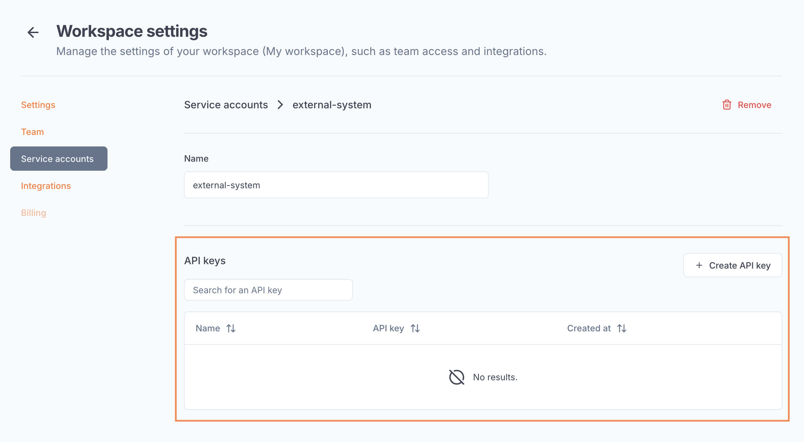

---

title: 'Service accounts'

description: 'Automate the life-cycle of Beamlit resources via API through service accounts.'

---

Service accounts are workspace users (i.e. identities) that represent an external system that needs to access Beamlit to operate resources in your workspace.

An example of service account is the one used by the [Beamlit operator](../Models/Cloud-Burst-Network/Install-Beamlit-operator.md) which you can install in your Kubernetes cluster and that can deploy models on Beamlit based on conditions.

## Authentication of service accounts

### API keys

Service accounts can use [API keys](Access-tokens.md) to authenticate on Beamlit. These API keys can be created and managed by admins from the service account’s page, in your workspace settings.

API keys have an infinite validity duration. 

### Client credentials (OAuth 2.0)

Service accounts can also use the *client credentials* [OAuth 2.0 grant type](Access-tokens.md), via their **client ID** and **client secret**. A pair client ID / client secret is generated automatically by Beamlit when you create a new service account.

<Warning>Make sure to copy the client secret when you create the service account as you will never be able to access it again after you leave the page.</Warning>

## Permissions of service accounts

Service accounts can have [similar permissions](Workspace-access-control.md) as other users from your team. These permissions are managed by admins in your workspace settings.