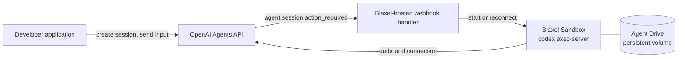

Use this when an AI agent needs to work with real files and tools without running on your laptop or production server. OpenAI runs the agent and keeps the session state. Blaxel supplies the computer: the image the executor runs in, a persistent volume through Agent Drive, and the secrets the executor needs. The [Agents API](https://developers.openai.com/api/docs/guides/agents-api) supports two ways to provision that computer, and this tutorial covers both.



| Mode | Who starts the Sandbox | When to use it |
| --- | --- | --- |
| Application-managed | Your application calls the Blaxel SDK, then connects the session | Quick start, scripts, jobs |
| Webhook-managed | A handler deployed once in your Blaxel account, when OpenAI sends `agent.session.action_required` | Production: the application only talks to the Agents API, and a lost Sandbox is replaced on the next input |

This tutorial uses the [Blaxel OpenAI Agents API cookbook](https://github.com/blaxel-ai/blaxel-openai-agents-api-cookbook). Its `run.sh` is application-managed; its `webhook/` directory is the handler.

## Who owns what

| OpenAI | Blaxel |
| --- | --- |
| Agent configuration, harness, and session state | Command execution inside an isolated [Sandbox](/Sandboxes/Overview) |
| Turn orchestration, model calls, and agent session webhooks | The image, the persistent volume ([Agent Drive](/Agent-drive/Overview)), and the [secrets](/Sandboxes/Variables-and-secrets) |
| Session-scoped environment ID | The webhook handler that starts or reconnects the Sandbox |
| Session lifecycle and deletion | Sandbox lifetime, [outbound network controls](/Sandboxes/Proxy), and cleanup |

## Prerequisites

- Python 3.11 through 3.14 and Git
- An OpenAI project with Agents API access and two API keys:
  - `OPENAI_API_KEY`, the project key. It stays with your application and the handler.
  - `OPENAI_EXECUTOR_API_KEY`, a restricted key with **List models: Read** and every other permission set to None, created in the same project by the same owner. It is the only key that enters a Sandbox.
- A Blaxel workspace, logged in with `bl login` or provided as `BL_WORKSPACE` and `BL_API_KEY` ([API keys](/Security/Access-tokens#api-keys))
- The Agents API client referenced by the cookbook, which `./run.sh` installs

Agent Drive is optional for the first run and required for the handoff and the reconnection proof.

<Note>
  Without `OPENAI_EXECUTOR_API_KEY`, the cookbook warns once and hands the Sandbox your project key. Create the restricted key before you share a Sandbox with anything you do not fully control.
</Note>

## 1. Run the example

### Prompt your agent

Copy this into a coding agent with terminal access:

```text
Clone https://github.com/blaxel-ai/blaxel-openai-agents-api-cookbook.git and read AGENTS.md.

Without printing or saving secrets, confirm that OPENAI_API_KEY is available, that Blaxel credentials are available (a `bl login` session, or BL_WORKSPACE and BL_API_KEY), and that the Agents API client in pyproject.toml can be installed. Tell me if OPENAI_EXECUTOR_API_KEY is missing, but continue.

Run ./run.sh without changing source files. Report where summary.md was created, whether its contents were confirmed, and whether the OpenAI session and Blaxel Sandbox were deleted.

If setup or access blocks the run, stop and report the exact missing requirement or access page.
```

### Run it yourself

```bash
git clone https://github.com/blaxel-ai/blaxel-openai-agents-api-cookbook.git
cd blaxel-openai-agents-api-cookbook

export OPENAI_API_KEY='<openai-project-key>'
export OPENAI_EXECUTOR_API_KEY='<restricted-openai-key>'
bl login   # or export BL_WORKSPACE and BL_API_KEY

./run.sh
```

<Note>
  The default `auto` mode uses Agent Drive when available. Set `BL_AGENT_DRIVE_MODE=off` before the run for completely disposable storage.
</Note>

## 2. Check the result

A successful run gives you a short, deterministic proof:

```text
Blaxel workspace: my-workspace (us-was-1)
Agent Drive: using openai-agents-api-context
started Blaxel sandbox openai-agents-api-...
installed Codex ...
created OpenAI session sess_...
environment connected
final status: idle
confirmed generated file .../summary.md
kept durable result on Agent Drive ...
deleted OpenAI session
deleted Blaxel sandbox
```

`confirmed generated file` is the line that matters. The script reads `summary.md` back and checks it for an exact marker from the source file, which proves the agent used the provided file instead of returning an ungrounded answer.

| Resource | Result |
| --- | --- |
| OpenAI session | Deleted |
| Blaxel Sandbox | Deleted |
| `summary.md` | Kept on Agent Drive when enabled |

## 3. Try the fresh-session handoff

Agent Drive becomes most useful when another agent continues from an explicit file instead of copied conversation history.

```bash
./run.sh --handoff
```

The handoff performs one extra loop:

```text
session A + Sandbox A -> summary.md -> deleted
                                   |
session B + Sandbox B -> review.md -> deleted
```

Both `summary.md` and `review.md` remain in the same Agent Drive run directory. The second agent must read the original verification marker before its review passes.

<Info>
  Agent Drive shares inspectable files. It does not copy model memory, conversation history, or session state.
</Info>

## 4. Let a webhook handler run the Sandbox

In the webhook-managed mode your application never imports the Blaxel SDK. It creates a session for a saved agent and sends input. When a turn needs an executor that is not connected, OpenAI sends `agent.session.action_required` with an `environment_connection` action to a handler you deploy once. The handler starts or reconnects the Sandbox, and the pending input continues without being resubmitted.

The controller creates Sandboxes on your behalf, so it needs a Blaxel API key.

```bash
export BL_WORKSPACE='<blaxel-workspace>'
export BL_API_KEY='<blaxel-api-key>'
./run.sh --deploy-webhook
```

The first deploy:

1. Creates a saved OpenAI agent and prints `export OPENAI_AGENT_ID=...`. Export it; the handler only acts on sessions of this agent.
2. Starts the controller Sandbox `openai-agents-api-webhook-controller` in `us-was-1` and prints its public webhook URL.

Register that URL in your OpenAI project under Settings, Webhooks, for the events `agent.session.action_required` and `agent.session.failed`. Export the signing secret OpenAI shows as `OPENAI_WEBHOOK_SECRET` and run the deploy again. Until then the endpoint answers `503` and accepts nothing.

The handler is a few hundred lines of Python in [`webhook/handler.py`](https://github.com/blaxel-ai/blaxel-openai-agents-api-cookbook/blob/main/webhook/handler.py). It verifies every delivery, stores the session ID in SQLite before answering `200`, and one loop re-reads the session and starts or reconnects its worker.

## 5. Reconnect with files preserved

```bash
./run.sh --reconnect
```

The proof talks only to the Agents API. It sends a first turn; the handler starts a worker Sandbox, mounts the shared Agent Drive path, and the agent writes `note.md`. The script then deletes that worker and sends a second turn in the same session. OpenAI notices the executor is gone, sends `agent.session.action_required` again, and the handler starts a replacement worker on the same Drive path. The run passes only when the replacement reads the marker the first worker wrote.

```text
created OpenAI session sess_...; the webhook handler owns worker openai-agents-api-worker-...
environment connected
confirmed .../note.md on worker openai-agents-api-worker-...
deleted worker openai-agents-api-worker-...; the session and its Agent Drive files remain
environment connected
confirmed replacement worker openai-agents-api-worker-... read the file the first worker wrote
deleted OpenAI session
deleted Blaxel sandbox
```

This is the property that makes the webhook-managed mode safe for long-lived sessions: a Sandbox can expire, be deleted to release compute, or fail, and the session continues on the next input with its files intact.

## 6. Choose the storage behavior

| `BL_AGENT_DRIVE_MODE` | Behavior |
| --- | --- |
| `auto` | Use Agent Drive when available and otherwise continue with temporary storage |
| `required` | Stop when Agent Drive is unavailable |
| `off` | Always use temporary Sandbox storage |

If Drive access is unavailable, the baseline still completes and prints the workspace-specific Console page for requesting access. The `--handoff` path stops because a fresh Sandbox needs the persisted `summary.md`. The webhook handler logs a warning at startup and replacement workers start with an empty filesystem.

Agent Drive currently requires `us-was-1`, which is the cookbook default for both modes.

## 7. Make it yours

Keep the lifecycle and replace the example task:

| Keep | Replace |
| --- | --- |
| OpenAI session and executor connection | `sample_report.txt` |
| Blaxel Sandbox isolation and cleanup, or the webhook handler | Agent instructions and prompt |
| Agent Drive access and mount | Artifact schema |
| Streaming, verification, and diagnostics | Verification rule |

Start with [main.py](https://github.com/blaxel-ai/blaxel-openai-agents-api-cookbook/blob/main/main.py) for one application-managed session, [handoff.py](https://github.com/blaxel-ai/blaxel-openai-agents-api-cookbook/blob/main/handoff.py) when a fresh agent should continue from a persisted artifact, and [webhook/handler.py](https://github.com/blaxel-ai/blaxel-openai-agents-api-cookbook/blob/main/webhook/handler.py) when OpenAI should trigger provisioning.

## 8. What's next

Three idea starters, ordered by effort. Each is a prompt for a coding agent that has the cookbook cloned and the same environment variables set. The full prompts live in the cookbook's [What's next section](https://github.com/blaxel-ai/blaxel-openai-agents-api-cookbook#whats-next).

1. **Swap in your own document (2 minutes).** Replace `sample_report.txt` with a document of yours, keep the verification-marker line, rerun `./run.sh`, and confirm the kept `summary.md` reflects your document.
2. **Analyze data and open the result in your browser.** The cookbook ships `sample_data.csv`. Have the agent compute totals and the busiest day, write a self-contained `report.html` with an inline SVG chart, then serve it from the sandbox and open it on a public [preview URL](/Sandboxes/Preview-url).
3. **Run it as a hosted Blaxel job.** Deploy the same orchestration as a [Blaxel job](/Jobs/Overview) and trigger an execution with no laptop in the loop. Inside a job, Blaxel injects workspace credentials, so the only secrets the job needs are `OPENAI_API_KEY` and `OPENAI_EXECUTOR_API_KEY`.

## 9. Advanced details

<AccordionGroup>
  <Accordion title="How the connection works">
    OpenAI hosts the agent and session. Blaxel runs the Codex executor inside the isolated Sandbox. The executor connects outbound with a session-scoped environment ID, so you never expose an inbound Sandbox port.

    In the application-managed mode, your code creates the Sandbox, installs the executor, creates the session, and starts `codex exec-server --remote <agents-api-url> --environment-id <id>` with `CODEX_API_KEY` set to the restricted executor key. In the webhook-managed mode the handler does the same in response to `agent.session.action_required`, after re-reading the session to confirm the `environment_connection` action still exists. Either way the version you test with is the version you run; the cookbook README records the last verified client and executor versions.
  </Accordion>
  <Accordion title="Why the handler never stops a Sandbox on idle">
    OpenAI's lifecycle documentation names `agent.session.action_required` as the only wake event: `session.turn.created` and `agent.session.in_progress` arrive too late, and `function_call` actions belong to the application. It also warns that `session.idle` can fire when a connection requirement clears, before the waiting input starts its turn, so idle is not a safe shutdown signal.

    The handler follows both rules. It reacts only to `action_required` and `failed`, and it releases compute only when the session fails, when the worker's lifetime ends, or when you delete the worker. Any of those is recovered by the next input.
  </Accordion>
  <Accordion title="Keep the Sandbox awake for the whole turn">
    A Blaxel Sandbox moves to standby within seconds when nothing holds an API connection to it, regardless of what is running inside. The cookbook and the handler therefore start the executor with [process keep-alive](/Sandboxes/Processes#sandbox-keep-alive), which holds the Sandbox awake for as long as the executor runs. To release compute between turns, delete the worker; the next input triggers a reconnect and Agent Drive carries the files across.
  </Accordion>
  <Accordion title="Reuse the same OpenAI session">
    Wait for the session to return to `idle`, then call `session.stream(input=...)` again. In the application-managed mode keep the same Sandbox and executor for turns in that same session. In the webhook-managed mode the handler reuses the session's worker when it still exists and replaces it otherwise.
  </Accordion>
  <Accordion title="Clean up an interrupted run">
    The scripts print every temporary session ID and Sandbox name. `bl get sandboxes` verifies the Blaxel side; workers carry an `agents-session-id` label. Delete a leaked Sandbox with `bl delete sandbox <printed-name> -y`, and delete the printed OpenAI session through the Agents API SDK. Deleting a session sends no webhook, so it never releases a worker on its own. When retiring the handler, remove the OpenAI webhook first, then delete the controller Sandbox.
  </Accordion>
  <Accordion title="Mount the Drive from custom code">
    Reusing this cookbook with the same `BL_AGENT_DRIVE_NAME` applies the correct workload label and scoped path. Custom consumers must use the same workspace and region, apply the matching workload label, and mount the permitted path. See [Agent Drive permissions](/Agent-drive/Permissions).
  </Accordion>
</AccordionGroup>

Sandbox lifetimes are a cleanup backstop: 15 minutes for application-managed Sandboxes, `WORKER_TTL` (default 2 hours) for handler workers, and `CONTROLLER_TTL` (default 24 hours) for the controller. None of them deletes an OpenAI session or replaces explicit cleanup.

## Resources

<Card title="OpenAI Agents API cookbook" icon="github" href="https://github.com/blaxel-ai/blaxel-openai-agents-api-cookbook">
  Review the complete runnable example, including the webhook handler.
</Card>

<Card title="Blaxel Sandboxes" icon="box" href="/Sandboxes/Overview">
  Learn how isolated execution environments work.
</Card>

<Card title="Agent Drive" icon="hard-drive" href="/Agent-drive/Overview">
  Share durable files and artifacts across Sandboxes and agents.
</Card>
