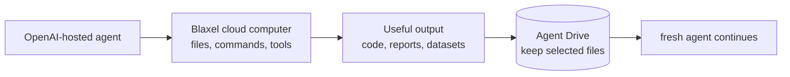

Use this when an AI agent needs to work with real files and tools without running on your laptop or production server. OpenAI manages the agent session, Blaxel gives it a disposable cloud computer, and Agent Drive can keep selected files after that computer is deleted.



This gives you three useful boundaries:

- Let an agent run commands and create deliverables away from your local machine
- Delete temporary compute after the task instead of maintaining another server
- Pass explicit files to a fresh agent without pretending that model memory is shared

This tutorial uses the [Blaxel OpenAI Agents API cookbook](https://github.com/blaxel-ai/blaxel-openai-agents-api-cookbook) to demonstrate that lifecycle with a small report.

## Who owns what

| OpenAI | Blaxel |
| --- | --- |
| Agent configuration, harness, and session state | Command execution inside an isolated [Sandbox](/Sandboxes/Overview) |
| Turn orchestration and model calls | Files and durable artifacts on [Agent Drive](/Agent-drive/Overview) |
| Session-scoped environment ID | [Outbound network controls](/Sandboxes/Proxy) for the workload |
| Session lifecycle and deletion | [Sandbox MCP server](/Sandboxes/MCP) and [variables and secrets](/Sandboxes/Variables-and-secrets) |

## Prerequisites

- Python 3.11 through 3.14 and Git
- An OpenAI project and API key with Agents API access
- The Agents API client version pinned by the cookbook, which `./run.sh` installs
- A Blaxel workspace and [API key](/Security/Access-tokens#api-keys)

Agent Drive is optional for the first run and required only for the fresh-session handoff.

## 1. Run the example

### Prompt your agent

Copy this into a coding agent with terminal access:

```text
Clone https://github.com/blaxel-ai/blaxel-openai-agents-api-cookbook.git and read AGENTS.md.

Without printing or saving secrets, confirm that OPENAI_API_KEY, BL_WORKSPACE, and BL_API_KEY are available.

Run ./run.sh without changing the repository. Report where summary.md was created, whether its contents were confirmed, and whether the OpenAI session and Blaxel Sandbox were deleted.

If setup or access blocks the run, stop and report the exact missing requirement or access page.
```

### Run it yourself

```bash
git clone https://github.com/blaxel-ai/blaxel-openai-agents-api-cookbook.git
cd blaxel-openai-agents-api-cookbook

export OPENAI_API_KEY='<openai-project-key>'
export BL_WORKSPACE='<blaxel-workspace>'
export BL_API_KEY='<blaxel-api-key>'

./run.sh
```

<Note>
  The default `auto` mode uses Agent Drive when available. Set `BL_AGENT_DRIVE_MODE=off` before the run for completely disposable storage.
</Note>

## 2. Check the result

A successful run gives you a short, deterministic proof:

```text
Agent Drive: using openai-agents-api-context
started Blaxel sandbox ...
created OpenAI session ...
environment connected
final status: idle
confirmed generated file .../summary.md
kept durable result on Agent Drive ...
deleted OpenAI session
deleted Blaxel sandbox
```

`confirmed generated file` is the line that matters. The script reads `summary.md` back and checks it for an exact marker from the source file, which proves the agent used the provided file instead of returning an ungrounded answer.

| Resource | Result |
| --- | --- |
| OpenAI session | Deleted |
| Blaxel Sandbox | Deleted |
| `summary.md` | Kept on Agent Drive when enabled |

## 3. Try the fresh-session handoff

Agent Drive becomes most useful when another agent continues from an explicit file instead of copied conversation history.

```bash
./run.sh --handoff
```

The handoff performs one extra loop:

```text
session A + Sandbox A → summary.md → deleted
                                  ↓
session B + Sandbox B → review.md  → deleted
```

Both `summary.md` and `review.md` remain in the same Agent Drive run directory. The second agent must read the original verification marker before its review passes.

<Info>
  Agent Drive shares inspectable files. It does not copy model memory, conversation history, or session state.
</Info>

## 4. Choose the storage behavior

| `BL_AGENT_DRIVE_MODE` | Behavior |
| --- | --- |
| `auto` | Use Agent Drive when available and otherwise continue with temporary storage |
| `required` | Stop when Agent Drive is unavailable |
| `off` | Always use temporary Sandbox storage |

If Drive access is unavailable, the baseline still completes and prints the workspace-specific Console page for requesting access. The `--handoff` path stops because a fresh Sandbox needs the persisted `summary.md`.

Agent Drive currently requires `us-was-1`, which is the cookbook default.

## 5. Make it yours

Keep the lifecycle and replace the example task:

| Keep | Replace |
| --- | --- |
| OpenAI session and executor connection | `sample_report.txt` |
| Blaxel Sandbox isolation and cleanup | Agent instructions and prompt |
| Agent Drive access and mount | Artifact schema |
| Streaming, verification, and diagnostics | Verification rule |

Start with [main.py](https://github.com/blaxel-ai/blaxel-openai-agents-api-cookbook/blob/main/main.py) for one session. Use [handoff.py](https://github.com/blaxel-ai/blaxel-openai-agents-api-cookbook/blob/main/handoff.py) when your workflow needs a fresh agent to continue from a persisted artifact.

## 6. Advanced details

<AccordionGroup>
  <Accordion title="How the connection works">
    OpenAI hosts the agent and session. Blaxel runs the Codex executor inside the isolated Sandbox. The executor connects outbound with a session-scoped environment ID, so you do not expose an inbound Sandbox port. The cookbook installs the pinned Codex executor in the Sandbox and starts it with `codex exec-server --remote <agents-api-url> --environment-id <id>`, so the version you test with is the version you run.
  </Accordion>
  <Accordion title="Reuse the same OpenAI session">
    Wait for the session to return to `idle`, then call `session.stream(input=...)` again. Keep the same Sandbox and executor only for turns in that same session. Create a fresh Sandbox for a fresh OpenAI session.
  </Accordion>
  <Accordion title="Keep the Sandbox awake between turns">
    Sandboxes move to standby when nothing is connected. The cookbook starts the executor with [process keep-alive](/Sandboxes/Processes#sandbox-keep-alive), so the Sandbox stays awake for as long as the executor runs and the session can take another turn without a reconnect.

    Treat the executor as bound to its Sandbox. If that Sandbox stops or reaches its expiration, start a fresh Sandbox and a fresh OpenAI session, and carry the work forward through the files on Agent Drive rather than expecting the previous session to resume.
  </Accordion>
  <Accordion title="Clean up an interrupted run">
    The script prints every temporary session ID and Sandbox name. `bl get sandboxes` verifies only the Blaxel side. Delete a leaked Sandbox with `bl delete sandbox <printed-name> -y`, and delete the printed OpenAI session through the Agents API SDK when its deletion signal is absent.
  </Accordion>
  <Accordion title="Mount the Drive from custom code">
    Reusing this cookbook with the same `BL_AGENT_DRIVE_NAME` applies the correct workload label and scoped path. Custom consumers must use the same workspace and region, apply the matching workload label, and mount the permitted path. See [Agent Drive permissions](/Agent-drive/Permissions).
  </Accordion>
</AccordionGroup>

The Sandbox's 15-minute lifetime is a cleanup backstop. It does not delete an OpenAI session or replace explicit cleanup.

## Resources

<Card title="OpenAI Agents API cookbook" icon="github" href="https://github.com/blaxel-ai/blaxel-openai-agents-api-cookbook">
  Review the complete runnable example.
</Card>

<Card title="Blaxel Sandboxes" icon="box" href="/Sandboxes/Overview">
  Learn how isolated execution environments work.
</Card>

<Card title="Agent Drive" icon="hard-drive" href="/Agent-drive/Overview">
  Share durable files and artifacts across Sandboxes and agents.
</Card>
