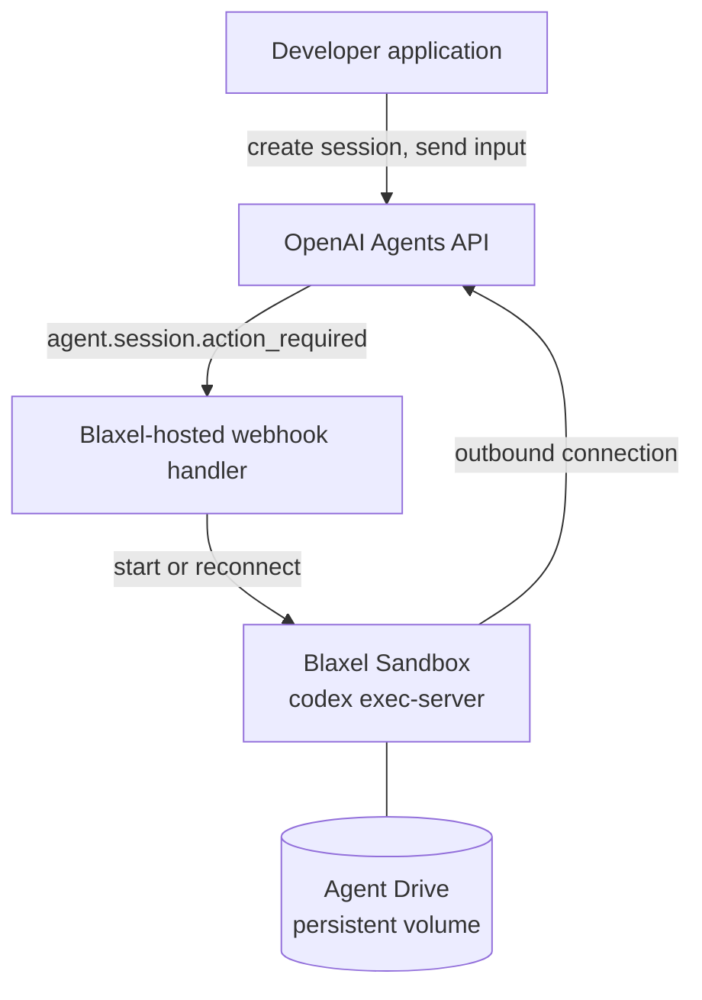

Give an OpenAI-hosted agent a Blaxel Sandbox to run commands, read documents, and write useful files. Keep those files on Agent Drive so a fresh agent, a team of specialists, or a replacement Sandbox can continue the work.

## Prerequisites

- Python 3.11 through 3.14 and Git
- An OpenAI project with Agents API access and two API keys:
  - `OPENAI_API_KEY`, the project key. It stays with your application and the handler.
  - `OPENAI_EXECUTOR_API_KEY`, a separate restricted executor key created in the same project by the same owner. It is the only OpenAI key passed to worker Sandboxes when configured and is required for webhook deployment.
- A Blaxel workspace, logged in with `bl login` or provided as `BL_WORKSPACE` and `BL_API_KEY` ([API keys](/Security/Access-tokens#api-keys))
- GitHub access to the [OpenAI preview client](https://github.com/OpenAI-Early-Access/agents-api-python-preview) referenced in the public [Blaxel cookbook](https://github.com/blaxel-ai/blaxel-openai-agents-api-cookbook); `./run.sh` installs the client

Agent Drive access in `us-was-1` is optional for the first run and required for the handoff, team example, and reconnection proof.

<Info>
  This walkthrough uses the Agents API preview client, which requires access from OpenAI. It is separate from the [OpenAI Agents SDK tutorial](/Tutorials/OpenAI-Agents-SDK).
</Info>

<Note>
  Strict executor permissions require `api.agents.environments.connect`; List models: Read alone is insufficient. Ask your OpenAI representative if that permission is unavailable.

  The application-managed examples warn and pass your project key to the Sandbox if `OPENAI_EXECUTOR_API_KEY` is absent; webhook deployment requires a separate executor key and rejects reuse of the project key.
</Note>



| Mode | Who starts the Sandbox | When to use it |
| --- | --- | --- |
| Application-managed | Your application calls the Blaxel SDK, then connects the session | Quick start, scripts, jobs |
| Webhook-managed | A handler deployed once in your Blaxel account, when OpenAI sends `agent.session.action_required` | A reusable handler manages the worker lifecycle while the application submits work through the Agents API |

This tutorial uses the [Blaxel OpenAI Agents API cookbook](https://github.com/blaxel-ai/blaxel-openai-agents-api-cookbook). Its `run.sh` is application-managed; its `webhook/` directory is the handler.

### Who owns what

| OpenAI | Blaxel |
| --- | --- |
| Agent configuration, harness, and session state | Command execution inside an isolated [Sandbox](/Sandboxes/Overview) |
| Turn orchestration, model calls, and agent session webhooks | The image, the persistent volume ([Agent Drive](/Agent-drive/Overview)), and the [secrets](/Sandboxes/Variables-and-secrets) |
| Session-scoped environment ID | The webhook handler that starts or reconnects the Sandbox |
| Session lifecycle and deletion | Sandbox lifetime, [outbound network controls](/Sandboxes/Proxy), and cleanup |

## 1. Run the example

### Prompt your agent

Copy this into a coding agent with terminal access:

```text
Clone https://github.com/blaxel-ai/blaxel-openai-agents-api-cookbook.git and read AGENTS.md.

Without printing or saving secrets, confirm that OPENAI_API_KEY is available, that Blaxel credentials are available (a `bl login` session, or BL_WORKSPACE and BL_API_KEY), and that the Agents API client in pyproject.toml can be installed. Tell me if OPENAI_EXECUTOR_API_KEY is missing, but continue.

Run ./run.sh without changing source files. Report where summary.md was created, whether its contents were confirmed, and whether the OpenAI session and Blaxel Sandbox were deleted.

If setup or access blocks the run, stop and report the exact missing requirement or access page.
```

### Run it yourself

```bash
git clone https://github.com/blaxel-ai/blaxel-openai-agents-api-cookbook.git
cd blaxel-openai-agents-api-cookbook

export OPENAI_API_KEY='<openai-project-key>'
export OPENAI_EXECUTOR_API_KEY='<restricted-openai-key>'
bl login   # or export BL_WORKSPACE and BL_API_KEY

./run.sh
```

<Note>
  The default `auto` mode uses Agent Drive when available. Set `BL_AGENT_DRIVE_MODE=off` before the run for completely disposable storage.
</Note>

## 2. Check the result

A successful run confirms the generated artifact and temporary resource cleanup:

```text
Blaxel workspace: my-workspace (us-was-1)
Agent Drive: using openai-agents-api-context
started Blaxel sandbox openai-agents-api-...
installed Codex ...
created OpenAI session sess_...
final status: idle
confirmed generated file .../summary.md
kept durable result on Agent Drive ...
deleted OpenAI session
deleted Blaxel sandbox
```

`confirmed generated file` is the line that matters. The script reads `summary.md` back and checks it for an exact marker from the source file, which proves the agent used the provided file instead of returning an ungrounded answer.

| Resource | Result |
| --- | --- |
| OpenAI session | Deleted |
| Blaxel Sandbox | Deleted |
| `summary.md` | Kept on Agent Drive when enabled |

## 3. Try the fresh-session handoff

Agent Drive becomes most useful when another agent continues from an explicit file instead of copied conversation history.

```bash
./run.sh --handoff
```

The first session writes `summary.md`, then its session and Sandbox are deleted. A fresh session and Sandbox mount the same Drive, read that file, and write `review.md`:

```text
session A + Sandbox A -> summary.md -> deleted
                                   |
session B + Sandbox B -> review.md -> deleted
```

Both `summary.md` and `review.md` remain in the same Agent Drive run directory. The second agent must read the original verification marker before its review passes.

<Info>
  Agent Drive shares inspectable files. It does not copy model memory, conversation history, or session state.
</Info>

### Try only the storage handoff

```bash
.venv/bin/python examples/agent_drive.py
```

This standalone example writes a handoff note, deletes its first Sandbox, and confirms that a fresh Sandbox reads exactly the same content. It creates a Drive with permissions for that workflow and retains it after temporary compute is deleted. It does not invoke a model.

The mount operation for a Drive and Sandbox with matching access labels is:

<CodeGroup>
```python Python
await sandbox.drives.mount(
    drive_name=drive.name,
    mount_path="/workspace/context",
    drive_path="/",
)
```

```typescript TypeScript
await sandbox.drives.mount({
  driveName: drive.name,
  mountPath: "/workspace/context",
  drivePath: "/",
});
```
</CodeGroup>

The full example includes the Drive and Sandbox creation, permission labels, content check and cleanup.

## 4. Run a team on a shared Drive

From the configured checkout, run:

```bash
.venv/bin/python -m examples.openai_agent_drive
```

The example creates three OpenAI sessions, each connected to its own Sandbox. They share a Drive created for this run:

| Agent | Input | Output |
| --- | --- | --- |
| Engineering specialist | `report.txt`, a fictional billing incident brief | `engineering.md`, a recovery plan |
| Support specialist | The same `report.txt` | `support.md`, a customer outreach plan |
| Coordinator | Both specialists' files | `plan.md`, a combined plan with owners, deadlines, and source filenames |

The two specialists work in parallel, each writing a separate file. Python waits for both tasks to complete and verifies their files before submitting the coordinator's task. By then the specialists' sessions and Sandboxes have been deleted; their findings remain on Agent Drive.

The coordinator also deletes its session and Sandbox after the final plan is read back. The script prints the retained Drive name so you can inspect `report.txt`, both findings, and `plan.md`. If a specialist fails, the example cancels the other specialist and skips the coordinator's task.

Agent Drive stores the shared files; the Python example defines the task order. Each run gets its own Drive and workload-label permissions, so independent teams do not share access.

## 5. Let a webhook handler run the Sandbox

In the webhook-managed mode your application never imports the Blaxel SDK. It creates a session for a saved agent and sends input. When a turn needs an executor that is not connected, OpenAI sends `agent.session.action_required` with an `environment_connection` action to a handler you deploy once. The handler starts or reconnects the Sandbox, and the pending input continues without being resubmitted.

The controller creates Sandboxes on your behalf, so it needs a valid Blaxel API key for the selected workspace. A local `bl login` session does not validate an exported `BL_API_KEY`; use a durable API key for a long-lived controller.

```bash
export BL_WORKSPACE='<blaxel-workspace>'
export BL_API_KEY='<blaxel-api-key>'
./run.sh --deploy-webhook
```

The first deploy:

1. Creates a saved OpenAI agent and prints `export OPENAI_AGENT_ID=...`. Export it; the handler only acts on sessions of this agent.
2. Starts the controller Sandbox `openai-agents-api-webhook-controller` in `us-was-1` and prints its public webhook URL.

Register that URL in your OpenAI project under Settings, Webhooks, for the events `agent.session.action_required` and `agent.session.failed`. Export the signing secret OpenAI shows as `OPENAI_WEBHOOK_SECRET` and run the deploy again. Until then the endpoint answers `503` and accepts nothing.

To test alongside an existing deployment, set a unique `OPENAI_WEBHOOK_RESOURCE_PREFIX` and optionally `OPENAI_AGENT_NAME` before the first deploy, starting without the old `OPENAI_AGENT_ID` or signing secret. Register the new URL and keep its prefix, agent ID and secret consistent across redeployment and reconnect. See the cookbook's separate-deployment steps. With no prefix, the original resource names remain unchanged.

The handler is a few hundred lines of Python in [`webhook/handler.py`](https://github.com/blaxel-ai/blaxel-openai-agents-api-cookbook/blob/main/webhook/handler.py). It verifies every delivery, stores the session ID in SQLite before answering `200`, and one loop re-reads the session and starts or reconnects its worker.

## 6. Reconnect with files preserved

```bash
./run.sh --reconnect
```

The application sends work through the Agents API; the proof also uses Blaxel to delete and inspect workers. It sends a first turn; the handler starts a worker Sandbox, mounts that session's Agent Drive, and the agent writes `note.md`. The script then stops the executor, deletes that worker, waits for OpenAI's `session.environment.disconnected` event, and sends a second turn in the same session. OpenAI sends `agent.session.action_required` again, and the handler starts a replacement worker on the same Drive path. The run passes only when the replacement reads the marker the first worker wrote.

```text
created OpenAI session sess_...; the webhook handler owns worker openai-agents-api-worker-...
confirmed .../note.md on worker openai-agents-api-worker-...
deleted worker openai-agents-api-worker-...; OpenAI reported the environment disconnected after 5s; the session and its Agent Drive files remain
confirmed replacement worker openai-agents-api-worker-... read the file the first worker wrote
deleted OpenAI session
deleted Blaxel sandbox
```

This separates a session from one particular computer: a Sandbox can expire, be deleted to release compute, or fail, and the session continues on the next input with files retained on Agent Drive.

When your application releases a Sandbox on purpose, stop the executor process first and wait for the `session.environment.disconnected` event before sending more input. Input sent while OpenAI still believes the executor is connected runs without file access and does not trigger the webhook.

The handler keeps the executor's worker awake while it is connected. Release that compute by deleting the worker; Agent Drive preserves the mounted files for its replacement.

## 7. Choose the storage behavior

| `BL_AGENT_DRIVE_MODE` | Behavior |
| --- | --- |
| `auto` | Use Agent Drive when available and otherwise continue with temporary storage |
| `required` | Stop when Agent Drive is unavailable |
| `off` | Always use temporary Sandbox storage |

If Drive access is unavailable, the baseline still completes and prints the workspace-specific Console page for requesting access. The `--handoff` path stops because a fresh Sandbox needs the persisted `summary.md`. The webhook handler logs a warning at startup and replacement workers start with an empty filesystem.

Agent Drive currently requires `us-was-1`, which is the cookbook default for both modes.

## 8. Make it yours

Keep the lifecycle and replace the example task:

| Keep | Replace |
| --- | --- |
| OpenAI session and executor connection | `sample_report.txt` |
| Blaxel Sandbox isolation and cleanup, or the webhook handler | Agent instructions and prompt |
| Agent Drive access and mount | Artifact schema |
| Durable completion, verification, and diagnostics | Verification rule |

Start with [main.py](https://github.com/blaxel-ai/blaxel-openai-agents-api-cookbook/blob/main/main.py) for one application-managed session, [handoff.py](https://github.com/blaxel-ai/blaxel-openai-agents-api-cookbook/blob/main/handoff.py) for a fresh agent reading a saved artifact, [the team example](https://github.com/blaxel-ai/blaxel-openai-agents-api-cookbook/blob/main/examples/openai_agent_drive.py) for parallel work, or [webhook/handler.py](https://github.com/blaxel-ai/blaxel-openai-agents-api-cookbook/blob/main/webhook/handler.py) when OpenAI should trigger provisioning.

## 9. Review and clean up

Read the cookbook README for the current verified client and executor versions. Replace the fictional support brief with your own document and keep a verification rule that checks the actual generated files.

Use a separate Drive and workload-label permissions for each independent webhook session. A replacement worker reuses its session's Drive. The application-managed handoff intentionally shares a Drive between trusted agents; a mount path alone is not an isolation boundary.

The cookbook submits each task once, verifies its new turn and durable idle state within 180 seconds (600 seconds for webhook-managed turns, including cold worker setup), and reads the retained final answer. It does not depend on live event delivery and rejects concurrent input to the same session. Cleanup cancels unfinished work if OpenAI requires an idle session before deletion.

The controller's SQLite queue survives process restarts within the same Sandbox. It does not survive deletion or expiration of that Sandbox. `CONTROLLER_TTL` defaults to `24h` and `WORKER_TTL` to `2h`, both measured from Sandbox creation. Restarting the controller process does not renew its lifetime.

The examples create hosted resources and the agent examples invoke a model. After a run, check the printed cleanup results rather than relying on the Sandbox TTL:

| Resource | Cleanup |
| --- | --- |
| Example sessions and worker Sandboxes | The scripts delete them; if interrupted, use the printed IDs to confirm both were removed |
| Webhook controller and registration | Retained by `--reconnect`; remove the deployment's OpenAI webhook, then its controller, remaining workers, and API sessions when you finish |
| Agent Drive | Retained deliberately; inspect or export the files before deleting a Drive you no longer need |

Deleting an OpenAI session does not send a cleanup webhook, so your application must also delete its worker. Use your configured resource prefix to identify the deployment and preserve resources belonging to other deployments.

## Resources

<Card title="OpenAI Agents API integration reference" href="/Integrations/OpenAI-Agents-API">Review execution modes, credentials, lifecycle rules, and configuration.</Card>

<Card title="OpenAI Agents API cookbook" href="https://github.com/blaxel-ai/blaxel-openai-agents-api-cookbook">Run the complete examples and inspect the verification code.</Card>

<Card title="Agent Drive" href="/Agent-drive/Overview">Configure durable files and request access.</Card>

<Card title="Blaxel Sandboxes" href="/Sandboxes/Overview">Manage your agent's execution environment.</Card>
