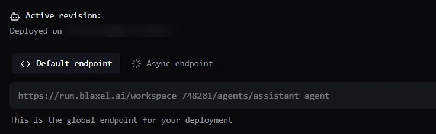

[OpenAI Agents SDK](https://developers.openai.com/api/docs/guides/agents-sdk) is an open source, production-grade library for building agentic applications. One of the most interesting features of this SDK is the ability to create agents that are backed by remote execution environments (sandboxes) in the cloud. This ability allows a model to directly access compute, including executing commands, working with files and directories, writing code, and performing computations.

This tutorial explores how you can use the OpenAI Agents SDK with Blaxel to create powerful sandbox-backed agents. You can also deploy your OpenAI Agents SDK projects to Blaxel with minimal code editing (and zero configuration), enabling you to colocate them close to the [sandboxes](/Sandboxes/Overview) the agents work on.

## Prerequisites

- An OpenAI API key. If not, [sign up for an OpenAI account](https://openai.com/) and obtain an API key.
- A Blaxel account. If not, [sign up for a Blaxel account](https://blaxel.ai).
- A Blaxel workspace and API key. Learn about [Blaxel workspaces](/Security/Workspace-access-control) and how to [obtain a Blaxel API key](/Security/Access-tokens#api-keys).

<Note>
  The OpenAI Agents SDK is provider-agnostic and can be used with both OpenAI and non-OpenAI models. This tutorial uses OpenAI models, but you can also read about [integrating other models](https://openai.github.io/openai-agents-python/models/#non-openai-models).
</Note>

## 1. Install the Blaxel CLI and log in to Blaxel

The main way to deploy an agent on Blaxel is with the [Blaxel CLI](../cli-reference/introduction). This method is detailed in this tutorial. Alternatively you can [connect a GitHub repository](/Agents/Github-integration) - any push to the `main` branch of the repository will automatically update the deployment on Blaxel - or deploy from a variety of pre-built templates using the Blaxel Console.

[Install the Blaxel CLI](../cli-reference/introduction) and log in to Blaxel using this command:

```bash
bl login
```

## 2. Install required dependencies

Create a directory for the project:

```shell
mkdir assistant-agent && cd assistant-agent
```

In your project directory, install the [OpenAI Agent SDK](https://platform.claude.com/docs/en/agent-sdk/overview) for the agent loop:

```shell
python3 -m venv .venv && source .venv/bin/activate # if new project
pip install openai-agents openai-agents[blaxel]
```

## 3. Configure the environment

Add your OpenAI API key, Blaxel API key and Blaxel workspace name to a `.env` file in the project directory:

```shell
echo "OPENAI_API_KEY=your_key_here" > .env
echo "BL_API_KEY=your_key_here" >> .env
echo "BL_WORKSPACE=your_workspace_name_here" >> .env
```

## 4. Build a simple agent

In your project directory, create a file named `main.py` with the following code.

```python
import asyncio
from agents import ModelSettings, Runner
from agents.run import RunConfig
from agents.sandbox import SandboxAgent, SandboxRunConfig
from agents.extensions.sandbox import BlaxelSandboxClient,BlaxelSandboxClientOptions

async def main():

    agent = SandboxAgent(
        name="Sandboxed agent",
        model="gpt-5.4",
        instructions=(
            "You have access to a sandbox environment. You can execute commands, manage files, and inspect processes inside the sandbox."
        ),
        model_settings=ModelSettings(tool_choice="auto"),
        default_manifest=Manifest(root="/blaxel"),
    )

    client = BlaxelSandboxClient()
    run_config = RunConfig(
        sandbox=SandboxRunConfig(
            client=client,
            options=BlaxelSandboxClientOptions(
                name="agent-sandbox-01",
                image="blaxel/base-image",
                region="us-pdx-1",
                memory=4096,
            ),
        )
    )

    result = await Runner.run(agent, "Install a complete Go development environment. Once done, return the installed Go version number and Go environment variables.", run_config=run_config)
    print(result.final_output)

    await client.close()

asyncio.run(main())
```

This creates a simple sandbox-backed agent with the OpenAI Agents SDK. Instructions that you send the agent will be executed in a sandbox named `agent-sandbox-01` that is dynamically created and managed in your workspace on Blaxel's infrastructure.

Run the agent:

```shell
python main.py
```

The agent will create and deploy a Blaxel sandbox using the `blaxel/base-image:latest` image, then investigate the sandbox and install all the tools required for Go development. Once done, it will return a report of its work and automatically delete the sandbox.

## 5. Build a data analysis agent

In addition to running commands, agents can also create, delete and manage files and directories in the sandbox filesystem. Generated files can be transferred from the sandbox environment to the host (and vice-versa).

To see this in action, update the simple agent from the previous example to perform data processing and analysis in a sandbox:

```python
import asyncio
from pathlib import Path

from agents import ModelSettings, Runner
from agents.run import RunConfig
from agents.sandbox import SandboxAgent, SandboxRunConfig
from agents.extensions.sandbox import BlaxelSandboxClient, BlaxelSandboxClientOptions


async def main():
    client = BlaxelSandboxClient()
    session = await client.create(
        options=BlaxelSandboxClientOptions(
            name="agent-sandbox-02",
            image="blaxel/py-app",
            region="us-pdx-1",
            memory=4096,
        )
    )
    await session.start()

    agent = SandboxAgent(
        name="Data analyst",
        model="gpt-5.4",
        instructions="You are a data analyst. You have access to a sandbox environment. You can execute commands, manage files, and inspect processes inside the sandbox.",
    )

    result = await Runner.run(
        agent,
        (
            "Obtain sample telemetry data using the API https://api.datamock.dev/v1/iot-telemetry?quantity=10&deviceType=wearable_fitness_tracker&exclude=deviceId,ipAddress,macAddress,signalStrength,networkType,location,status,batteryLevel,lastSync,firmwareVersion,alerts."
            "Analyze the received data and create a chart showing memory and CPU usage. Save it as /workspace/chart.png. "
            "Install any packages you need."
        ),
        run_config=RunConfig(sandbox=SandboxRunConfig(session=session)),
    )
    print(result.final_output)

    # Download the chart from the sandbox to the local host
    with open("chart.png", "wb") as f:
        f.write((await session.read(Path("/workspace/chart.png"))).read())
    print(f"Saved chart to host as chart.png")

    await session.stop()
    await session.shutdown()
    await client.close()


asyncio.run(main())
```

In this example, the agent uses Blaxel's `blaxel/py-app` image to create a sandbox containing a complete Python development environment. When the sandbox is created, the SDK automatically also creates a new workspace directory (defaults to `/workspace` but can be configured to point to another location) for the agent to operate in

The agent then uses sandbox tools to call the remote API, obtains a dataset (mock data), and autonomously installs all the required packages for chart creation. It then prepares and saves a chart of the received data to the workspace at `/workspace/chart.png`. This file is then read from the sandbox session and downloaded to the local host. Once the session is complete, the sandbox is terminated.

## 6. Build a coding agent

One of the most popular uses for agents is to generate code. Sandboxes provide isolated execution environments, allowing agents to securely run generated code with no risk of escaping. Blaxel sandboxes offer a unique advantage here: human operators can preview agent-generated applications in real-time via direct preview URLs for each running sandbox.

Instead of running the agent locally, this example deploys it through [Blaxel Agents Hosting](/Agents/Overview), which uses the same underlying infrastructure as Blaxel sandboxes.

Agents deployed on Blaxel Agents Hosting must expose an HTTP endpoint for requests. An easy way to do this is with [FastAPI](https://fastapi.tiangolo.com) - install it as below:

```shell
pip install fastapi
```

Update the agent code in `main.py` as below:

```python
import uvicorn
from fastapi import FastAPI, Request

from agents import ModelSettings, Runner
from agents.run import RunConfig
from agents.sandbox import Manifest, SandboxAgent, SandboxRunConfig
from agents.extensions.sandbox import BlaxelSandboxClient, BlaxelSandboxClientOptions


app = FastAPI()

@app.post("/generate")
async def generate(request: Request):
    body = await request.json()
    task = body["task"]
    client = BlaxelSandboxClient()
    session = await client.create(
        manifest=Manifest(root="/blaxel"),
        options=BlaxelSandboxClientOptions(
            name="agent-sandbox-03",
            image="blaxel/nextjs:latest",
            region="us-pdx-1",
            memory=4096,
            exposed_port_public=True,
            pause_on_exit=True,
        )
    )

    agent = SandboxAgent(
        name="Next.js code generation agent",
        model="gpt-5.4",
        instructions="You are a Next.js expert with shell access to a sandbox. You can execute commands, manage files, and start servers. The sandbox includes a skeleton Next.js app in /blaxel.",
        model_settings=ModelSettings(tool_choice="auto"),
    )

    await Runner.run(
        agent,
        task,
        run_config=RunConfig(sandbox=SandboxRunConfig(session=session)),
        max_turns=50,
    )

    endpoint = await session.resolve_exposed_port(3000)
    preview_url = endpoint.url_for("http")

    await session.stop()
    await session.shutdown()
    await client.close()

    return {"preview_url": preview_url}

if __name__ == "__main__":
    uvicorn.run(app, host="0.0.0.0", port=8000)
```

This creates a Next.js coding agent and an endpoint at `/generate` to accept requests. The coding agent's sandbox is generated from Blaxel's `blaxel/nextjs` image, which contains a complete Next.js development environment and a Next.js skeleton application.

<Note>
  The agent's HTTP service must be bound to the host and port provided by Blaxel. Blaxel automatically injects these values as `HOST` and `PORT` variables into the runtime environment. It is important to read these variables in your code and ensure that the agent's HTTP service binds to the correct host and port.

  In addition, the `exposed_port_public` parameter and the `resolve_exposed_port()` function call take care of producing a preview URL for the user, and the `pause_on_exit` parameter prevents the sandbox from being automatically deleted at the end of the session.
</Note>


## 7. Enable telemetry (optional)

Instrumentation happens automatically when workloads run on Blaxel. To enable telemetry:

- Add the required package to your project:

  ```shell python
  pip install "blaxel[telemetry]"
  ```

- Import the package in your code:

  ```python Python
  import blaxel.telemetry
  ```

## 8. Test the agent locally

Test the agent by making the endpoint available locally:

```shell
bl serve --hotreload &
```

This starts the agent locally while handling the core agent logic, function calls and model API calls exactly as they would be when deployed on Blaxel. The `--hotreload` flag monitors and reloads the agent if the source code changes.

Note the host port (port 8000, as configured in the previous code listing) on which the agent is running.

In another terminal, send the agent a request (update the endpoint URL below with the correct port number for your agent):

```shell
curl -X POST http://0.0.0.0:8000/generate \
  -H "Content-Type: application/json" \
  -d '{"task": "Create a website about Kitty, the cat that does amazing things"}'
```

The agent will start working on the task and once it is complete, you should see output similar to the following:

```shell
{"preview_url":"https://a4455b03....preview.bl.run/"}
```

Open the preview URL in your browser to see the results of the agent's work.

## 9. Deploy the agent on Blaxel

#######
TODO - SDK needs to be publicly available for pip install to work
#######

You're now ready to deploy the agent on Blaxel. When deploying to Blaxel, your workloads are served optimally to dramatically accelerate cold-start and latency while enforcing your deployment policies.

Deploying the agent is as simple as running the following command:

```shell
bl deploy
```

The Blaxel CLI will prompt for the type of resource you are deploying ("agent"). It will then auto-detect other details of your project and begin the deployment. The deployment process usually takes a few minutes, and you can watch progress from the Blaxel Console.

Once the deployment process is complete, log in to the [Blaxel Console](https://app.blaxel.ai/) to find the global endpoint for your agent service. Typically, this will be of the form `https://run.blaxel.ai/WORKSPACE/agents/AGENT`.



## 10. Test the agent on Blaxel

By default, agents deployed on Blaxel are not public. All agent requests must be authenticated via a [bearer token](/Security/Access-tokens). Requests can be made either via the Blaxel API or the Blaxel CLI.

Test the deployed agent by sending an authenticated request to its global endpoint (update the endpoint URL below with the correct endpoint URL for your agent, and modify the `task` as desired):

```bash
curl -X POST https://run.blaxel.ai/$(bl workspace --current)/agents/assistant-agent/query  \
  -H "X-Blaxel-Workspace: $(bl workspace --current)" \
  -H "X-Blaxel-Authorization: Bearer $(bl token)" \
  -H "Content-Type: application/json" \
  -d '{"task": "Create a website about Simone, the cat that does amazing things"}'
```

As before, the agent will generate the code and respond with a preview URL for the result.

You can also send a request through the Blaxel CLI:

```shell
bl run agent assistant-agent/generate --data '{"task": "Create a website about Simone, the cat that does amazing things"}'
```

<Tip>
  Although deployed agents are private by default, it is possible to [make an agent publicly available](/Agents/Query-agents#make-an-agent-public).
</Tip>

That's it! You're ready to start building and deploying Blaxel sandbox-backed agents with OpenAI Agents SDK on Blaxel.

## Resources

Want more info on developing and deploying agents on Blaxel? Check out the following resources:

<Card title="Give compute to your agent with the TypeScript SDK " icon="square-js" href="/Agents/Develop-an-agent-ts">
  Complete tutorial for using the TypeScript SDK to develop an agent using Blaxel services.
</Card>

<Card title="Give compute to your agent with the Python SDK " icon="python" href="/Agents/Develop-an-agent-py">
  Complete tutorial for using the Python SDK to develop an agent using Blaxel services.
</Card>

<Card title="Deploy your agent code to Blaxel" icon="server" href="/Agents/Deploy-an-agent">
  Complete tutorial for deploying AI agents on Blaxel.
</Card>

<Card title="Manage environment variables" icon="lock" href="/Agents/Variables-and-secrets">
  Complete tutorial for managing variables and secrets when deploying on Blaxel.
</Card>
