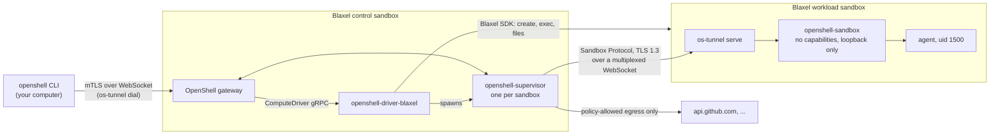

Run [NVIDIA OpenShell](https://github.com/NVIDIA/OpenShell) on Blaxel to confine autonomous agents with network, filesystem, and process policies. A control sandbox hosts the OpenShell gateway, Blaxel compute driver, and supervisors, while each agent runs in a separate Blaxel microVM.

Your computer only runs the `openshell` CLI. The workload sandbox does not receive your Blaxel key, gateway key, or model-provider credentials.



## Prerequisites

- A [Blaxel account](https://blaxel.ai) and workspace with access to the `landlock`, `tun`, and `iptables` kernel variants
- A service-account API key for the workspace
- The [`bl` CLI](https://github.com/blaxel-ai/toolkit), logged in to your workspace
- [Go](https://go.dev/doc/install) `1.25` or newer
- The [GitHub CLI](https://cli.github.com/) and Git

This tutorial uses OpenShell `main` from the NVIDIA `dev` release. The verified integration uses OpenShell commit `08548713c`, release `0.0.117-dev.281`, the `openshell.compute.v1` compute-driver protocol, and Blaxel Go SDK `v0.27.2`.

<Warning>
  OpenShell `main` can change between `dev` releases. The deployment downloads the expected source and verifies its checksums before building.
</Warning>

## 1. Configure the deployment

Clone the Blaxel OpenShell integration repository:

```bash
git clone git@github.com:blaxel-ai/openshell-blaxel.git
cd openshell-blaxel
```

Create your local environment file:

```bash
cp .env.example .env
```

Open `.env` and set:

- `BL_WORKSPACE` to your Blaxel workspace name
- `BL_ENV` to the target Blaxel environment
- `BL_REGION` to the region where the sandboxes run
- `BL_API_KEY` to the workspace service-account API key

<Warning>
  Treat `.env` as a secret and do not commit it. The deployment uses the key from the control plane, but does not place it inside workload sandboxes.
</Warning>

## 2. Deploy the control plane

Build OpenShell and create the Blaxel control sandbox:

```bash
make deploy
```

The deployment:

- downloads OpenShell `main` from NVIDIA's `dev` release and checks its checksums
- builds the Blaxel compute driver and WebSocket tunnel
- creates the control sandbox with `tun` and `iptables` enabled
- generates the gateway public key infrastructure
- starts the gateway, driver, ingress tunnel, CLAT, and DNS forwarder
- downloads the CLI client bundle to `~/.openshell-blaxel/mtls`

Running `make deploy` again updates the binaries in place and restarts the gateway and driver.

<Accordion title="How Blaxel networking supports OpenShell">
  Blaxel sandboxes are IPv6-only with NAT64/DNS64, and only HTTPS leaves the platform. OpenShell's policy DNS currently resolves A records only, so the control sandbox runs a 464XLAT CLAT with `tayga` and a DNS-over-HTTPS forwarder.

  Blaxel exposes HTTPS and WebSocket ingress through `/port/N`. The CLI and Sandbox Protocol therefore use multiplexed WebSockets, with TLS preserved end to end.

  The upstream change in [NVIDIA/OpenShell pull request #3702](https://github.com/NVIDIA/OpenShell/pull/3702), tracked by [issue #3716](https://github.com/NVIDIA/OpenShell/issues/3716), removes the need for the CLAT after it is merged.
</Accordion>

## 3. Connect the OpenShell CLI

Start the local tunnel and register the CLI with the gateway:

```bash
make connect
```

The tunnel carries mTLS traffic from the local CLI to the control sandbox over WebSocket. OpenShell's CLI uses a separate configuration directory, so this integration does not modify an existing OpenShell installation.

## 4. Verify the deployment

Run the end-to-end test suite:

```bash
make e2e
```

The suite takes about four minutes. It creates a workload sandbox, verifies the isolation and network-policy boundaries, exercises stop and start behavior, and then deletes the sandbox.

A successful run ends with output similar to:

```text
== 1. control plane on Blaxel      gateway main (mTLS) · blaxel driver negotiated
== 2. create sandbox               Ready after 15s (supervisor session attached)
== 3. isolation                    uid 1500 · landlock kernel · netns has only loopback
                                   raw egress blocked · Landlock denies /var/tmp
                                   driver state and credentials hidden from the workload
== 4. network policy               unlisted host denied · policy update loaded
                                   allowed host reachable through the supervisor proxy
                                   L7 read-only blocks POST · denials in the audit log
== 5. stop / start                 new generation, fresh launch credentials, workspace kept
== 6. delete                       gone
RESULT: 20 passed, 0 failed
```

Each workload uses the `landlock` kernel variant with Linux 6.18 and Landlock ABI v7. The agent runs as UID `1500` with no capabilities, `no_new_privs`, Landlock, seccomp, and a network namespace that only contains loopback. Policy-approved egress passes through its supervisor.

## 5. Create and enter a workload sandbox

Create a sandbox named `dev` and keep its main process running:

```bash
make os ARGS='sandbox create --name dev --no-tty -- sleep infinity'
```

Open an interactive shell:

```bash
make os ARGS='sandbox exec -n dev --tty -- bash -l'
```

The command after `--` is the sandbox's main process. `sleep infinity` keeps the sandbox alive while interactive shells connect and disconnect.

## 6. Apply a read-only network policy

Export the sandbox's base policy:

```bash
make os ARGS='policy get dev --base' | sed -n '/^---$/,$p' | sed 1d > /tmp/dev.yaml
```

Add a rule that allows only `/usr/bin/curl` to send read-only REST requests to `api.github.com`:

```bash
cat >> /tmp/dev.yaml <<'EOF'

network_policies:
  github:
    name: github-readonly
    endpoints:
      - host: api.github.com
        port: 443
        protocol: rest
        enforcement: enforce
        access: read-only
    binaries:
      - path: /usr/bin/curl
EOF
```

Apply the policy and wait for it to load:

```bash
make os ARGS='policy set dev --policy /tmp/dev.yaml --wait'
```

From the workload sandbox, `curl https://api.github.com/zen` now succeeds. A `POST` request is denied at HTTP layer 7, and hosts that are not listed in the policy do not resolve.

<Note>
  OpenShell `main` currently emits `policy get --base` output without a trailing newline. The blank line before `network_policies` keeps the appended YAML valid.
</Note>

## 7. Inspect and manage the deployment

Read the sandbox's OCSF allow and deny audit trail:

```bash
make os ARGS='logs dev'
```

Inspect the control-plane processes, gateway, and OpenShell-to-Blaxel sandbox mapping:

```bash
make status
```

Preview cleanup actions without changing resources:

```bash
./gw/cleanup.sh dev
./gw/cleanup.sh --orphans
```

Add `--apply` to a cleanup command after reviewing its exact plan.

Redeploying restarts the gateway and driver. A workload sandbox pins its first supervisor, so a sandbox that was running before a redeploy needs a new generation. If it appears as `Stopped`, start it again:

```bash
make os ARGS='sandbox start dev'
```

The workspace is preserved across stop and start operations.

## 8. Delete the resources

Delete the workload sandbox:

```bash
make os ARGS='sandbox delete dev'
```

Delete the control sandbox when you no longer need the deployment:

```bash
make destroy
```

## Resources

<Card title="OpenShell on Blaxel" icon="github" href="https://github.com/blaxel-ai/openshell-blaxel">
  Review the integration source, design guide, security boundaries, failure handling, and teardown procedures.
</Card>

<Card title="NVIDIA OpenShell" icon="shield" href="https://github.com/NVIDIA/OpenShell">
  Learn about OpenShell policies, architecture, and runtime isolation.
</Card>

<Card title="Blaxel sandboxes" icon="cube" href="/Sandboxes/Overview">
  Learn how to create and operate isolated microVM compute environments.
</Card>
